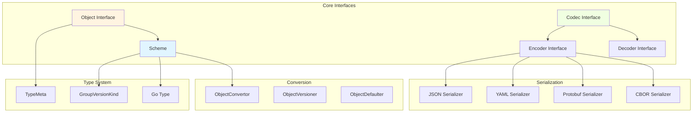
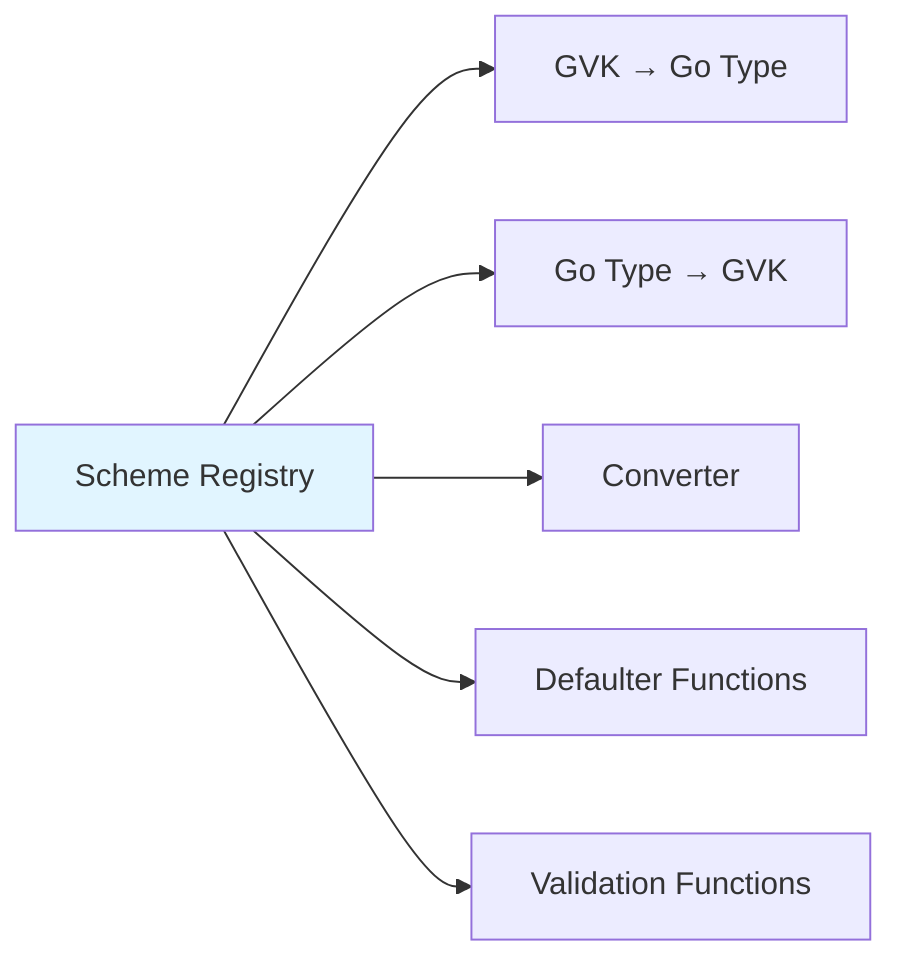
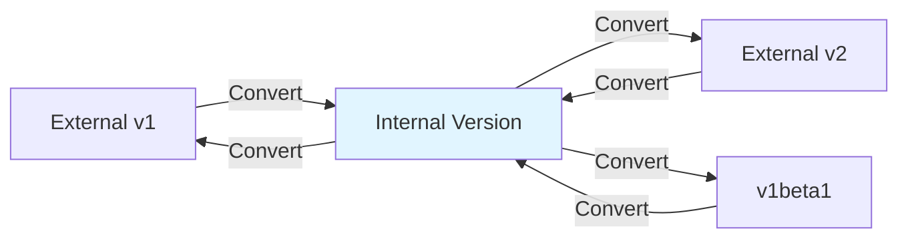
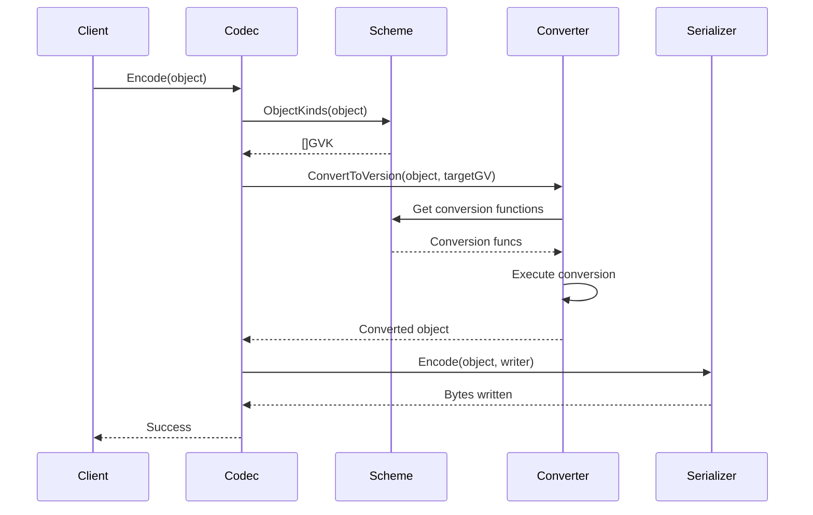
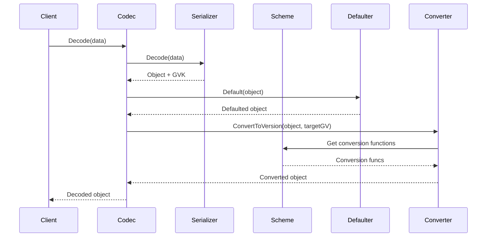

# Runtime Package

## Overview

The `pkg/runtime` package is the core of k8s.io/apimachinery, providing the fundamental machinery for working with Kubernetes API objects. It defines the type system, serialization interfaces, and conversion mechanisms that enable versioned APIs.

## Purpose

The runtime package provides:

1. **Type Registry (Scheme)**: Maps between Go types and GroupVersionKind
2. **Object Interface**: Base interface for all API objects
3. **Serialization**: Encoding and decoding objects in multiple formats
4. **Version Conversion**: Converting objects between API versions
5. **Type Metadata**: TypeMeta for embedding in API objects

## Architecture



## Core Interfaces

### Object Interface

The fundamental interface that all API objects must implement:

```go
type Object interface {
    GetObjectKind() schema.ObjectKind
    DeepCopyObject() Object
}
```

**Key Points:**
- Every API object must implement this interface
- `GetObjectKind()` returns the object's GroupVersionKind accessor
- `DeepCopyObject()` creates a deep copy of the object
- Enables generic handling of API objects

### Scheme

The Scheme is the central type registry that manages the relationship between Go types and Kubernetes API types.



**Key Responsibilities:**

1. **Type Registration**: Register Go types with their GroupVersionKind
2. **Type Lookup**: Find Go types by GVK and vice versa
3. **Conversion**: Convert between different versions of the same type
4. **Defaulting**: Apply default values to objects
5. **Validation**: Validate object fields

**Key Methods:**

```go
// Register types
AddKnownTypes(gv GroupVersion, types ...Object)
AddUnversionedTypes(gv GroupVersion, types ...Object)

// Type queries
ObjectKinds(obj Object) ([]GroupVersionKind, bool, error)
Recognizes(gvk GroupVersionKind) bool
New(kind GroupVersionKind) (Object, error)

// Conversion
Convert(in, out, context interface{}) error
ConvertToVersion(in Object, gv GroupVersioner) (Object, error)

// Defaulting
Default(obj Object)
```

**Internal Structure:**

```go
type Scheme struct {
    // GVK to Go type mapping
    gvkToType map[schema.GroupVersionKind]reflect.Type
    
    // Go type to GVK mapping
    typeToGVK map[reflect.Type][]schema.GroupVersionKind
    
    // Unversioned types (never converted)
    unversionedTypes map[reflect.Type]schema.GroupVersionKind
    
    // Field label conversion functions
    fieldLabelConversionFuncs map[schema.GroupVersionKind]FieldLabelConversionFunc
    
    // Defaulter functions
    defaulterFuncs map[reflect.Type]func(interface{})
    
    // Validation functions
    validationFuncs map[reflect.Type]func(ctx context.Context, op operation.Operation, object, oldObject interface{}) field.ErrorList
    
    // Converter for version conversion
    converter *conversion.Converter
    
    // Version priority for each group
    versionPriority map[string][]string
}
```

### Encoder Interface

Encodes objects to a serialized format:

```go
type Encoder interface {
    Encode(obj Object, w io.Writer) error
    Identifier() Identifier
}
```

**Variants:**

1. **NondeterministicEncoder**: Allows non-deterministic encoding for performance
2. **EncoderWithAllocator**: Allows custom memory allocation for efficiency

### Decoder Interface

Decodes serialized data into objects:

```go
type Decoder interface {
    Decode(data []byte, defaults *schema.GroupVersionKind, into Object) (Object, *schema.GroupVersionKind, error)
}
```

**Parameters:**
- `data`: Serialized bytes
- `defaults`: Default GVK if not specified in data
- `into`: Optional pre-allocated object to decode into

**Returns:**
- Decoded object
- Actual GVK from the data
- Error if decoding fails

### Codec Interface

Combines Encoder and Decoder:

```go
type Codec Serializer

type Serializer interface {
    Encoder
    Decoder
}
```

A Codec is version-aware and handles conversion during serialization.

### NegotiatedSerializer

Handles content negotiation for multiple serialization formats:

```go
type NegotiatedSerializer interface {
    SupportedMediaTypes() []SerializerInfo
    EncoderForVersion(serializer Encoder, gv GroupVersioner) Encoder
    DecoderToVersion(serializer Decoder, gv GroupVersioner) Decoder
}
```

**Purpose:**
- Support multiple media types (JSON, YAML, Protobuf, CBOR)
- Negotiate format based on HTTP Accept/Content-Type headers
- Wrap serializers with version conversion

## Type System

### TypeMeta

Embedded in all API objects to carry type information:

```go
type TypeMeta struct {
    APIVersion string `json:"apiVersion,omitempty"`
    Kind       string `json:"kind,omitempty"`
}
```

**Usage:**

```go
type Pod struct {
    runtime.TypeMeta `json:",inline"`
    // ... other fields
}
```

### GroupVersionKind (GVK)

Uniquely identifies an API type:

```go
type GroupVersionKind struct {
    Group   string  // e.g., "apps"
    Version string  // e.g., "v1"
    Kind    string  // e.g., "Deployment"
}
```

### RawExtension

Holds embedded objects with deferred decoding:

```go
type RawExtension struct {
    Raw    []byte  // Serialized bytes
    Object Object  // Decoded object (lazy)
}
```

**Use Cases:**
- Plugin architectures
- Unknown types
- Deferred decoding for performance

### Unknown

Represents objects with unrecognized types:

```go
type Unknown struct {
    TypeMeta        `json:",inline"`
    Raw             []byte
    ContentEncoding string
    ContentType     string
}
```

## Conversion System

### ObjectConvertor Interface

Converts objects between versions:

```go
type ObjectConvertor interface {
    Convert(in, out, context interface{}) error
    ConvertToVersion(in Object, gv GroupVersioner) (Object, error)
    ConvertFieldLabel(gvk GroupVersionKind, label, value string) (string, string, error)
}
```

### Conversion Strategy



**Key Principles:**

1. **Hub-and-Spoke**: All versions convert through a single internal version
2. **Lossless**: Conversion preserves all data (round-trip safe)
3. **Automatic**: Most conversions are auto-generated
4. **Manual Overrides**: Custom conversion functions for complex cases

### Conversion Functions

**Auto-generated:**
```go
func autoConvert_v1_Pod_To_core_Pod(in *v1.Pod, out *core.Pod, s conversion.Scope) error {
    // Auto-generated field-by-field copy
}
```

**Manual:**
```go
func Convert_v1_Pod_To_core_Pod(in *v1.Pod, out *core.Pod, s conversion.Scope) error {
    // Custom conversion logic
    if err := autoConvert_v1_Pod_To_core_Pod(in, out, s); err != nil {
        return err
    }
    // Additional custom logic
    return nil
}
```

## Defaulting

### ObjectDefaulter Interface

Applies default values to objects:

```go
type ObjectDefaulter interface {
    Default(in Object)
}
```

### Defaulting Functions

Registered per type:

```go
func SetDefaults_Pod(obj *v1.Pod) {
    if obj.Spec.RestartPolicy == "" {
        obj.Spec.RestartPolicy = v1.RestartPolicyAlways
    }
    // ... more defaults
}
```

**Characteristics:**
- Called automatically during decoding
- Idempotent (safe to call multiple times)
- Version-specific
- Must not return errors

## Serialization Flow

### Encoding Flow



### Decoding Flow



## Content Types

Supported serialization formats:

```go
const (
    ContentTypeJSON         = "application/json"
    ContentTypeYAML         = "application/yaml"
    ContentTypeProtobuf     = "application/vnd.kubernetes.protobuf"
    ContentTypeCBOR         = "application/cbor"
    ContentTypeCBORSequence = "application/cbor-seq"
)
```

## Key Types

### SerializerInfo

Describes a serialization format:

```go
type SerializerInfo struct {
    MediaType        string
    MediaTypeType    string
    MediaTypeSubType string
    EncodesAsText    bool
    Serializer       Serializer
    PrettySerializer Serializer
    StrictSerializer Serializer
    StreamSerializer *StreamSerializerInfo
}
```

### GroupVersioner Interface

Selects target version for conversion:

```go
type GroupVersioner interface {
    KindForGroupVersionKinds(kinds []GroupVersionKind) (GroupVersionKind, bool)
    Identifier() string
}
```

**Implementations:**
- `GroupVersion`: Single target version
- `GroupVersions`: Multiple possible versions (first match)
- `InternalGroupVersioner`: Converts to internal version

## Usage Examples

### Creating a Scheme

```go
scheme := runtime.NewScheme()

// Register types
scheme.AddKnownTypes(schema.GroupVersion{Group: "apps", Version: "v1"},
    &Deployment{},
    &DeploymentList{},
)

// Register conversion functions
scheme.AddConversionFunc((*v1.Deployment)(nil), (*core.Deployment)(nil),
    func(a, b interface{}, scope conversion.Scope) error {
        return Convert_v1_Deployment_To_core_Deployment(
            a.(*v1.Deployment), b.(*core.Deployment), scope)
    })

// Register defaulter
scheme.AddTypeDefaultingFunc(&v1.Deployment{}, func(obj interface{}) {
    SetDefaults_Deployment(obj.(*v1.Deployment))
})
```

### Encoding an Object

```go
import (
    "k8s.io/apimachinery/pkg/runtime"
    "k8s.io/apimachinery/pkg/runtime/serializer"
)

// Create codec factory
codecFactory := serializer.NewCodecFactory(scheme)

// Get encoder for specific version
encoder := codecFactory.EncoderForVersion(
    serializer.NewCodecFactory(scheme).LegacyCodec(),
    schema.GroupVersion{Group: "apps", Version: "v1"},
)

// Encode object
var buf bytes.Buffer
err := encoder.Encode(deployment, &buf)
```

### Decoding an Object

```go
// Get universal deserializer (handles any registered type)
decoder := codecFactory.UniversalDeserializer()

// Decode
obj, gvk, err := decoder.Decode(data, nil, nil)
if err != nil {
    return err
}

// Type assert to specific type
deployment, ok := obj.(*appsv1.Deployment)
```

### Converting Between Versions

```go
// Convert to specific version
converted, err := scheme.ConvertToVersion(
    internalDeployment,
    schema.GroupVersion{Group: "apps", Version: "v1"},
)

// Convert to internal version
internal, err := scheme.ConvertToVersion(
    v1Deployment,
    runtime.InternalGroupVersioner,
)
```

## Key Design Patterns

### 1. Interface-Based Design

All core functionality is defined through interfaces, enabling:
- Multiple implementations
- Testing with mocks
- Extensibility

### 2. Registry Pattern

The Scheme acts as a central registry:
- Type registration
- Conversion function registration
- Defaulter registration
- Validation registration

### 3. Hub-and-Spoke Conversion

All versions convert through internal version:
- O(N) conversion functions instead of O(N²)
- Single source of truth for type structure
- Easier to maintain

### 4. Lazy Decoding

RawExtension enables deferred decoding:
- Parse only when needed
- Preserve unknown fields
- Support plugin architectures

## Sub-packages

### runtime/schema

Defines GroupVersionKind and related types:
- `GroupVersionKind`: Type identifier
- `GroupVersionResource`: Resource identifier
- `GroupVersion`: API version identifier
- Parsing and string conversion utilities

### runtime/serializer

Implements serialization formats:
- **json**: JSON serialization
- **yaml**: YAML serialization (wraps JSON)
- **protobuf**: Protocol buffer serialization
- **cbor**: CBOR serialization
- **streaming**: Streaming serialization for watch
- **versioning**: Version conversion during serialization

## Performance Considerations

### Caching

**CacheableObject Interface:**
```go
type CacheableObject interface {
    CacheEncode(id Identifier, encode func(Object, io.Writer) error, w io.Writer) error
    GetObject() Object
}
```

Enables caching of serialized representations.

### Memory Allocation

**EncoderWithAllocator:**
```go
type EncoderWithAllocator interface {
    Encoder
    EncodeWithAllocator(obj Object, w io.Writer, memAlloc MemoryAllocator) error
}
```

Allows custom memory allocation strategies.

### Nondeterministic Encoding

**NondeterministicEncoder:**
```go
type NondeterministicEncoder interface {
    Encoder
    EncodeNondeterministic(Object, io.Writer) error
}
```

Faster encoding when determinism isn't required (e.g., map iteration order).

## Testing Support

### runtime/testing

Provides utilities for testing:
- **FuzzInternalObject**: Fuzzing for testing conversion
- **RoundTripTest**: Verify round-trip conversion
- **TestCodec**: Test serialization/deserialization

## Summary

The runtime package provides:

1. **Type System**: GVK-based type identification with Scheme registry
2. **Serialization**: Multiple format support with content negotiation
3. **Conversion**: Hub-and-spoke version conversion
4. **Defaulting**: Automatic default value application
5. **Extensibility**: Interface-based design for customization

This package is the foundation for all Kubernetes API machinery, enabling versioned APIs, backward compatibility, and type-safe operations on API objects.

