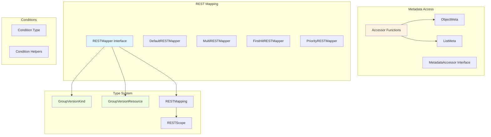
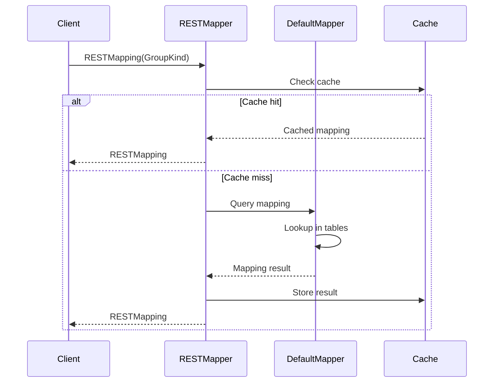
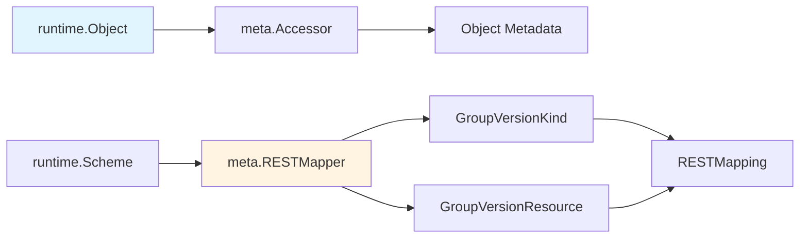

# API Meta Package

## Overview

The `pkg/api/meta` package provides utilities for working with API object metadata and resource mapping. It enables generic access to object metadata (name, namespace, labels, annotations) and mapping between GroupVersionKind (type) and GroupVersionResource (REST endpoint).

## Purpose

The meta package provides:

1. **Metadata Access**: Generic interfaces to access object metadata
2. **REST Mapping**: Map between Kind and Resource names
3. **Resource Discovery**: Determine REST endpoints for types
4. **Scope Information**: Identify namespace vs cluster-scoped resources
5. **Conditions Management**: Work with status conditions

## Architecture



## Core Interfaces

### MetadataAccessor Interface

Provides generic access to object metadata:

```go
type MetadataAccessor interface {
    APIVersion(obj runtime.Object) (string, error)
    SetAPIVersion(obj runtime.Object, version string) error
    
    Kind(obj runtime.Object) (string, error)
    SetKind(obj runtime.Object, kind string) error
    
    Namespace(obj runtime.Object) (string, error)
    SetNamespace(obj runtime.Object, namespace string) error
    
    Name(obj runtime.Object) (string, error)
    SetName(obj runtime.Object, name string) error
    
    GenerateName(obj runtime.Object) (string, error)
    SetGenerateName(obj runtime.Object, name string) error
    
    UID(obj runtime.Object) (types.UID, error)
    SetUID(obj runtime.Object, uid types.UID) error
    
    Labels(obj runtime.Object) (map[string]string, error)
    SetLabels(obj runtime.Object, labels map[string]string) error
    
    Annotations(obj runtime.Object) (map[string]string, error)
    SetAnnotations(obj runtime.Object, annotations map[string]string) error
    
    runtime.ResourceVersioner
}
```

### Accessor Functions

Convenience functions for metadata access:

```go
// Get metadata accessor for an object
func Accessor(obj interface{}) (metav1.Object, error)

// Get list metadata accessor
func ListAccessor(obj interface{}) (List, error)

// Get common accessor (works for both objects and lists)
func CommonAccessor(obj interface{}) (metav1.Common, error)

// Get type accessor
func TypeAccessor(obj interface{}) (Type, error)
```

**Usage Example:**

```go
accessor, err := meta.Accessor(pod)
if err != nil {
    return err
}

name := accessor.GetName()
namespace := accessor.GetNamespace()
labels := accessor.GetLabels()
```

## REST Mapper

### RESTMapper Interface

Maps between Kinds and Resources:

```go
type RESTMapper interface {
    // KindFor returns the Kind for a given resource
    KindFor(resource schema.GroupVersionResource) (schema.GroupVersionKind, error)
    
    // KindsFor returns all possible Kinds for a resource
    KindsFor(resource schema.GroupVersionResource) ([]schema.GroupVersionKind, error)
    
    // ResourceFor returns the Resource for a given resource (resolves partial resources)
    ResourceFor(input schema.GroupVersionResource) (schema.GroupVersionResource, error)
    
    // ResourcesFor returns all possible Resources
    ResourcesFor(input schema.GroupVersionResource) ([]schema.GroupVersionResource, error)
    
    // RESTMapping returns the REST mapping for a given Kind
    RESTMapping(gk schema.GroupKind, versions ...string) (*RESTMapping, error)
    
    // RESTMappings returns all REST mappings for a given Kind
    RESTMappings(gk schema.GroupKind, versions ...string) ([]*RESTMapping, error)
    
    // ResourceSingularizer converts plural resource to singular
    ResourceSingularizer(resource string) (singular string, err error)
}
```

### RESTMapping Type

Contains information for RESTful resource access:

```go
type RESTMapping struct {
    // Resource is the GroupVersionResource (REST endpoint location)
    Resource schema.GroupVersionResource
    
    // GroupVersionKind is the type to submit to this endpoint
    GroupVersionKind schema.GroupVersionKind
    
    // Scope indicates if resource is namespaced or cluster-scoped
    Scope RESTScope
}
```

### RESTScope

Indicates resource scope:

```go
type RESTScope interface {
    Name() RESTScopeName
}

const (
    RESTScopeNameNamespace RESTScopeName = "namespace"
    RESTScopeNameRoot      RESTScopeName = "root"
)
```

## REST Mapper Implementations

### 1. DefaultRESTMapper

Basic REST mapper with static mappings:

```go
type DefaultRESTMapper struct {
    defaultGroupVersions []schema.GroupVersion
    
    resourceToKind       map[schema.GroupVersionResource]schema.GroupVersionKind
    kindToPluralResource map[schema.GroupVersionKind]schema.GroupVersionResource
    kindToScope          map[schema.GroupVersionKind]RESTScope
    singularToPlural     map[schema.GroupVersionResource]schema.GroupVersionResource
    pluralToSingular     map[schema.GroupVersionResource]schema.GroupVersionResource
}
```

**Usage:**

```go
mapper := meta.NewDefaultRESTMapper([]schema.GroupVersion{
    {Group: "apps", Version: "v1"},
})

// Add mappings
mapper.Add(
    schema.GroupVersionKind{Group: "apps", Version: "v1", Kind: "Deployment"},
    meta.RESTScopeNamespace,
)

// Query mapping
mapping, err := mapper.RESTMapping(schema.GroupKind{Group: "apps", Kind: "Deployment"})
// mapping.Resource = apps/v1/deployments
```

### 2. MultiRESTMapper

Combines multiple REST mappers:

```go
type MultiRESTMapper []RESTMapper
```

**Behavior:**
- Queries each mapper in order
- Returns first successful result
- Aggregates errors if all fail

**Usage:**

```go
mapper := meta.MultiRESTMapper{
    mapper1,
    mapper2,
    mapper3,
}
```

### 3. FirstHitRESTMapper

Caches successful lookups:

```go
type FirstHitRESTMapper struct {
    MultiRESTMapper
    // Internal cache for successful lookups
}
```

**Benefits:**
- Faster repeated lookups
- Reduces redundant mapper queries

### 4. PriorityRESTMapper

Orders mappers by priority:

```go
type PriorityRESTMapper struct {
    // Delegate mappers with priorities
    Delegate  RESTMapper
    Priorities []schema.GroupVersionKind
}
```

**Usage:**
- Prefer certain versions over others
- Control version selection order

## Mapping Flow



## Resource Name Conventions

### Pluralization Rules

The mapper uses English pluralization rules:

```go
func UnsafeGuessKindToResource(kind schema.GroupVersionKind) (plural, singular schema.GroupVersionResource) {
    kindName := kind.Kind
    singularName := strings.ToLower(kindName)
    
    // Special cases (e.g., "endpoints")
    for _, skip := range unpluralizedSuffixes {
        if strings.HasSuffix(singularName, skip) {
            return singular, singular
        }
    }
    
    // Pluralization rules
    switch string(singularName[len(singularName)-1]) {
    case "s":
        return singularName + "es", singular  // class -> classes
    case "y":
        return strings.TrimSuffix(singularName, "y") + "ies", singular  // policy -> policies
    default:
        return singularName + "s", singular  // pod -> pods
    }
}
```

**Examples:**
- `Pod` → `pods` (singular: `pod`)
- `Deployment` → `deployments` (singular: `deployment`)
- `Policy` → `policies` (singular: `policy`)
- `Ingress` → `ingresses` (singular: `ingress`)
- `Endpoints` → `endpoints` (no change)

## Conditions Management

### Condition Type

Represents a status condition:

```go
type Condition struct {
    Type               string
    Status             ConditionStatus
    ObservedGeneration int64
    LastTransitionTime metav1.Time
    Reason             string
    Message            string
}

type ConditionStatus string

const (
    ConditionTrue    ConditionStatus = "True"
    ConditionFalse   ConditionStatus = "False"
    ConditionUnknown ConditionStatus = "Unknown"
)
```

### Condition Helper Functions

```go
// Find a condition by type
func FindStatusCondition(conditions []metav1.Condition, conditionType string) *metav1.Condition

// Set a condition (adds or updates)
func SetStatusCondition(conditions *[]metav1.Condition, newCondition metav1.Condition)

// Remove a condition
func RemoveStatusCondition(conditions *[]metav1.Condition, conditionType string)

// Check if condition is true
func IsStatusConditionTrue(conditions []metav1.Condition, conditionType string) bool

// Check if condition is false
func IsStatusConditionFalse(conditions []metav1.Condition, conditionType string) bool

// Check if condition is present and not unknown
func IsStatusConditionPresentAndEqual(conditions []metav1.Condition, conditionType string, status metav1.ConditionStatus) bool
```

**Usage Example:**

```go
// Set a condition
meta.SetStatusCondition(&deployment.Status.Conditions, metav1.Condition{
    Type:               "Available",
    Status:             metav1.ConditionTrue,
    ObservedGeneration: deployment.Generation,
    LastTransitionTime: metav1.Now(),
    Reason:             "MinimumReplicasAvailable",
    Message:            "Deployment has minimum availability.",
})

// Check condition
if meta.IsStatusConditionTrue(deployment.Status.Conditions, "Available") {
    // Deployment is available
}

// Find condition
condition := meta.FindStatusCondition(deployment.Status.Conditions, "Progressing")
if condition != nil {
    fmt.Println(condition.Message)
}
```

## Type Conversions

### Partial Object Metadata

Convert full objects to partial metadata:

```go
func AsPartialObjectMetadata(m metav1.Object) *metav1.PartialObjectMetadata
```

**Use Case:**
- Reduce memory usage
- List operations that only need metadata
- Watch operations with metadata-only mode

**Example:**

```go
accessor, _ := meta.Accessor(pod)
partial := meta.AsPartialObjectMetadata(accessor)
// partial only contains metadata, not spec/status
```

## Common Patterns

### 1. Generic Metadata Access

```go
func PrintObjectInfo(obj runtime.Object) error {
    accessor, err := meta.Accessor(obj)
    if err != nil {
        return err
    }
    
    fmt.Printf("Name: %s\n", accessor.GetName())
    fmt.Printf("Namespace: %s\n", accessor.GetNamespace())
    fmt.Printf("Labels: %v\n", accessor.GetLabels())
    fmt.Printf("UID: %s\n", accessor.GetUID())
    
    return nil
}
```

### 2. Resource Lookup

```go
func GetResourceForKind(mapper meta.RESTMapper, gk schema.GroupKind) (schema.GroupVersionResource, error) {
    mapping, err := mapper.RESTMapping(gk)
    if err != nil {
        return schema.GroupVersionResource{}, err
    }
    
    return mapping.Resource, nil
}
```

### 3. Scope Detection

```go
func IsNamespaced(mapper meta.RESTMapper, gvk schema.GroupVersionKind) (bool, error) {
    mapping, err := mapper.RESTMapping(gvk.GroupKind(), gvk.Version)
    if err != nil {
        return false, err
    }
    
    return mapping.Scope.Name() == meta.RESTScopeNameNamespace, nil
}
```

### 4. List Extraction

```go
func ExtractList(obj runtime.Object) ([]runtime.Object, error) {
    items := make([]runtime.Object, 0)
    
    err := meta.EachListItem(obj, func(item runtime.Object) error {
        items = append(items, item)
        return nil
    })
    
    return items, err
}
```

## Helper Functions

### EachListItem

Iterate over list items:

```go
func EachListItem(obj runtime.Object, fn func(runtime.Object) error) error
```

**Example:**

```go
err := meta.EachListItem(podList, func(obj runtime.Object) error {
    pod := obj.(*v1.Pod)
    fmt.Println(pod.Name)
    return nil
})
```

### ExtractList

Extract items from a list:

```go
func ExtractList(obj runtime.Object) ([]runtime.Object, error)
```

### SetList

Set items in a list:

```go
func SetList(obj runtime.Object, objects []runtime.Object) error
```

## Error Types

### NoResourceMatchError

Returned when no resource matches the query:

```go
type NoResourceMatchError struct {
    PartialResource schema.GroupVersionResource
}
```

### NoKindMatchError

Returned when no kind matches the query:

```go
type NoKindMatchError struct {
    GroupKind       schema.GroupKind
    SearchedVersions []string
}
```

### AmbiguousResourceError

Returned when multiple resources match:

```go
type AmbiguousResourceError struct {
    PartialResource  schema.GroupVersionResource
    MatchingResources []schema.GroupVersionResource
}
```

### AmbiguousKindError

Returned when multiple kinds match:

```go
type AmbiguousKindError struct {
    PartialKind schema.GroupVersionKind
    MatchingKinds []schema.GroupVersionKind
}
```

## Sub-packages

### table

Provides table output formatting:

```go
type Table struct {
    ColumnDefinitions []ColumnDefinition
    Rows              []TableRow
}
```

Used for `kubectl get` table output.

### testrestmapper

Testing utilities for REST mappers:

```go
type TestRESTMapper struct {
    // Test implementation
}
```

## Integration with Runtime

The meta package integrates closely with runtime:



## Performance Considerations

### Caching

REST mappers should cache lookups:

```go
type cachedRESTMapper struct {
    delegate RESTMapper
    cache    map[schema.GroupKind]*RESTMapping
    mu       sync.RWMutex
}
```

### Lazy Loading

Discovery-based mappers load mappings on-demand:

```go
type lazyRESTMapper struct {
    delegate RESTMapper
    loaded   bool
    mu       sync.Mutex
}
```

## Testing Support

### Creating Test Mappers

```go
func NewTestRESTMapper() *testrestmapper.TestRESTMapper {
    return &testrestmapper.TestRESTMapper{
        // Pre-configured test mappings
    }
}
```

### Mock Accessors

```go
type FakeAccessor struct {
    Name      string
    Namespace string
    Labels    map[string]string
}

func (f *FakeAccessor) GetName() string { return f.Name }
func (f *FakeAccessor) GetNamespace() string { return f.Namespace }
// ... more methods
```

## Summary

The api/meta package provides:

1. **Metadata Access**: Generic interfaces for object metadata
2. **REST Mapping**: Map between Kinds and Resources
3. **Resource Discovery**: Find REST endpoints for types
4. **Scope Detection**: Identify namespace vs cluster scope
5. **Conditions**: Manage status conditions
6. **Pluralization**: Automatic resource name pluralization
7. **Error Handling**: Specific error types for mapping failures

This package enables generic handling of Kubernetes API objects without knowing their specific types, making it essential for tools like kubectl and client-go.

