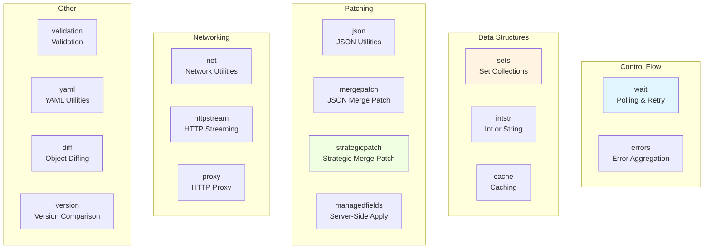

# Utility Packages

## Overview

The `pkg/util` directory contains numerous utility packages that provide common functionality used throughout Kubernetes. These packages handle everything from polling and retry logic to patching and validation.

## Key Utility Packages



## Wait Package

Provides polling, retry, and periodic execution utilities.

### Core Functions

#### Until

Run a function periodically until stopped:

```go
func Until(f func(), period time.Duration, stopCh <-chan struct{})
```

**Example:**

```go
stopCh := make(chan struct{})

// Run function every second
wait.Until(func() {
    fmt.Println("Tick")
}, time.Second, stopCh)

// Stop after 10 seconds
time.Sleep(10 * time.Second)
close(stopCh)
```

#### Forever

Run a function periodically forever:

```go
func Forever(f func(), period time.Duration)
```

**Example:**

```go
// Run forever (until process exits)
wait.Forever(func() {
    fmt.Println("Heartbeat")
}, 30*time.Second)
```

#### Poll

Poll a condition until it succeeds or times out:

```go
func Poll(interval, timeout time.Duration, condition ConditionFunc) error
```

**Example:**

```go
// Wait for pod to be ready
err := wait.Poll(time.Second, 5*time.Minute, func() (bool, error) {
    pod, err := client.CoreV1().Pods("default").Get(ctx, "my-pod", metav1.GetOptions{})
    if err != nil {
        return false, err
    }
    return pod.Status.Phase == v1.PodRunning, nil
})
```

#### PollImmediate

Like Poll, but runs condition immediately:

```go
func PollImmediate(interval, timeout time.Duration, condition ConditionFunc) error
```

#### PollInfinite

Poll indefinitely until condition succeeds:

```go
func PollInfinite(interval time.Duration, condition ConditionFunc) error
```

#### ExponentialBackoff

Poll with exponential backoff:

```go
type Backoff struct {
    Duration time.Duration  // Initial duration
    Factor   float64        // Multiplication factor
    Jitter   float64        // Jitter factor
    Steps    int            // Maximum steps
    Cap      time.Duration  // Maximum duration
}

func (b *Backoff) Step() time.Duration
```

**Example:**

```go
backoff := wait.Backoff{
    Duration: time.Second,
    Factor:   2.0,
    Jitter:   0.1,
    Steps:    5,
    Cap:      time.Minute,
}

err := wait.ExponentialBackoff(backoff, func() (bool, error) {
    // Try operation
    err := tryOperation()
    if err == nil {
        return true, nil  // Success
    }
    if isPermanentError(err) {
        return false, err  // Permanent failure
    }
    return false, nil  // Retry
})
```

### Context-Aware Functions

#### PollUntilContextCancel

Poll until context is cancelled:

```go
func PollUntilContextCancel(ctx context.Context, interval time.Duration, immediate bool, condition ConditionWithContextFunc) error
```

**Example:**

```go
ctx, cancel := context.WithTimeout(context.Background(), 5*time.Minute)
defer cancel()

err := wait.PollUntilContextCancel(ctx, time.Second, true, func(ctx context.Context) (bool, error) {
    // Check condition
    return checkCondition(), nil
})
```

### Jitter

Add randomness to avoid thundering herd:

```go
func Jitter(duration time.Duration, maxFactor float64) time.Duration
```

**Example:**

```go
// Add up to 20% jitter
interval := wait.Jitter(time.Second, 0.2)
// Returns between 1s and 1.2s
```

### Group

Manage a group of goroutines:

```go
type Group struct{}

func (g *Group) Start(f func())
func (g *Group) StartWithChannel(stopCh <-chan struct{}, f func(stopCh <-chan struct{}))
func (g *Group) StartWithContext(ctx context.Context, f func(context.Context))
func (g *Group) Wait()
```

**Example:**

```go
var group wait.Group

// Start multiple workers
for i := 0; i < 10; i++ {
    group.Start(func() {
        // Worker logic
    })
}

// Wait for all to complete
group.Wait()
```

## Sets Package

Generic set implementation using Go generics.

### Creating Sets

```go
// Empty set
s := sets.New[string]()

// Set with initial values
s := sets.New("a", "b", "c")

// From map keys
m := map[string]int{"a": 1, "b": 2}
s := sets.KeySet(m)
```

### Set Operations

```go
type Set[T comparable] map[T]Empty

// Insert elements
s.Insert("d", "e")

// Delete elements
s.Delete("a")

// Check membership
if s.Has("b") {
    fmt.Println("Set contains b")
}

// Check all
if s.HasAll("a", "b", "c") {
    fmt.Println("Set contains all")
}

// Check any
if s.HasAny("a", "b", "c") {
    fmt.Println("Set contains at least one")
}

// Length
len := s.Len()

// Clear
s.Clear()

// Is empty
if s.IsEmpty() {
    fmt.Println("Set is empty")
}
```

### Set Algebra

```go
s1 := sets.New("a", "b", "c")
s2 := sets.New("b", "c", "d")

// Union
union := s1.Union(s2)  // {a, b, c, d}

// Intersection
intersection := s1.Intersection(s2)  // {b, c}

// Difference
diff := s1.Difference(s2)  // {a}

// Symmetric difference
symDiff := s1.SymmetricDifference(s2)  // {a, d}

// Is superset
if s1.IsSuperset(s2) {
    fmt.Println("s1 contains all elements of s2")
}

// Is subset
if s1.IsSubset(s2) {
    fmt.Println("s1 is contained in s2")
}

// Equal
if s1.Equal(s2) {
    fmt.Println("Sets are equal")
}
```

### Conversion

```go
// To slice
slice := s.UnsortedList()

// To sorted slice (requires Ordered type)
sortedSlice := sets.List(s)

// Pop arbitrary element
element, ok := s.PopAny()
```

## IntStr Package

Represents a value that can be either an integer or a string.

### Type Definition

```go
type IntOrString struct {
    Type   Type
    IntVal int32
    StrVal string
}

type Type int

const (
    Int    Type = iota
    String
)
```

### Creating IntOrString

```go
// From int
val := intstr.FromInt(80)

// From int32
val := intstr.FromInt32(8080)

// From string
val := intstr.FromString("http")
```

### Using IntOrString

```go
// Get int value
if val.Type == intstr.Int {
    port := val.IntValue()
}

// Get string value
if val.Type == intstr.String {
    name := val.StrVal
}

// Get as int (converts string to int if possible)
port, err := val.IntValue()

// String representation
str := val.String()
```

### Use Cases

**Service Ports:**

```go
type ServicePort struct {
    Port       int32
    TargetPort intstr.IntOrString  // Can be port number or name
}

// By number
port := ServicePort{
    Port:       80,
    TargetPort: intstr.FromInt(8080),
}

// By name
port := ServicePort{
    Port:       80,
    TargetPort: intstr.FromString("http"),
}
```

## Errors Package

Aggregate multiple errors.

### Creating Aggregate Errors

```go
func NewAggregate(errlist []error) Aggregate
```

**Example:**

```go
var errs []error

for _, item := range items {
    if err := process(item); err != nil {
        errs = append(errs, err)
    }
}

if len(errs) > 0 {
    return utilerrors.NewAggregate(errs)
}
```

### Aggregate Interface

```go
type Aggregate interface {
    error
    Errors() []error
    Is(error) bool
}
```

### Filtering Errors

```go
// Filter out specific errors
filtered := utilerrors.FilterOut(err, func(e error) bool {
    return errors.Is(e, context.Canceled)
})

// Reduce to single error
reduced := utilerrors.Reduce(aggregate)
```

## Validation Package

Field validation utilities.

### Field Path

Track location of validation errors:

```go
type Path struct {
    name   string
    parent *Path
}

// Create path
path := field.NewPath("spec").Child("containers").Index(0).Child("name")
// Results in: spec.containers[0].name
```

### Error Types

```go
// Required field missing
field.Required(path, "field is required")

// Invalid value
field.Invalid(path, value, "must be positive")

// Not supported
field.NotSupported(path, value, []string{"supported", "values"})

// Duplicate value
field.Duplicate(path, value)

// Too long
field.TooLong(path, value, maxLength)

// Too short
field.TooShort(path, value, minLength)

// Internal error
field.InternalError(path, err)
```

### Error List

```go
type ErrorList []*Error

// Add errors
var allErrs field.ErrorList
allErrs = append(allErrs, field.Required(path, "required"))
allErrs = append(allErrs, field.Invalid(path, value, "invalid"))

// Convert to error
if len(allErrs) > 0 {
    return allErrs.ToAggregate()
}
```

## Strategic Merge Patch

Kubernetes-specific patching strategy.

### Creating Patch

```go
import "k8s.io/apimachinery/pkg/util/strategicpatch"

// Create patch between original and modified
patch, err := strategicpatch.CreateTwoWayMergePatch(
    originalJSON,
    modifiedJSON,
    dataStruct,
)
```

### Applying Patch

```go
// Apply patch to original
result, err := strategicpatch.StrategicMergePatch(
    originalJSON,
    patchJSON,
    dataStruct,
)
```

### Patch Strategies

**Merge Strategies:**

- `replace`: Replace entire field
- `merge`: Merge objects/maps
- `retainKeys`: Merge but remove unlisted keys

**List Strategies:**

- `atomic`: Replace entire list
- `merge`: Merge by patch key
- `set`: Treat as set (no duplicates)

**Example Struct Tags:**

```go
type PodSpec struct {
    Containers []Container `json:"containers" patchStrategy:"merge" patchMergeKey:"name"`
    Volumes    []Volume    `json:"volumes" patchStrategy:"merge,retainKeys" patchMergeKey:"name"`
}
```

## JSON Merge Patch

RFC 7386 JSON Merge Patch.

### Creating Patch

```go
import "k8s.io/apimachinery/pkg/util/jsonmergepatch"

patch, err := jsonmergepatch.CreateThreeWayJSONMergePatch(
    originalJSON,
    modifiedJSON,
    currentJSON,
)
```

### Applying Patch

```go
result, err := jsonmergepatch.MergePatch(originalJSON, patchJSON)
```

## Managed Fields

Server-side apply field tracking.

### Field Manager

Tracks which fields are managed by which actors:

```go
type FieldManager interface {
    Update(obj runtime.Object, manager string) error
    Apply(obj runtime.Object, manager string, force bool) error
}
```

### Use Cases

- Server-side apply
- Field ownership tracking
- Conflict detection
- Multi-actor coordination

## Net Package

Network utilities.

### Parsing

```go
// Parse CIDR
_, ipnet, err := net.ParseCIDR("10.0.0.0/8")

// Parse IP
ip := net.ParseIP("192.168.1.1")

// Parse port range
ports, err := net.ParsePortRange("8000-9000")
```

### Validation

```go
// Is valid IP
if net.IsIPv4String(str) {
    // Valid IPv4
}

if net.IsIPv6String(str) {
    // Valid IPv6
}
```

## YAML Package

YAML utilities built on JSON.

### Converting

```go
import "k8s.io/apimachinery/pkg/util/yaml"

// YAML to JSON
jsonData, err := yaml.ToJSON(yamlData)

// JSON to YAML
yamlData, err := yaml.JSONToYAML(jsonData)
```

### Streaming

```go
// Create YAML decoder
decoder := yaml.NewYAMLToJSONDecoder(reader)

// Decode multiple YAML documents
for {
    var obj map[string]interface{}
    if err := decoder.Decode(&obj); err != nil {
        if err == io.EOF {
            break
        }
        return err
    }
    // Process obj
}
```

## Diff Package

Object comparison and diffing.

### Creating Diffs

```go
import "k8s.io/apimachinery/pkg/util/diff"

// Object diff
diff := diff.ObjectDiff(obj1, obj2)
fmt.Println(diff)

// Reflect diff
diff := diff.ObjectReflectDiff(obj1, obj2)
```

## Version Package

Version comparison utilities.

### Comparing Versions

```go
import "k8s.io/apimachinery/pkg/util/version"

v1 := version.MustParse("1.20.0")
v2 := version.MustParse("1.21.0")

// Compare
if v1.LessThan(v2) {
    fmt.Println("v1 < v2")
}

if v1.AtLeast(v2) {
    fmt.Println("v1 >= v2")
}

// String representation
str := v1.String()  // "1.20.0"
```

## Common Patterns

### 1. Retry with Backoff

```go
backoff := wait.Backoff{
    Duration: time.Second,
    Factor:   2.0,
    Steps:    5,
}

err := wait.ExponentialBackoff(backoff, func() (bool, error) {
    err := tryOperation()
    return err == nil, err
})
```

### 2. Periodic Task

```go
stopCh := make(chan struct{})
defer close(stopCh)

wait.Until(func() {
    performTask()
}, 30*time.Second, stopCh)
```

### 3. Set Operations

```go
current := sets.New("a", "b", "c")
desired := sets.New("b", "c", "d")

toAdd := desired.Difference(current)     // {d}
toRemove := current.Difference(desired)  // {a}
```

### 4. Field Validation

```go
func ValidatePod(pod *v1.Pod) field.ErrorList {
    allErrs := field.ErrorList{}
    
    if pod.Name == "" {
        allErrs = append(allErrs, field.Required(
            field.NewPath("metadata", "name"),
            "name is required",
        ))
    }
    
    return allErrs
}
```

### 5. Error Aggregation

```go
var errs []error
for i, item := range items {
    if err := validate(item); err != nil {
        errs = append(errs, fmt.Errorf("item %d: %w", i, err))
    }
}
return utilerrors.NewAggregate(errs)
```

## Summary

The utility packages provide:

1. **wait**: Polling, retry, and periodic execution
2. **sets**: Generic set data structure
3. **intstr**: Integer or string type
4. **errors**: Error aggregation
5. **validation**: Field validation
6. **strategicpatch**: Kubernetes-specific patching
7. **mergepatch**: JSON merge patch
8. **managedfields**: Server-side apply tracking
9. **net**: Network utilities
10. **yaml**: YAML conversion
11. **diff**: Object comparison
12. **version**: Version comparison

These utilities are essential building blocks used throughout Kubernetes for common operations.

