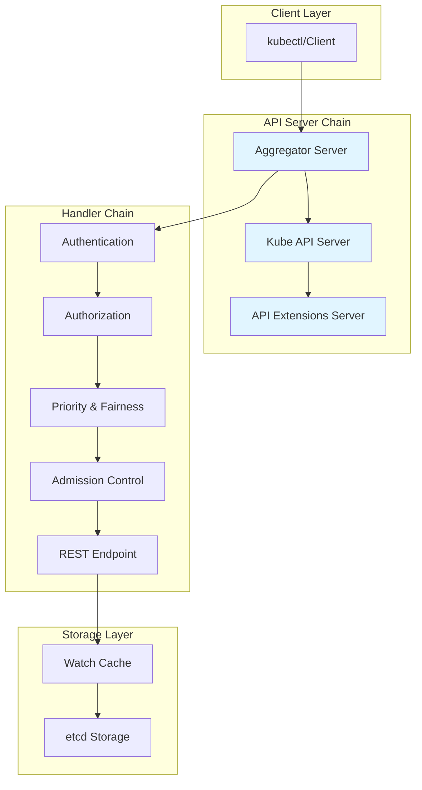
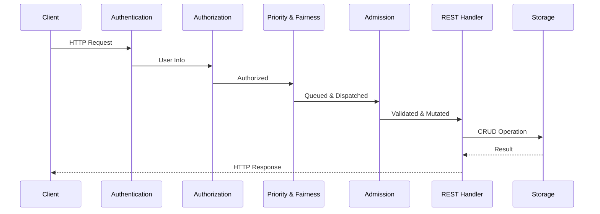
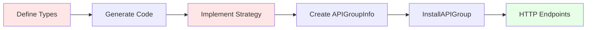
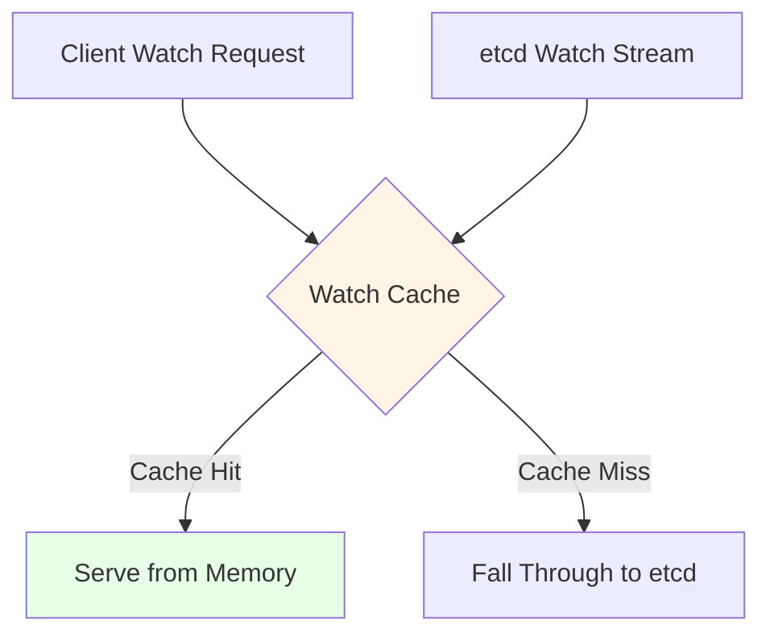

# k8s.io/apiserver - Overview

## Introduction

The `k8s.io/apiserver` library is the foundational framework for building Kubernetes-style API servers. It provides the complete machinery for creating aggregated API servers with delegated authentication and authorization, kubectl-compatible discovery, admission control chains, and versioned types.

This library serves as the foundation for:
- The main Kubernetes API server (`kube-apiserver`)
- The API aggregation layer (`kube-aggregator`)
- Custom extension API servers
- The API extensions server (`apiextensions-apiserver`)

## Purpose

The apiserver library provides a generic, reusable framework that allows developers to:

1. **Build Custom API Servers**: Create extension API servers that integrate seamlessly with the Kubernetes API
2. **Implement Admission Plugins**: Develop custom admission control logic to validate or mutate API requests
3. **Extend the API Surface**: Add new API groups and resources that behave like core Kubernetes APIs
4. **Leverage Standard Patterns**: Use battle-tested patterns for authentication, authorization, storage, and more

## High-Level Architecture

## Server Composition

The Kubernetes API server is not a single monolithic server but a **server chain** of three distinct `GenericAPIServer` instances:

### 1. Aggregator Server
- **Purpose**: Handles the `apiregistration.k8s.io` API and proxies requests to extension API servers
- **Mechanism**: Watches `APIService` objects and routes requests based on API group registration
- **Use Case**: Enables third-party APIs to be seamlessly integrated into the main API server

### 2. Kube API Server (Core)
- **Purpose**: Serves all built-in Kubernetes APIs (core/v1, apps/v1, etc.)
- **Mechanism**: Configured with REST storage strategies for all core resources
- **Delegation**: Passes unhandled requests to the next server in the chain

### 3. API Extensions Server
- **Purpose**: Handles CustomResourceDefinitions (CRDs)
- **Mechanism**: Dynamically creates REST storage handlers when CRDs are created
- **Use Case**: Most common extension pattern for adding new resource types

## Request Flow

Every request flows through a standard chain of HTTP handlers (filters):

### Handler Chain Stages

1. **Authentication** (`pkg/authentication`)
   - Identifies the user making the request
   - Pluggable system supporting multiple authenticators (certs, tokens, OIDC)
   - First successful authenticator wins

2. **Authorization** (`pkg/authorization`)
   - Checks if the user is permitted to perform the action
   - Pluggable system (RBAC, Node, Webhook)
   - Requires at least one authorizer to allow the request

3. **Priority and Fairness** (`pkg/util/flowcontrol`)
   - Manages request concurrency to prevent overload
   - Classifies requests into FlowSchemas and PriorityLevels
   - Ensures critical operations are not starved

4. **Admission Control** (`pkg/admission`)
   - Primary mechanism for policy enforcement
   - Request body is deserialized at this stage
   - Chain of plugins that can mutate or validate objects

5. **REST Endpoint Handling** (`pkg/endpoints`)
   - Dispatches to appropriate REST handler
   - Installed by the APIInstaller
   - Performs CRUD operations via storage layer

## Core Components

### GenericAPIServer (`pkg/server`)

The heart of any API server. Responsibilities include:
- Assembling and running the HTTP serving stack
- Managing the handler chain
- Installing API groups
- Handling server lifecycle (startup, shutdown, health checks)

### API Group Registration

The process of adding a new API group:

1. **Define Types**: Create Go structs for the API resources
2. **Generate Code**: Use code generators for deep-copy, conversion, defaulting
3. **Implement Strategy**: Write validation and business logic
4. **Create APIGroupInfo**: Bundle Scheme, Storage, and version information
5. **Install API Group**: Register with GenericAPIServer
6. **HTTP Endpoints**: Automatically exposed by APIInstaller

### Storage Layer (`pkg/storage`)

Provides an abstraction over the underlying storage backend (typically etcd):

- **Interface**: Defines CRUD operations and watch semantics
- **Watch Cache**: In-memory cache to reduce etcd load
- **Versioning**: Optimistic concurrency via ResourceVersion
- **Transformation**: Encryption at rest, value transformers

### Registry (`pkg/registry`)

Bridges the REST API and storage layer:

- **genericregistry.Store**: Generic CRUD implementation
- **Strategy Pattern**: Resource-specific validation and business logic
- **REST Storage**: Implements the REST interface for resources

## Key Features

### Watch Cache

To handle high volumes of watch requests without overwhelming etcd:

- Performs initial LIST to get current state
- Maintains a watch stream from etcd
- Serves most requests from memory
- Falls back to etcd when necessary

### Optimistic Concurrency

Uses `resourceVersion` for conflict detection:

- Maps to etcd's `mod_revision`
- Client must provide current resourceVersion for updates
- Server rejects with 409 Conflict if version doesn't match
- Forces read-modify-write workflow

### Server-Side Apply

Declarative, intent-based patch mechanism:

- Tracks field ownership via `managedFields`
- Allows multiple actors to manage different fields
- Prevents accidental overwrites
- Supports conflict resolution

## Discovery and OpenAPI

The API server provides:

- `/apis` - Discovery endpoints for API groups
- `/openapi/v2` - OpenAPI 2.0 specification
- `/openapi/v3` - OpenAPI 3.0 specification

Generation process:

## Security & Observability

### Security

- **mTLS**: Primary authentication for system components
- **Service Account Tokens**: API server acts as OIDC provider
- **Audit Logging**: Policy-driven event logging pipeline
- **Encryption at Rest**: Transparent encryption of data in etcd

### Observability

- **Metrics**: Prometheus-compatible metrics
- **Tracing**: OpenTelemetry integration
- **Audit Events**: Comprehensive audit trail
- **Health Checks**: Readiness and liveness endpoints

## Package Organization

The apiserver library is organized into the following key packages:

| Package | Purpose |
|---------|---------|
| `pkg/admission` | Admission control framework and plugins |
| `pkg/apis` | Internal API types for apiserver configuration |
| `pkg/audit` | Audit event logging and policy evaluation |
| `pkg/authentication` | Authentication framework and authenticators |
| `pkg/authorization` | Authorization framework and authorizers |
| `pkg/cel` | Common Expression Language (CEL) support |
| `pkg/endpoints` | REST endpoint installation and handlers |
| `pkg/features` | Feature gate definitions |
| `pkg/quota` | Resource quota evaluation |
| `pkg/reconcilers` | Reconciliation utilities |
| `pkg/registry` | Storage registry and REST storage implementations |
| `pkg/server` | Core GenericAPIServer and configuration |
| `pkg/storage` | Storage interface and implementations |
| `pkg/storageversion` | Storage version management |
| `pkg/util` | Utility packages (flowcontrol, webhook, etc.) |
| `pkg/validation` | Validation metrics and utilities |
| `pkg/warning` | Warning header support |

## Extension Patterns

### 1. CustomResourceDefinitions (CRDs)

**Recommended for most use cases**

- Declarative, schema-based resource definitions
- No custom code required
- Stored in etcd
- Automatic CRUD operations
- Built-in validation, versioning, defaulting

### 2. API Aggregation

**For advanced use cases requiring custom logic**

- Full control over API behavior
- Custom storage backends
- Complex business logic
- Non-CRUD subresources (e.g., /logs, /exec)

### 3. Admission Webhooks

**For policy enforcement**

- ValidatingWebhookConfiguration
- MutatingWebhookConfiguration
- External policy enforcement
- No API server code changes

### 4. Built-in Admission Plugins

**For core system capabilities**

- Compiled into the API server
- Highest performance
- Deepest integration
- Requires code changes to kube-apiserver

## Design Principles

1. **Composability**: Server chain allows layering of functionality
2. **Pluggability**: Authentication, authorization, admission are all pluggable
3. **Extensibility**: Multiple patterns for extending the API surface
4. **Performance**: Watch cache and efficient storage access patterns
5. **Consistency**: Optimistic concurrency and strong consistency guarantees
6. **Security**: Defense in depth with multiple security layers
7. **Observability**: Comprehensive metrics, tracing, and audit logging

## Compatibility

**Important**: There are NO compatibility guarantees for this repository. It is in direct support of Kubernetes, so branches track Kubernetes versions and maintain compatibility with that repository.

## Next Steps

To dive deeper into specific components:

- [Admission Control](./01-admission.md) - Admission framework and plugins
- [APIs](./02-apis.md) - Internal API types
- [Audit](./03-audit.md) - Audit logging system
- [Authentication](./04-authentication.md) - Authentication framework
- [Authorization](./05-authorization.md) - Authorization framework
- [CEL](./06-cel.md) - Common Expression Language support
- [Endpoints](./07-endpoints.md) - REST endpoint handling
- [Features](./08-features.md) - Feature gates
- [Quota](./09-quota.md) - Resource quota system
- [Reconcilers](./10-reconcilers.md) - Reconciliation utilities
- [Registry](./11-registry.md) - Storage registry
- [Server](./12-server.md) - GenericAPIServer core
- [Storage](./13-storage.md) - Storage layer
- [Storage Version](./14-storageversion.md) - Storage version management
- [Utilities](./15-util.md) - Utility packages
- [Validation](./16-validation.md) - Validation system
- [Warning](./17-warning.md) - Warning headers

## References

- [Kubernetes API Concepts](https://kubernetes.io/docs/reference/using-api/api-concepts/)
- [API Aggregation](https://kubernetes.io/docs/concepts/extend-kubernetes/api-extension/apiserver-aggregation/)
- [Custom Resources](https://kubernetes.io/docs/concepts/extend-kubernetes/api-extension/custom-resources/)
- [Admission Controllers](https://kubernetes.io/docs/reference/access-authn-authz/admission-controllers/)
