# pkg/admission - Admission Control Framework

## Overview

The `pkg/admission` package provides the admission control framework for Kubernetes API servers. Admission control is the primary mechanism for policy enforcement in Kubernetes, allowing plugins to intercept API requests after authentication and authorization but before objects are persisted to storage.

Admission controllers can:
- **Mutate** objects (modify the request)
- **Validate** objects (accept or reject the request)
- **Add annotations** to audit events
- **Request re-invocation** after mutations

## Architecture

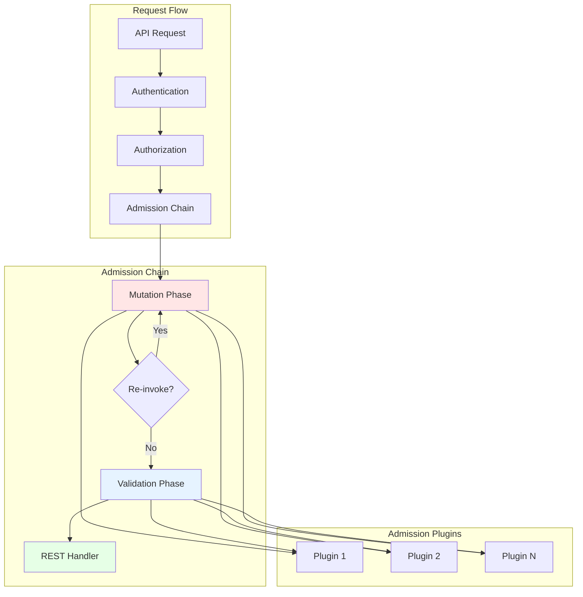

## Core Concepts

### Admission Interface

The base interface that all admission plugins must implement:

```go
type Interface interface {
    Handles(operation Operation) bool
}
```

Operations include:
- `CREATE` - Creating a new object
- `UPDATE` - Updating an existing object
- `DELETE` - Deleting an object
- `CONNECT` - Connecting to an object (e.g., exec, attach, port-forward)

### Mutation vs Validation

Admission plugins can implement one or both interfaces:

**MutationInterface**: Plugins that modify objects
```go
type MutationInterface interface {
    Interface
    Admit(ctx context.Context, a Attributes, o ObjectInterfaces) error
}
```

**ValidationInterface**: Plugins that validate objects (read-only)
```go
type ValidationInterface interface {
    Interface
    Validate(ctx context.Context, a Attributes, o ObjectInterfaces) error
}
```

### Admission Attributes

The `Attributes` interface provides information about the request:

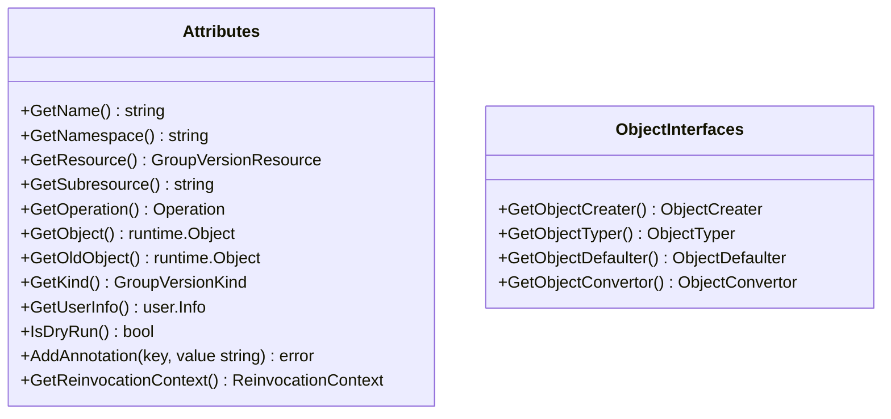

Key attributes:
- **Name/Namespace**: Identity of the object
- **Resource**: The resource being accessed (e.g., "pods")
- **Subresource**: Subresource if applicable (e.g., "status", "exec")
- **Operation**: CREATE, UPDATE, DELETE, or CONNECT
- **Object**: The new/current object
- **OldObject**: The existing object (UPDATE/DELETE only)
- **UserInfo**: Information about the requesting user
- **DryRun**: Whether this is a dry-run request

## Admission Chain

The admission chain processes requests in two phases:

### Phase 1: Mutation

All mutation plugins run in order:

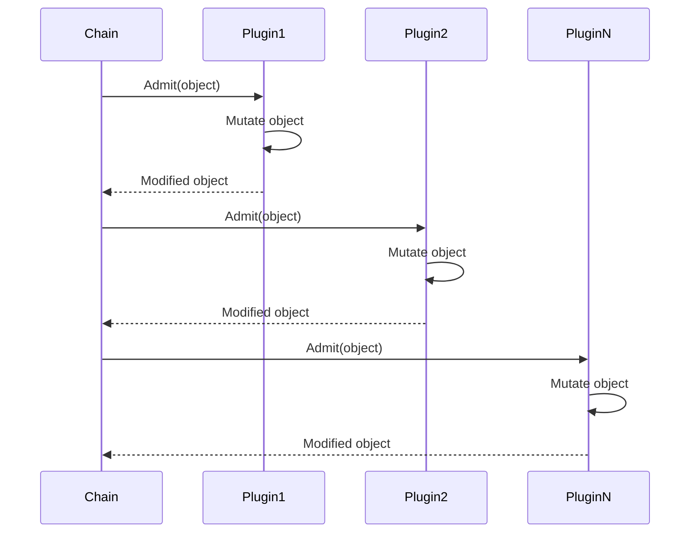

### Phase 2: Validation

All validation plugins run in order:

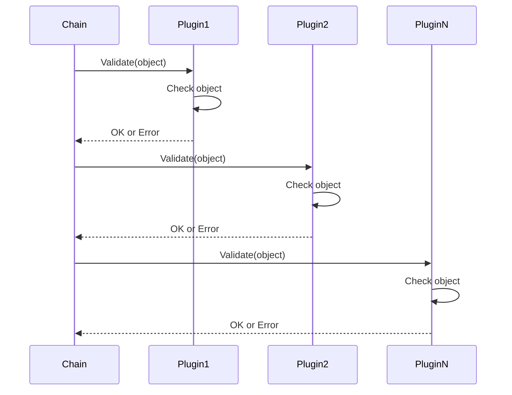

**Important**: The chain stops immediately on the first error.

## Re-invocation

Some admission plugins (particularly webhooks) may need to be re-invoked after other plugins have mutated the object:

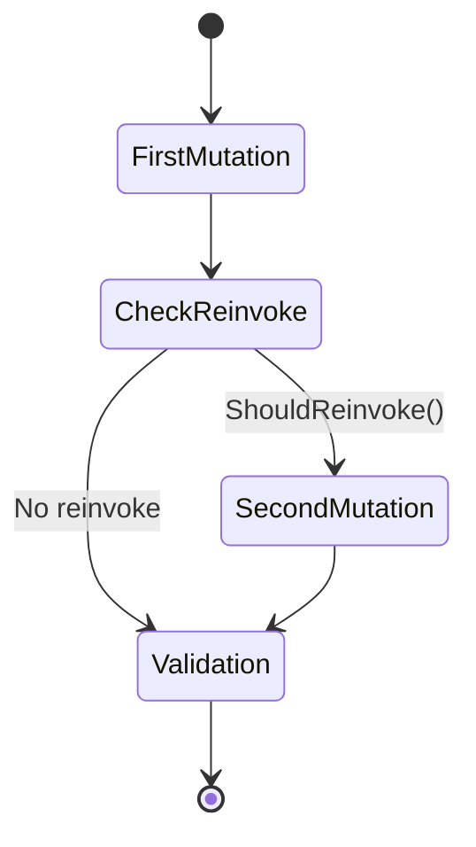

The `ReinvocationContext` tracks:
- **IsReinvoke()**: Whether this is a re-invocation
- **ShouldReinvoke()**: Whether any plugin requested re-invocation
- **SetShouldReinvoke()**: Request re-invocation
- **SetValue()/Value()**: Store plugin-specific state between invocations

## Plugin Registration

### Plugin Factory

Plugins are registered via factory functions:

```go
type Factory func(config io.Reader) (Interface, error)
```

### Registration Process

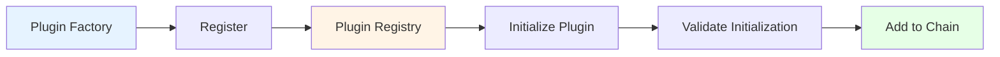

1. **Register**: Plugin factory is registered with a name
2. **Initialize**: Plugin is created from factory with configuration
3. **Validate**: Plugin's initialization is validated
4. **Chain**: Plugin is added to the admission chain

### Plugin Initialization

Plugins can implement `PluginInitializer` to receive shared resources:

```go
type PluginInitializer interface {
    Initialize(plugin Interface)
}
```

Common initializers provide:
- Kubernetes client
- Informers for watching resources
- Authorization interface
- Quota registry

## Configuration

### Admission Configuration

Admission plugins are configured via `AdmissionConfiguration`:

```yaml
apiVersion: apiserver.config.k8s.io/v1
kind: AdmissionConfiguration
plugins:
- name: PodSecurity
  configuration:
    apiVersion: pod-security.admission.config.k8s.io/v1
    kind: PodSecurityConfiguration
    defaults:
      enforce: "baseline"
      audit: "restricted"
      warn: "restricted"
```

### Configuration Provider

The `ConfigProvider` interface supplies configuration to plugins:

```go
type ConfigProvider interface {
    ConfigFor(pluginName string) (io.Reader, error)
}
```

## Handler Base Class

The `Handler` struct provides common functionality:

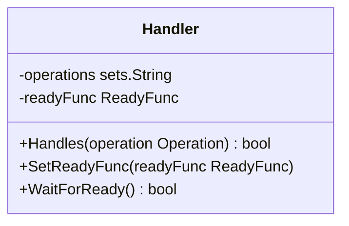

Features:
- **Operation Filtering**: Only handle specific operations
- **Readiness**: Wait for plugin to be ready (e.g., cache warm-up)
- **Timeout**: 10-second timeout for readiness

## Annotations

Admission plugins can add annotations to audit events:

```go
// Add annotation with Metadata audit level
err := attributes.AddAnnotation("plugin.admission.k8s.io/decision", "allowed")

// Add annotation with custom audit level
err := attributes.AddAnnotationWithLevel(
    "plugin.admission.k8s.io/details",
    "detailed-info",
    auditinternal.LevelRequest,
)
```

**Annotation Key Format**: Must be a qualified name like `domain/key`
- Example: `podsecuritypolicy.admission.k8s.io/admit-policy`

**Rules**:
- Keys must be unique (no overwriting)
- Minimum audit level is Metadata
- Annotations are included in audit events

## Built-in Admission Plugins

The package includes several built-in plugins:

### 1. Namespace Lifecycle

Located in `plugin/namespace/lifecycle/`:

- Prevents operations on namespaces being deleted
- Rejects creates in non-existent namespaces
- Handles namespace finalization

### 2. Resource Quota

Located in `plugin/resourcequota/`:

- Enforces resource quota constraints
- Tracks resource usage per namespace
- Prevents over-allocation

### 3. Webhook Admission

Located in `plugin/webhook/`:

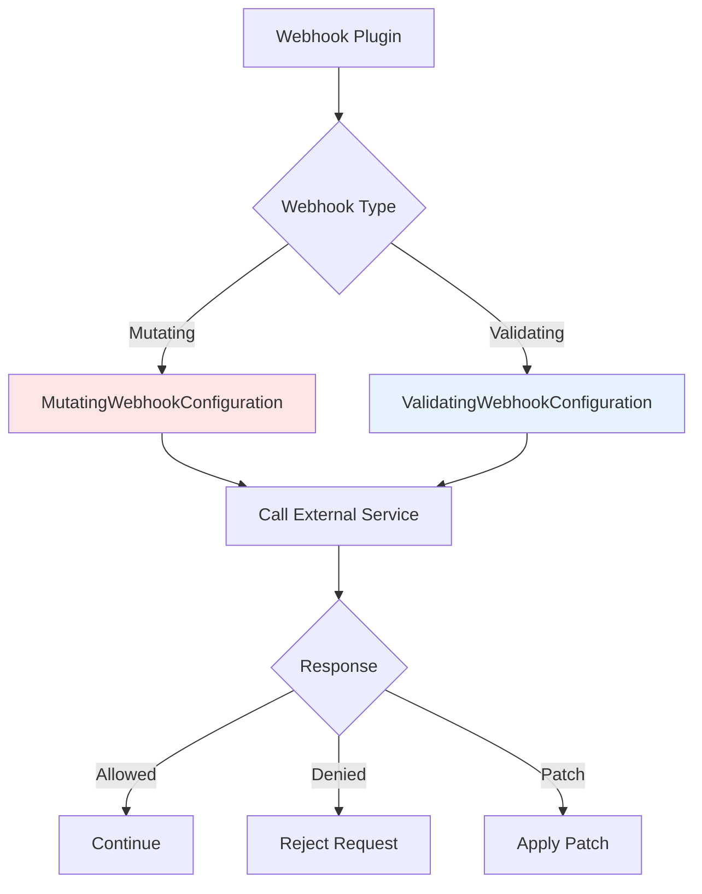

Features:
- **Mutating Webhooks**: Can modify objects via JSON patches
- **Validating Webhooks**: Can only allow/deny requests
- **Match Conditions**: CEL expressions for fine-grained matching
- **Failure Policy**: Fail open or closed on errors
- **Timeout**: Configurable timeout for webhook calls

### 4. CEL Admission Policies

Located in `plugin/cel/` and `plugin/policy/`:

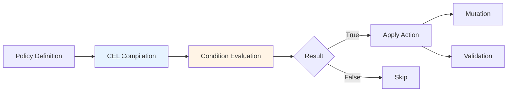

**Validating Admission Policies**:
- CEL expressions for validation
- No code required
- Supports parameter resources
- Match conditions for targeting

**Mutating Admission Policies**:
- CEL expressions for mutations
- JSON patch generation
- Composable transformations

### 5. Authorizer Plugin

Located in `plugin/authorizer/`:

- Caching authorizer wrapper
- Reduces authorization overhead
- Improves performance for repeated checks

## Error Handling

Admission plugins can return errors to reject requests:

```go
func (p *myPlugin) Validate(ctx context.Context, a Attributes, o ObjectInterfaces) error {
    if !isValid(a.GetObject()) {
        return fmt.Errorf("object is invalid: %v", reason)
    }
    return nil
}
```

Error types in `errors.go`:
- **Forbidden**: Policy violation (HTTP 403)
- **Invalid**: Validation failure (HTTP 422)
- **NotSupported**: Operation not supported (HTTP 400)

## Metrics

Admission plugins can emit metrics via `pkg/admission/metrics/`:

- **admission_controller_admission_duration_seconds**: Latency histogram
- **admission_webhook_admission_duration_seconds**: Webhook latency
- **admission_webhook_rejection_count**: Rejection counter

## Testing

The package provides testing utilities in `testing/`:

```go
// Create a test admission chain
handler := NewChainHandler(plugin1, plugin2)

// Create test attributes
attrs := NewAttributesRecord(
    object,      // new object
    oldObject,   // old object (or nil)
    kind,        // GroupVersionKind
    namespace,   // namespace
    name,        // name
    resource,    // GroupVersionResource
    subresource, // subresource (or "")
    operation,   // CREATE, UPDATE, DELETE, CONNECT
    options,     // operation options
    dryRun,      // dry run flag
    userInfo,    // user info
)

// Test mutation
err := handler.Admit(ctx, attrs, objectInterfaces)

// Test validation
err := handler.Validate(ctx, attrs, objectInterfaces)
```

## Package Structure

```
pkg/admission/
├── interfaces.go          # Core interfaces (Interface, MutationInterface, ValidationInterface)
├── attributes.go          # Attributes implementation
├── chain.go              # Chain handler implementation
├── handler.go            # Base Handler struct
├── plugins.go            # Plugin registry and factory
├── config.go             # Configuration loading
├── reinvocation.go       # Re-invocation handler
├── errors.go             # Error types
├── decorator.go          # Plugin decorators
├── audit.go              # Audit integration
├── configuration/        # Configuration API types
├── initializer/          # Plugin initializers
├── metrics/              # Metrics collection
├── testing/              # Testing utilities
└── plugin/               # Built-in plugins
    ├── authorizer/       # Caching authorizer
    ├── cel/              # CEL support
    ├── namespace/        # Namespace lifecycle
    ├── policy/           # Admission policies
    │   ├── generic/      # Generic policy framework
    │   ├── mutating/     # Mutating policies
    │   └── validating/   # Validating policies
    ├── resourcequota/    # Resource quota enforcement
    └── webhook/          # Webhook admission
        ├── mutating/     # Mutating webhooks
        ├── validating/   # Validating webhooks
        ├── config/       # Webhook configuration
        ├── errors/       # Webhook errors
        ├── matchconditions/ # Match condition evaluation
        └── predicates/   # Matching predicates
```

## Key Workflows

### Creating an Admission Plugin

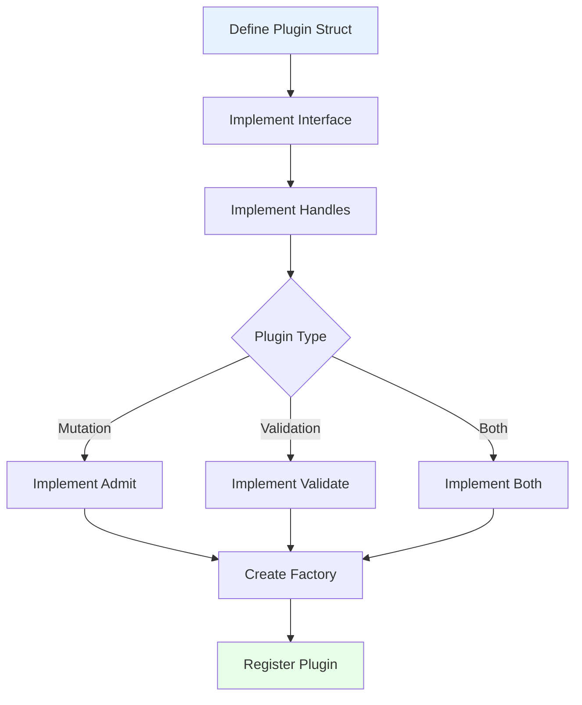

### Processing a Request

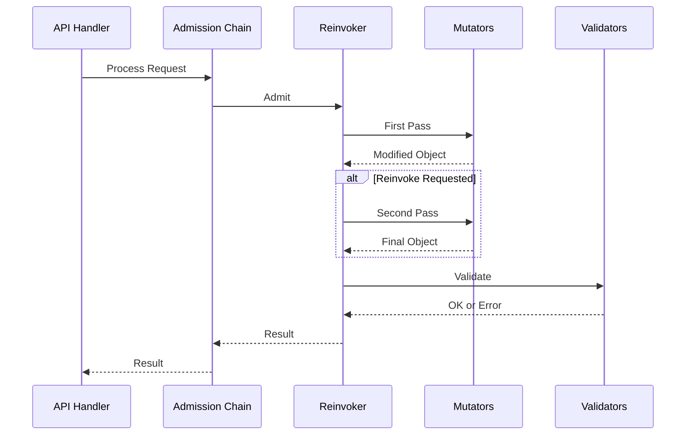

## Best Practices

### 1. Operation Filtering

Only handle operations you care about:

```go
func NewPlugin() *Plugin {
    return &Plugin{
        Handler: admission.NewHandler(admission.Create, admission.Update),
    }
}
```

### 2. Readiness

Implement readiness for plugins that need warm-up:

```go
func (p *Plugin) SetReadyFunc(readyFunc admission.ReadyFunc) {
    p.Handler.SetReadyFunc(readyFunc)
}

// In initialization
p.SetReadyFunc(func() bool {
    return p.informer.HasSynced()
})
```

### 3. Error Messages

Provide clear, actionable error messages:

```go
return fmt.Errorf("pod %s/%s violates policy: %v", 
    namespace, name, reason)
```

### 4. Annotations

Use annotations for audit trail:

```go
attributes.AddAnnotation(
    "myplugin.admission.k8s.io/decision",
    fmt.Sprintf("allowed: %s", reason),
)
```

### 5. Performance

- Minimize work in hot path
- Use informers for resource lookups
- Cache expensive computations
- Fail fast on obvious violations

### 6. Testing

- Test both mutation and validation phases
- Test error cases
- Test dry-run behavior
- Test re-invocation scenarios

## Integration with API Server

The admission chain is integrated into the API server via `pkg/server/config.go`:

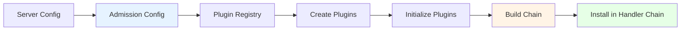

The admission chain is invoked after authentication and authorization but before the object is persisted to storage.

## Related Packages

- **pkg/apis/apiserver**: Configuration API types
- **pkg/audit**: Audit event integration
- **pkg/authentication**: User information
- **pkg/authorization**: Authorization checks within plugins
- **pkg/cel**: CEL expression evaluation
- **pkg/endpoints**: REST handler integration

## References

- [Kubernetes Admission Controllers Documentation](https://kubernetes.io/docs/reference/access-authn-authz/admission-controllers/)
- [Dynamic Admission Control](https://kubernetes.io/docs/reference/access-authn-authz/extensible-admission-controllers/)
- [Validating Admission Policies](https://kubernetes.io/docs/reference/access-authn-authz/validating-admission-policy/)
- [Pod Security Admission](https://kubernetes.io/docs/concepts/security/pod-security-admission/)
