# pkg/apis - Internal API Types

## Overview

The `pkg/apis` package contains internal API type definitions used by the apiserver itself. These are configuration types for various apiserver components, not the Kubernetes resource types that the API server serves.

## Purpose

This package defines:
- **Admission Configuration**: Configuration for admission plugins
- **Audit Configuration**: Audit policy and event types
- **Egress Selector Configuration**: Network egress configuration
- **Encryption Configuration**: Encryption at rest configuration
- **Tracing Configuration**: Distributed tracing configuration

## Package Structure

```
pkg/apis/
├── apidiscovery/        # API discovery types
│   ├── v2/              # Discovery v2 API
│   └── v2beta1/         # Discovery v2beta1 API
├── apiserver/           # API server configuration types
│   ├── v1/              # v1 API version
│   ├── v1alpha1/        # v1alpha1 API version
│   ├── v1beta1/         # v1beta1 API version
│   ├── install/         # Scheme installation
│   ├── load/            # Configuration loading
│   └── validation/      # Configuration validation
├── audit/               # Audit event types
│   ├── v1/              # v1 API version
│   ├── install/         # Scheme installation
│   ├── validation/      # Event validation
│   └── fuzzer/          # Fuzzing support
├── cel/                 # CEL configuration
├── example/             # Example API types (for testing)
├── example2/            # Example API types (for testing)
└── flowcontrol/         # Flow control bootstrap configuration
```

## Key API Types

### AdmissionConfiguration

Configuration for admission control plugins:

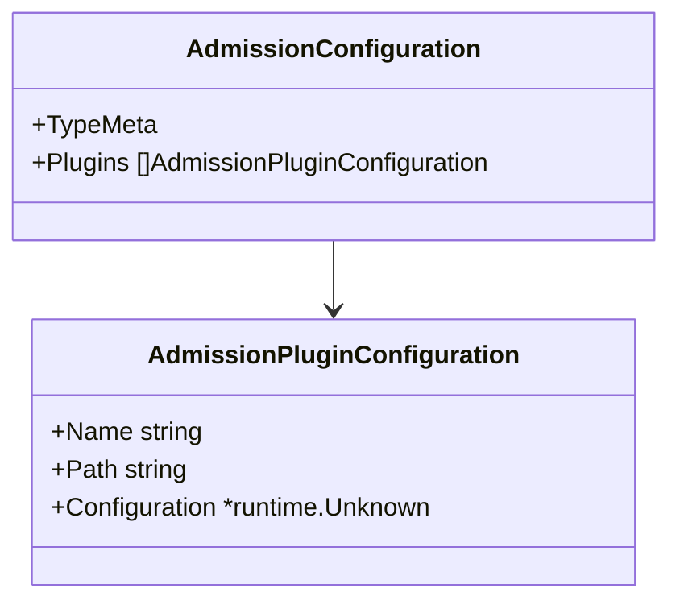

**Fields**:
- **Plugins**: List of plugin configurations
  - **Name**: Plugin name (must match registered name)
  - **Path**: Path to configuration file
  - **Configuration**: Embedded configuration object

**Example**:
```yaml
apiVersion: apiserver.config.k8s.io/v1
kind: AdmissionConfiguration
plugins:
- name: PodSecurity
  configuration:
    apiVersion: pod-security.admission.config.k8s.io/v1
    kind: PodSecurityConfiguration
    defaults:
      enforce: "baseline"
```

### EgressSelectorConfiguration

Configuration for network egress (e.g., konnectivity):

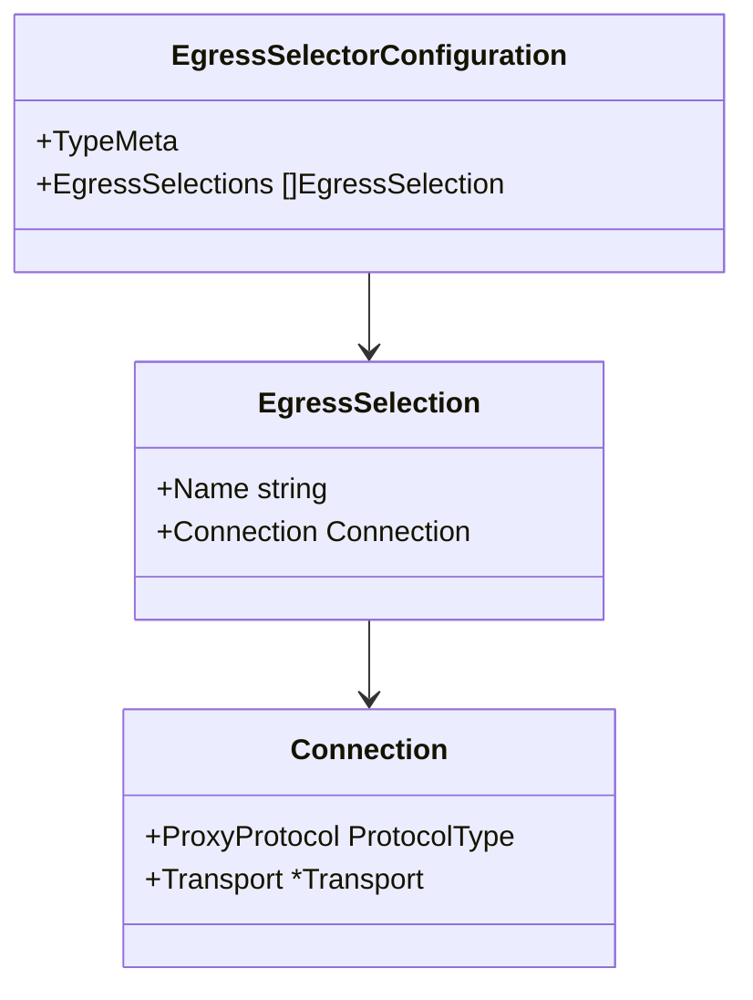

**Egress Types**:
- **controlplane**: Control plane communication
- **etcd**: etcd communication
- **cluster**: Cluster communication

**Protocol Types**:
- **HTTPConnect**: HTTP CONNECT proxy
- **GRPC**: gRPC proxy
- **Direct**: Direct connection (no proxy)

### EncryptionConfiguration

Configuration for encryption at rest:

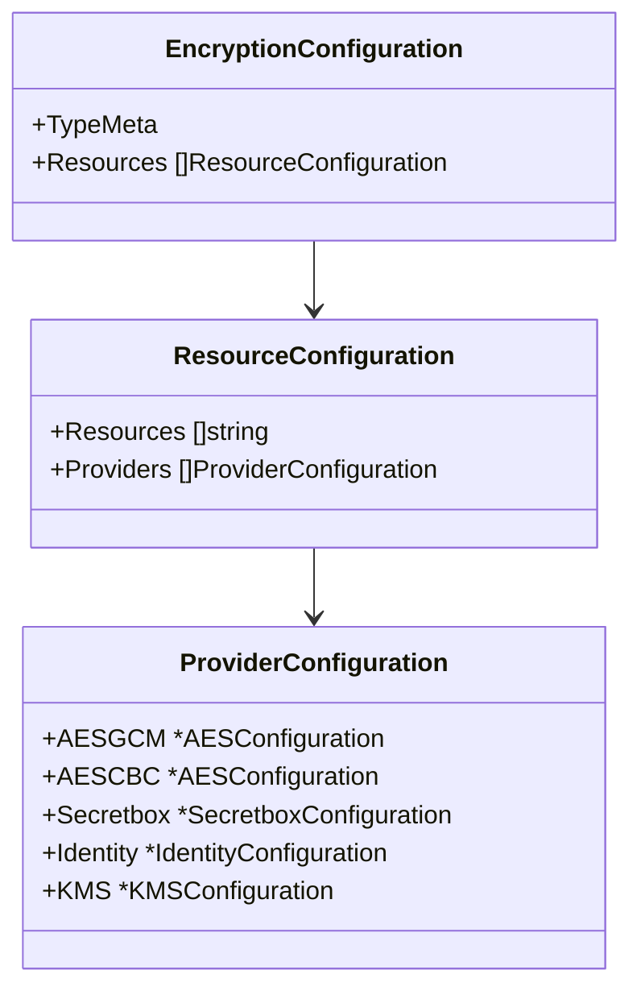

**Provider Types**:
- **AESGCM**: AES-GCM encryption
- **AESCBC**: AES-CBC encryption
- **Secretbox**: NaCl Secretbox encryption
- **Identity**: No encryption (plaintext)
- **KMS**: External KMS provider

### TracingConfiguration

Configuration for distributed tracing:

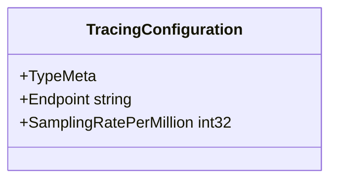

**Fields**:
- **Endpoint**: OpenTelemetry collector endpoint
- **SamplingRatePerMillion**: Sampling rate (0-1000000)

## Audit API Types

Located in `pkg/apis/audit/`:

### Event

The core audit event type:

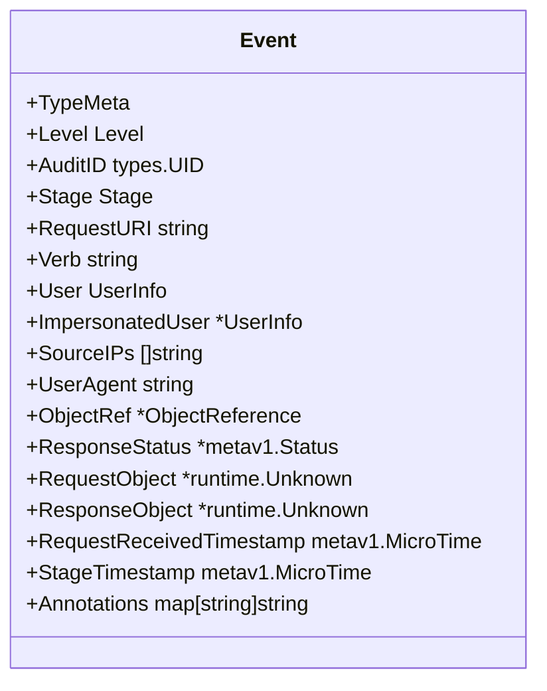

### Audit Levels

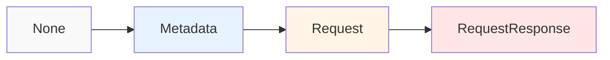

- **None**: Don't log events
- **Metadata**: Log request metadata (user, timestamp, resource, verb)
- **Request**: Log metadata + request body
- **RequestResponse**: Log metadata + request body + response body

### Audit Stages

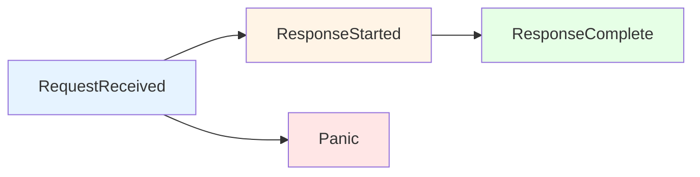

- **RequestReceived**: Request received by handler
- **ResponseStarted**: Response headers sent
- **ResponseComplete**: Response body sent
- **Panic**: Handler panicked

### Policy

Audit policy configuration:

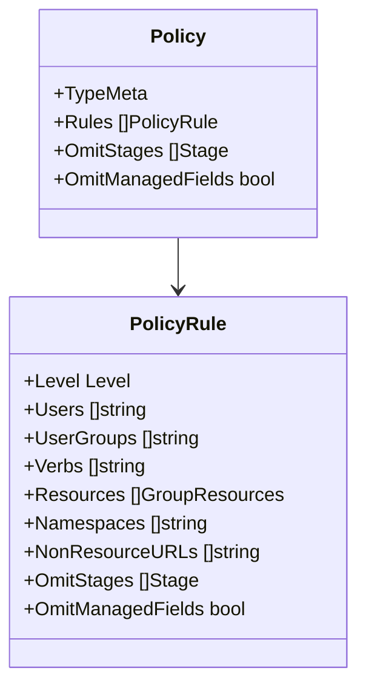

**Example Policy**:
```yaml
apiVersion: audit.k8s.io/v1
kind: Policy
rules:
- level: Metadata
  resources:
  - group: ""
    resources: ["secrets", "configmaps"]
- level: Request
  verbs: ["create", "update", "patch", "delete"]
- level: None
  resources:
  - group: ""
    resources: ["events"]
```

## API Discovery Types

Located in `pkg/apis/apidiscovery/`:

### APIGroupDiscovery

Aggregated discovery format (v2):

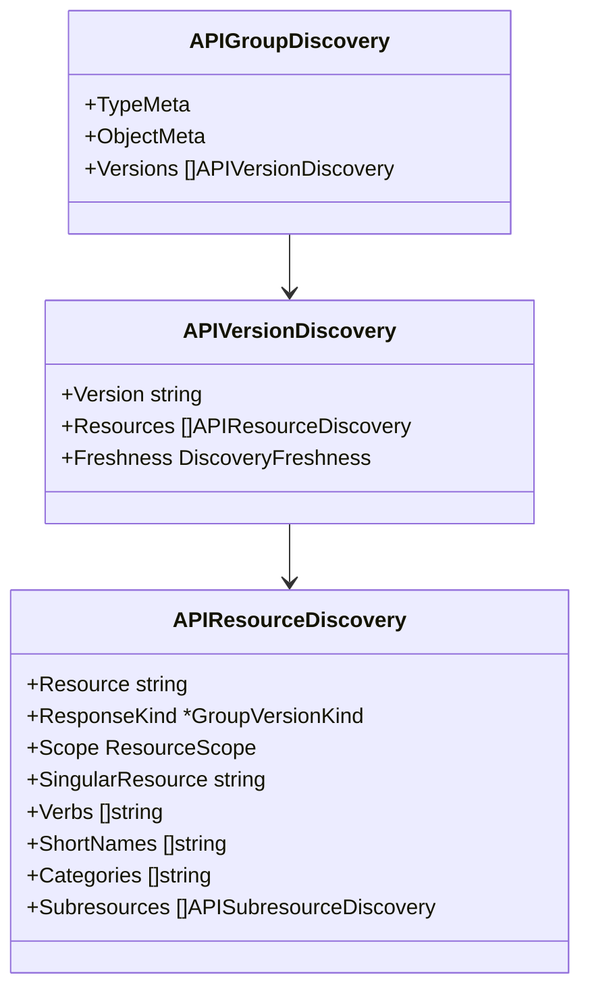

**Benefits of v2 Discovery**:
- Aggregated format (fewer API calls)
- Includes subresources
- Freshness indication
- More efficient for large clusters

## Scheme Registration

Each API group has an `install` package that registers types with the scheme:

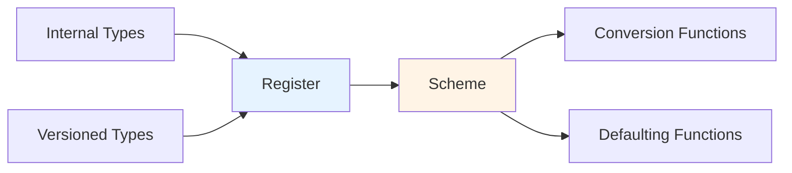

**Installation Process**:
1. Define internal types (unversioned)
2. Define versioned types (v1, v1alpha1, etc.)
3. Generate conversion functions
4. Generate defaulting functions
5. Register all with scheme

## Validation

Located in `validation/` subdirectories:

### EncryptionConfiguration Validation

Validates encryption configuration:
- Provider configuration correctness
- Key lengths and formats
- Resource specifications
- Provider ordering

### Audit Policy Validation

Validates audit policies:
- Rule completeness
- Level specifications
- Resource and verb specifications
- Stage configurations

## Configuration Loading

Located in `pkg/apis/apiserver/load/`:

### Loading Process

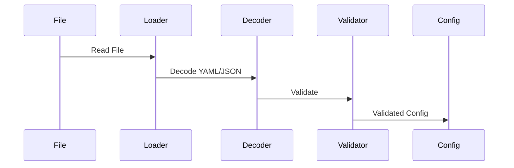

**Steps**:
1. Read configuration file
2. Decode YAML/JSON
3. Convert to internal version
4. Apply defaults
5. Validate configuration
6. Return typed config object

## Code Generation

Types in this package use code generators:

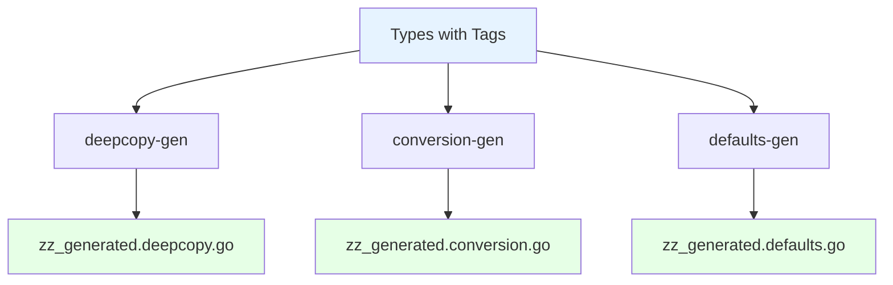

**Generated Files**:
- `zz_generated.deepcopy.go`: DeepCopy methods
- `zz_generated.conversion.go`: Version conversion
- `zz_generated.defaults.go`: Default value application

## Usage Examples

### Loading Admission Configuration

```go
import (
    "k8s.io/apiserver/pkg/admission"
    "k8s.io/apiserver/pkg/apis/apiserver"
)

// Read configuration
configProvider, err := admission.ReadAdmissionConfiguration(
    pluginNames,
    configFilePath,
    configScheme,
)

// Get plugin-specific config
pluginConfig, err := configProvider.ConfigFor("MyPlugin")
```

### Creating Audit Events

```go
import (
    auditinternal "k8s.io/apiserver/pkg/apis/audit"
)

event := &auditinternal.Event{
    Level: auditinternal.LevelMetadata,
    Stage: auditinternal.StageResponseComplete,
    RequestURI: req.URL.RequestURI(),
    Verb: req.Method,
    User: *user,
    ObjectRef: &auditinternal.ObjectReference{
        Resource: resource,
        Namespace: namespace,
        Name: name,
    },
}
```

## Best Practices

### 1. Version Management

Always use versioned types for external configuration:
- Read as versioned type (v1, v1alpha1, etc.)
- Convert to internal type for processing
- Apply defaults after conversion

### 2. Validation

Validate configuration early:
- Validate on load
- Provide clear error messages
- Check for common mistakes

### 3. Defaults

Apply sensible defaults:
- Use defaulting functions
- Document default behavior
- Make defaults explicit in examples

### 4. Compatibility

Maintain backward compatibility:
- Support multiple versions
- Provide conversion functions
- Deprecate gracefully

## Related Packages

- **pkg/admission**: Uses AdmissionConfiguration
- **pkg/audit**: Uses audit Event and Policy types
- **pkg/server**: Uses all configuration types
- **pkg/storage**: Uses EncryptionConfiguration

## References

- [API Server Configuration](https://kubernetes.io/docs/reference/config-api/apiserver-config.v1/)
- [Audit Configuration](https://kubernetes.io/docs/reference/config-api/apiserver-audit.v1/)
- [Encryption at Rest](https://kubernetes.io/docs/tasks/administer-cluster/encrypt-data/)
