# pkg/audit - Audit Logging System

## Overview

The `pkg/audit` package implements the audit logging system for Kubernetes API servers. It provides a policy-driven event logging pipeline that records API requests for security, compliance, and debugging purposes.

## Purpose

The audit system:
- **Records API Activity**: Logs all API requests with configurable detail levels
- **Policy-Based Filtering**: Controls what gets logged based on user, resource, verb, etc.
- **Multiple Backends**: Supports various storage backends (log files, webhooks, etc.)
- **Performance Optimized**: Minimizes impact on API server performance
- **Compliance Support**: Provides audit trail for regulatory requirements

## Architecture

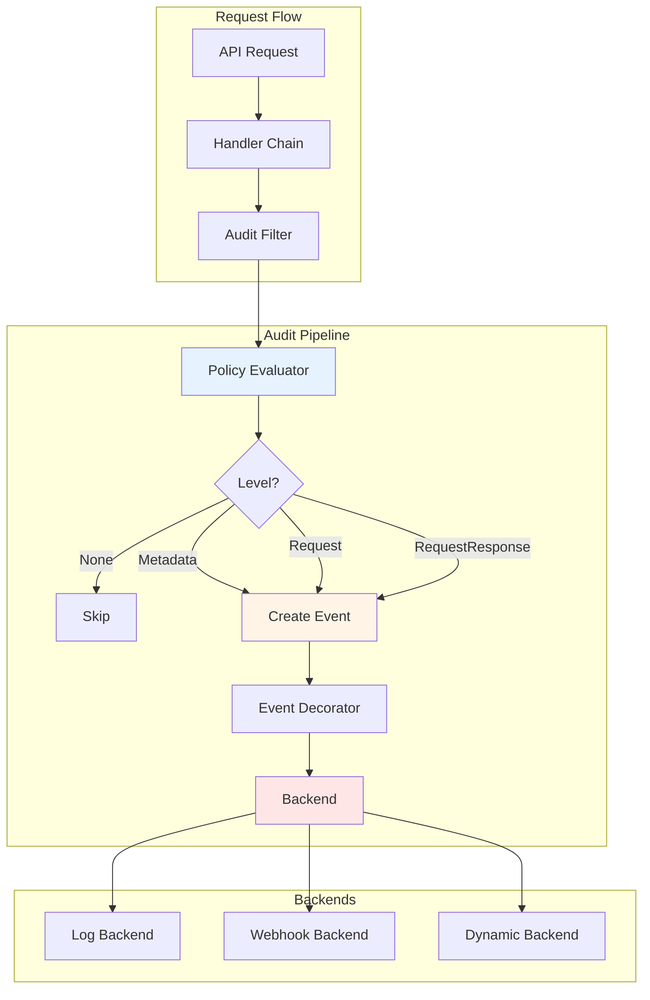

## Core Interfaces

### Backend Interface

The main interface for audit backends:

```go
type Backend interface {
    Sink
    Run(stopCh <-chan struct{}) error
    Shutdown()
    String() string
}

type Sink interface {
    ProcessEvents(events ...*auditinternal.Event) bool
}
```

**Methods**:
- **ProcessEvents**: Process audit events (may be called up to 3 times per request)
- **Run**: Initialize backend (non-blocking)
- **Shutdown**: Gracefully shut down, ensuring all events are delivered
- **String**: Return backend name

### PolicyRuleEvaluator Interface

Evaluates audit policy against requests:

```go
type PolicyRuleEvaluator interface {
    EvaluatePolicyRule(authorizer.Attributes) RequestAuditConfig
}
```

**Returns**:
- **Level**: Audit level for this request
- **OmitStages**: Stages to skip
- **OmitManagedFields**: Whether to omit managed fields

## Audit Levels

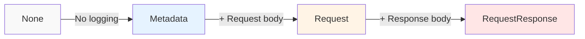

### Level Details

| Level | What's Logged | Use Case |
|-------|---------------|----------|
| **None** | Nothing | Exclude from audit |
| **Metadata** | Request metadata only | Most requests |
| **Request** | Metadata + request body | Write operations |
| **RequestResponse** | Metadata + request + response | Debugging, compliance |

**Metadata includes**:
- User information
- Timestamp
- Resource (group, version, resource, namespace, name)
- Verb (get, list, create, update, patch, delete, etc.)
- HTTP status code
- Source IPs
- User agent

## Audit Stages

Events can be logged at different stages of request processing:

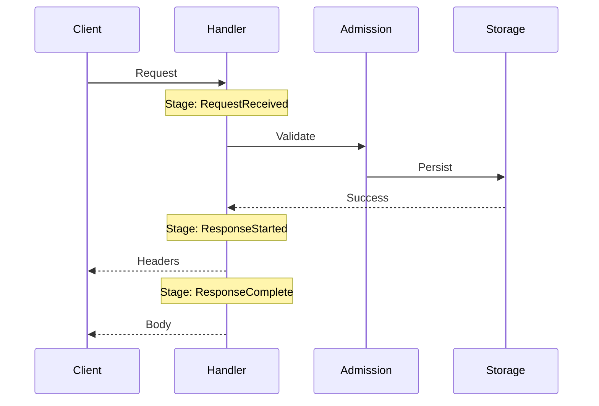

**Stages**:
- **RequestReceived**: Request received, before handler chain
- **ResponseStarted**: Response headers sent
- **ResponseComplete**: Response body sent (normal completion)
- **Panic**: Handler panicked

## Event Structure

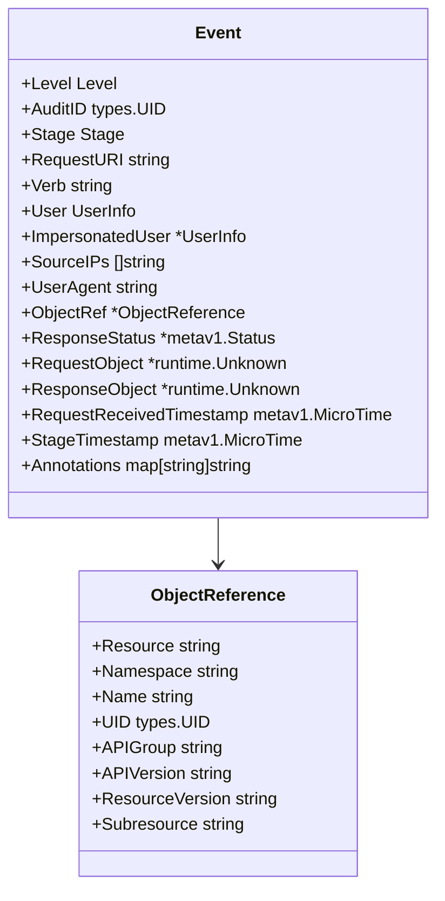

## Policy Evaluation

### Policy Structure

```yaml
apiVersion: audit.k8s.io/v1
kind: Policy
rules:
# Don't log read-only requests
- level: None
  verbs: ["get", "list", "watch"]
  
# Log secrets at metadata level
- level: Metadata
  resources:
  - group: ""
    resources: ["secrets"]
    
# Log all write operations with request body
- level: Request
  verbs: ["create", "update", "patch", "delete"]
  
# Catch-all rule
- level: Metadata
```

### Policy Matching

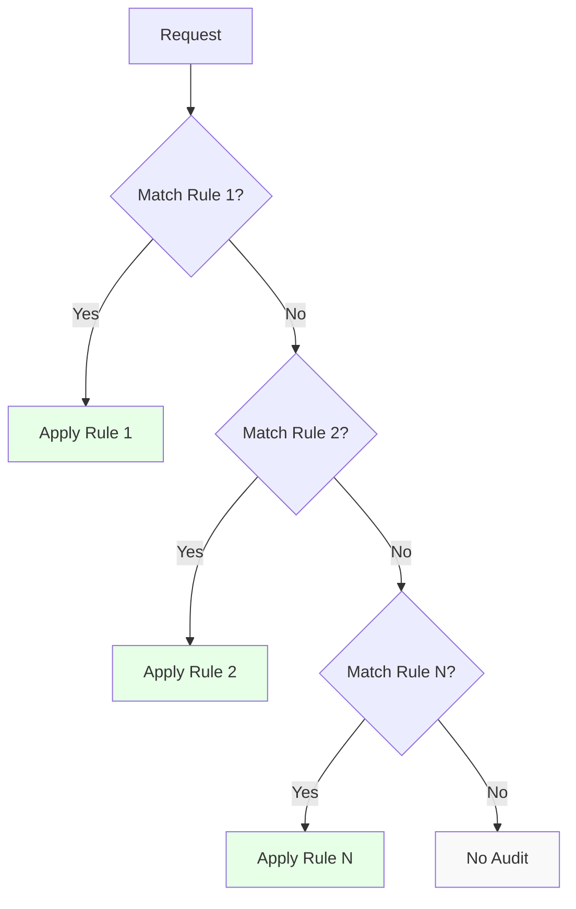

**Matching Order**:
1. Rules are evaluated in order
2. First matching rule wins
3. If no rule matches, event is not logged

**Match Criteria**:
- **Users**: User names
- **UserGroups**: User group memberships
- **Verbs**: HTTP verbs or Kubernetes verbs
- **Resources**: API resources (group/version/resource)
- **Namespaces**: Namespace names
- **NonResourceURLs**: Non-resource URL paths

## Backends

### Log Backend

Writes events to log files:

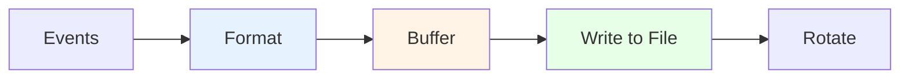

**Features**:
- JSON format (one event per line)
- Buffered writes for performance
- Log rotation support
- Configurable batch size

### Webhook Backend

Sends events to external webhook:

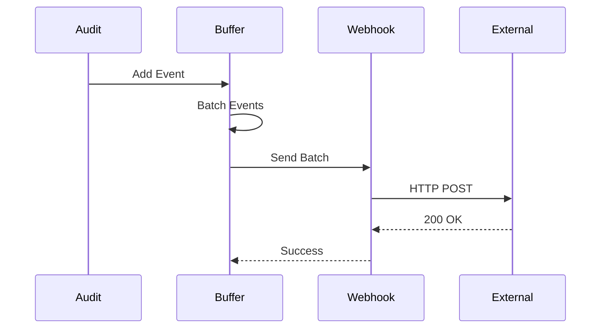

**Features**:
- Batching for efficiency
- Retry on failure
- Configurable timeout
- TLS support

### Dynamic Backend

Routes events to multiple backends:

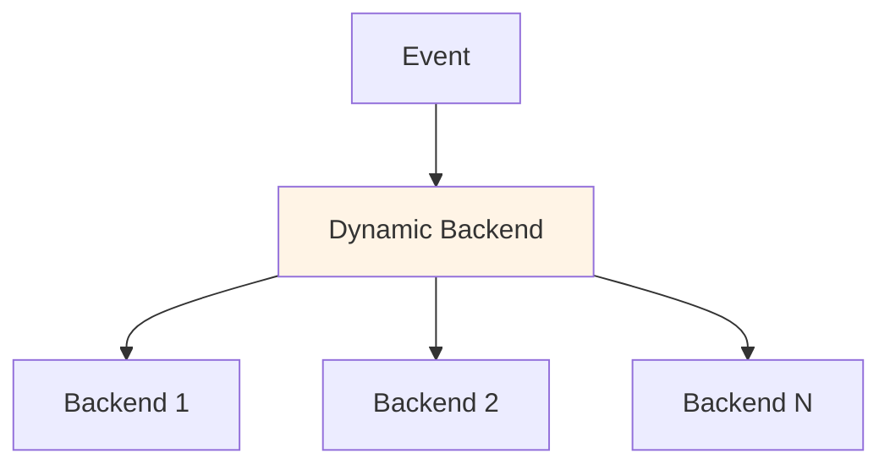

**Features**:
- Multiple backend support
- Dynamic backend registration
- Parallel event delivery

## Event Decorators

### Audit Annotations

Admission plugins can add annotations to events:

```go
// In admission plugin
attributes.AddAnnotation(
    "podsecuritypolicy.admission.k8s.io/policy",
    "restricted",
)
```

Annotations appear in the audit event:

```json
{
  "annotations": {
    "podsecuritypolicy.admission.k8s.io/policy": "restricted"
  }
}
```

### Impersonation

Tracks impersonation information:

```json
{
  "user": {
    "username": "admin",
    "groups": ["system:masters"]
  },
  "impersonatedUser": {
    "username": "developer",
    "groups": ["developers"]
  }
}
```

## Context Integration

### Audit Context

Audit information is stored in request context:

```go
// Store audit ID in context
ctx = audit.WithAuditID(ctx, auditID)

// Retrieve audit ID
auditID := audit.AuditIDFrom(ctx)

// Store audit event
ctx = audit.WithAuditEvent(ctx, event)

// Retrieve audit event
event := audit.AuditEventFrom(ctx)
```

### Request Attributes

Audit uses authorization attributes:

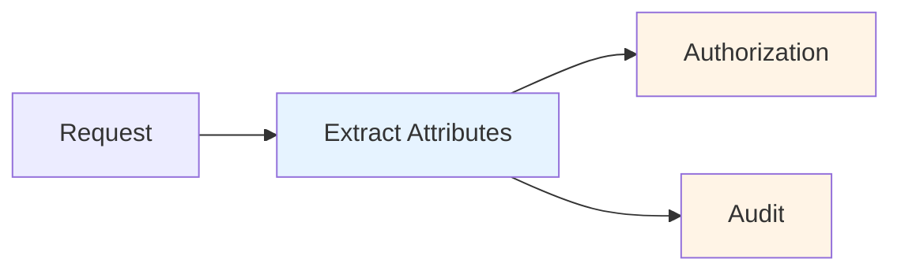

## Performance Considerations

### Buffering

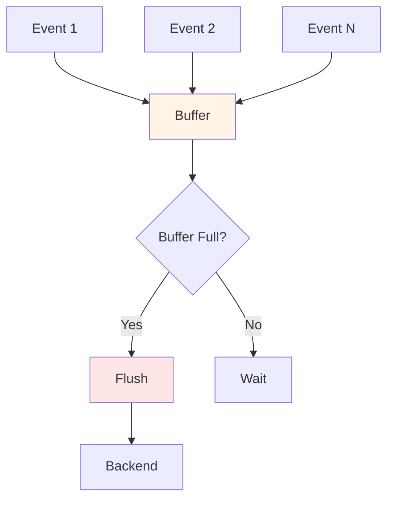

**Buffering Strategy**:
- Events buffered in memory
- Flush on buffer full or timeout
- Batch size configurable
- Reduces backend calls

### Asynchronous Processing

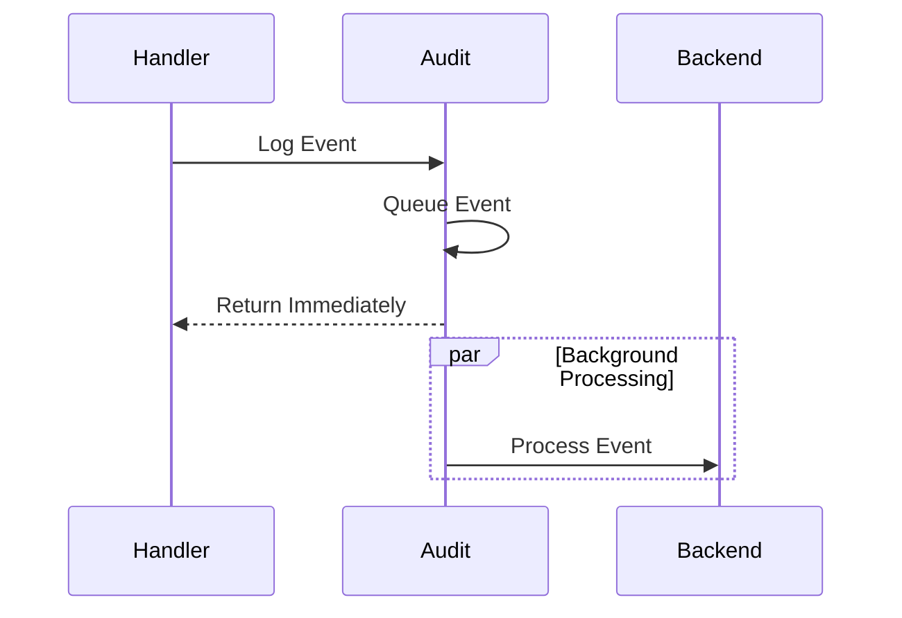

**Benefits**:
- Non-blocking API requests
- Minimal latency impact
- Batch processing efficiency

## Metrics

The audit system exposes metrics:

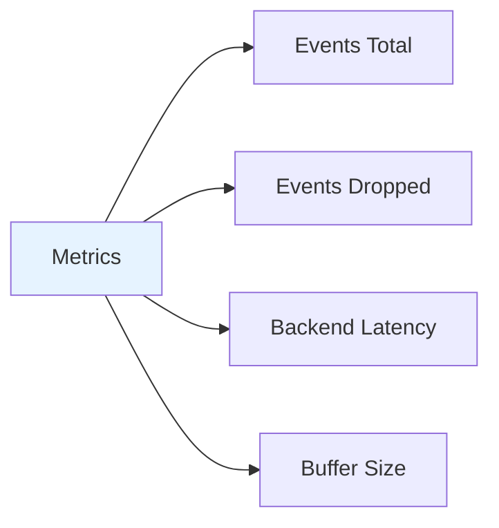

**Key Metrics**:
- `apiserver_audit_event_total`: Total events generated
- `apiserver_audit_requests_rejected_total`: Rejected due to errors
- `apiserver_audit_level_total`: Events per level
- Backend-specific latency and error metrics

## Union Backend

Combines multiple backends:

```go
type Union struct {
    backends []Backend
}

func (u *Union) ProcessEvents(events ...*Event) bool {
    success := true
    for _, backend := range u.backends {
        if !backend.ProcessEvents(events...) {
            success = false
        }
    }
    return success
}
```

**Use Case**: Send events to both log file and webhook

## Request Logging

### Request Object

Captures full request details:

```go
type Request struct {
    *auditinternal.Event
    
    // Additional request-specific fields
    RequestObject runtime.Object
    ResponseObject runtime.Object
}
```

### Truncation

Large objects may be truncated:

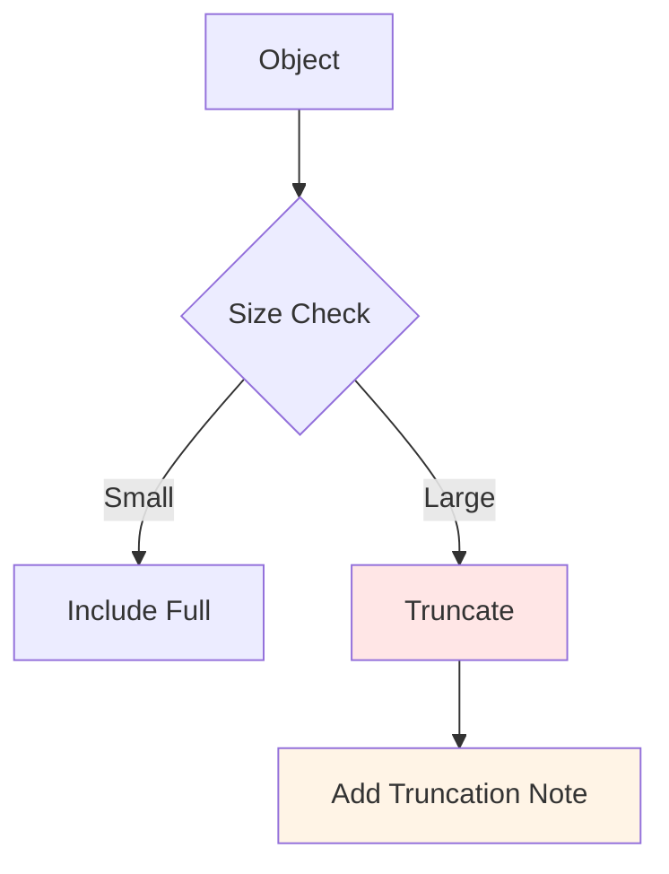

**Truncation Rules**:
- Objects over size limit are truncated
- Truncation is noted in event
- Prevents excessive log size

## Package Structure

```
pkg/audit/
├── types.go              # Backend and evaluator interfaces
├── context.go            # Context integration
├── evaluator.go          # Policy evaluation
├── request.go            # Request logging
├── request_log.go        # Request log formatter
├── format.go             # Event formatting
├── metrics.go            # Metrics collection
├── scheme.go             # Scheme registration
├── union.go              # Union backend
└── policy/               # Policy evaluation
    ├── checker.go        # Policy rule checker
    ├── reader.go         # Policy file reader
    ├── enforcer.go       # Policy enforcement
    └── util.go           # Utility functions
```

## Configuration Example

### Complete Audit Configuration

```yaml
apiVersion: audit.k8s.io/v1
kind: Policy
rules:
# Don't log requests to certain non-resource URLs
- level: None
  nonResourceURLs:
  - /healthz*
  - /version
  - /swagger*

# Don't log watch requests
- level: None
  verbs: ["watch"]

# Don't log authenticated requests to certain non-resource URLs
- level: None
  userGroups: ["system:authenticated"]
  nonResourceURLs:
  - /api*

# Log pod changes at RequestResponse level
- level: RequestResponse
  resources:
  - group: ""
    resources: ["pods"]
  verbs: ["create", "update", "patch", "delete"]

# Log secrets and configmaps at Metadata level
- level: Metadata
  resources:
  - group: ""
    resources: ["secrets", "configmaps"]

# Log all other resources at Request level
- level: Request
  omitStages:
  - RequestReceived
```

## Best Practices

### 1. Policy Design

**Start restrictive, then expand**:
```yaml
# Start with this
- level: Metadata

# Add specific rules as needed
- level: Request
  resources:
  - group: "apps"
    resources: ["deployments"]
```

### 2. Performance

**Minimize RequestResponse level**:
- Only use for critical resources
- Exclude read-only operations
- Use omitStages to reduce events

### 3. Storage

**Plan for log volume**:
- Estimate events per second
- Configure log rotation
- Consider external storage

### 4. Security

**Protect audit logs**:
- Restrict file permissions
- Use separate storage
- Enable encryption

### 5. Compliance

**Meet regulatory requirements**:
- Log all access to sensitive data
- Retain logs for required period
- Ensure log integrity

## Integration with API Server

### Handler Chain Integration

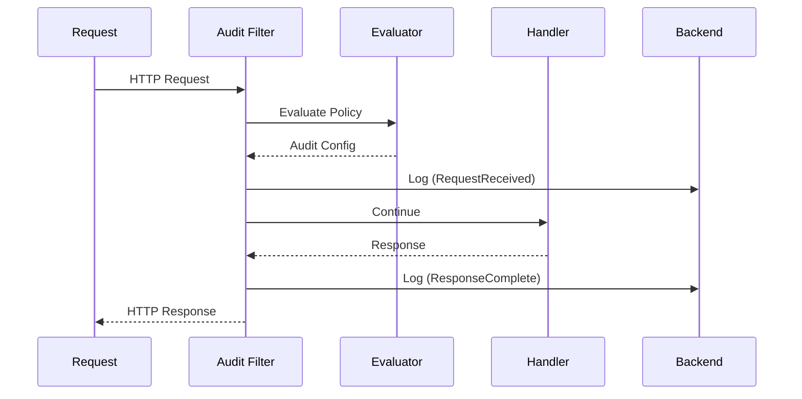

### Server Configuration

```go
// In server config
config := &server.Config{
    AuditBackend: auditBackend,
    AuditPolicyRuleEvaluator: policyEvaluator,
}
```

## Testing

### Mock Backend

```go
type fakeBackend struct {
    events []*auditinternal.Event
}

func (f *fakeBackend) ProcessEvents(events ...*auditinternal.Event) bool {
    f.events = append(f.events, events...)
    return true
}
```

### Testing Policies

```go
// Create test policy
policy := &audit.Policy{
    Rules: []audit.PolicyRule{
        {
            Level: audit.LevelMetadata,
            Resources: []audit.GroupResources{
                {Resources: []string{"pods"}},
            },
        },
    },
}

// Evaluate
config := evaluator.EvaluatePolicyRule(attributes)
assert.Equal(t, audit.LevelMetadata, config.Level)
```

## Related Packages

- **pkg/apis/audit**: Audit event type definitions
- **pkg/admission**: Admission plugins add annotations
- **pkg/authorization**: Provides request attributes
- **pkg/server**: Integrates audit into handler chain

## References

- [Kubernetes Auditing](https://kubernetes.io/docs/tasks/debug/debug-cluster/audit/)
- [Audit Policy](https://kubernetes.io/docs/reference/config-api/apiserver-audit.v1/)
- [Audit Annotations](https://kubernetes.io/docs/reference/access-authn-authz/extensible-admission-controllers/#audit-annotations)
