# pkg/authentication - Authentication Framework

## Overview

The `pkg/authentication` package provides the authentication framework for Kubernetes API servers. It identifies users making API requests through a pluggable system of authenticators.

## Purpose

The authentication system:
- **Identifies Users**: Determines who is making the request
- **Pluggable Architecture**: Supports multiple authentication methods
- **Union Strategy**: Tries authenticators in sequence until one succeeds
- **Token Management**: Handles various token formats (JWT, bootstrap tokens, etc.)
- **Service Account Support**: Built-in support for Kubernetes service accounts

## Architecture

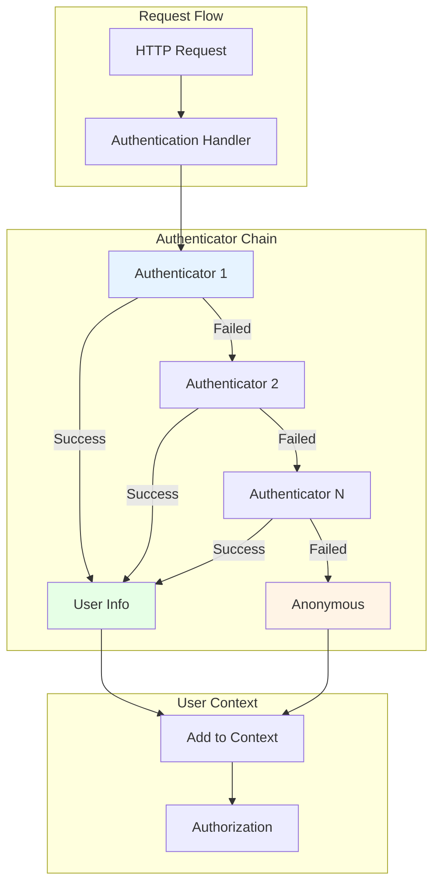

## Core Interfaces

### Authenticator Interfaces

```go
// Token authenticator - validates bearer tokens
type Token interface {
    AuthenticateToken(ctx context.Context, token string) (*Response, bool, error)
}

// Request authenticator - validates HTTP requests
type Request interface {
    AuthenticateRequest(req *http.Request) (*Response, bool, error)
}
```

### Authentication Response

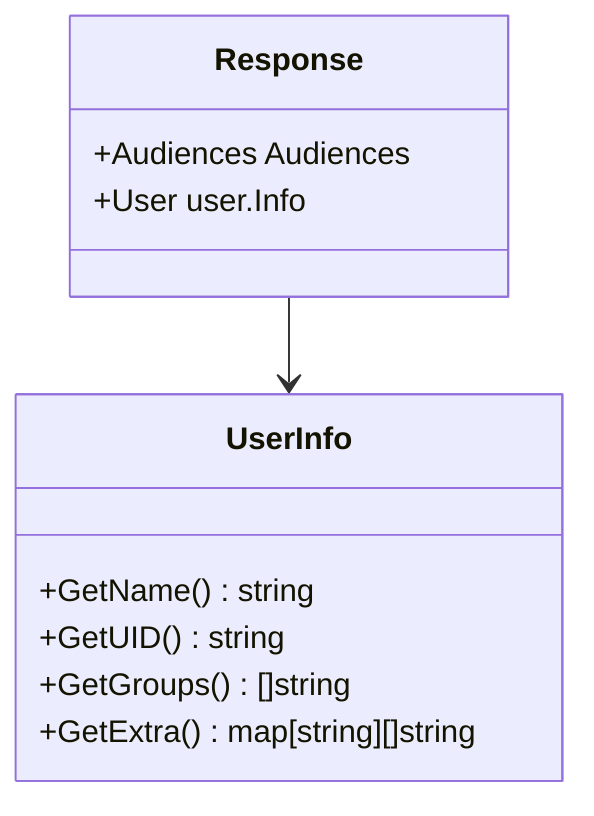

**Response Fields**:
- **Audiences**: Token audiences (for audience-aware authenticators)
- **User**: User information
  - **Name**: Username
  - **UID**: Unique identifier
  - **Groups**: Group memberships
  - **Extra**: Additional attributes

## Built-in Authenticators

### 1. X509 Client Certificates

Located in `request/x509/`:

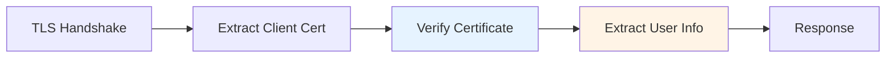

**User Mapping**:
- **Username**: Certificate CommonName (CN)
- **Groups**: Certificate Organization (O) fields
- **UID**: Not set

**Example Certificate**:
```
Subject: CN=john, O=developers, O=team-a
```
Maps to:
- Username: `john`
- Groups: `["developers", "team-a"]`

### 2. Bearer Tokens

Located in `request/bearertoken/`:

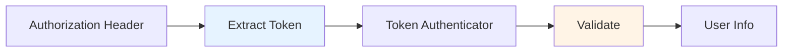

**Header Format**:
```
Authorization: Bearer <token>
```

**Token Types**:
- Service account tokens (JWT)
- Bootstrap tokens
- OIDC tokens
- Static tokens
- Webhook tokens

### 3. Service Account Tokens

Located in `serviceaccount/`:

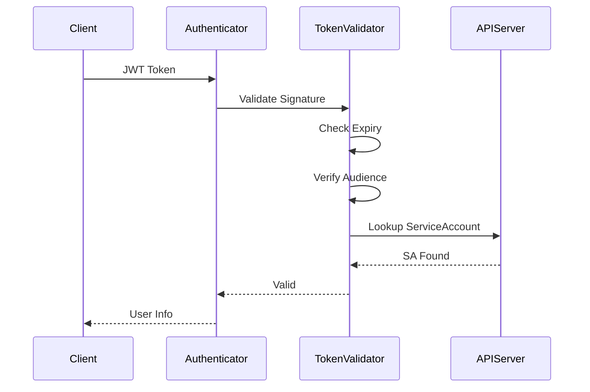

**JWT Claims**:
```json
{
  "iss": "https://kubernetes.default.svc",
  "sub": "system:serviceaccount:default:my-sa",
  "aud": ["https://kubernetes.default.svc"],
  "exp": 1234567890,
  "iat": 1234567800,
  "kubernetes.io": {
    "namespace": "default",
    "serviceaccount": {
      "name": "my-sa",
      "uid": "12345"
    },
    "pod": {
      "name": "my-pod",
      "uid": "67890"
    }
  }
}
```

**User Mapping**:
- **Username**: `system:serviceaccount:<namespace>:<name>`
- **UID**: ServiceAccount UID
- **Groups**: 
  - `system:serviceaccounts`
  - `system:serviceaccounts:<namespace>`

### 4. OIDC (OpenID Connect)

Located in `token/oidc/`:

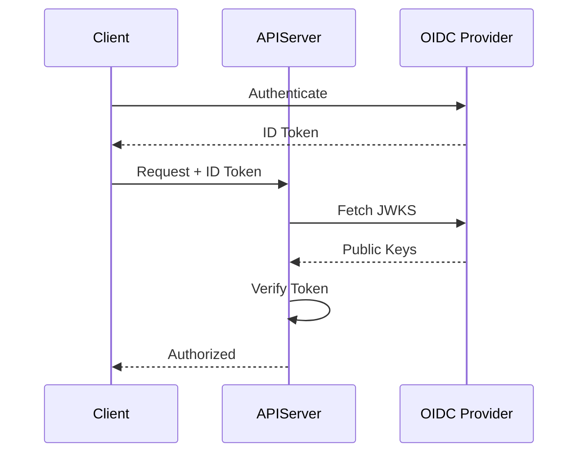

**Configuration**:
- **Issuer URL**: OIDC provider URL
- **Client ID**: Expected audience
- **CA Bundle**: Provider's CA certificate
- **Username Claim**: Claim for username (default: `sub`)
- **Groups Claim**: Claim for groups (optional)

**User Mapping**:
- **Username**: From configured claim (e.g., `email`, `sub`)
- **Groups**: From configured groups claim
- **Extra**: Additional claims as extra attributes

### 5. Webhook Token Authentication

Located in `token/webhook/`:

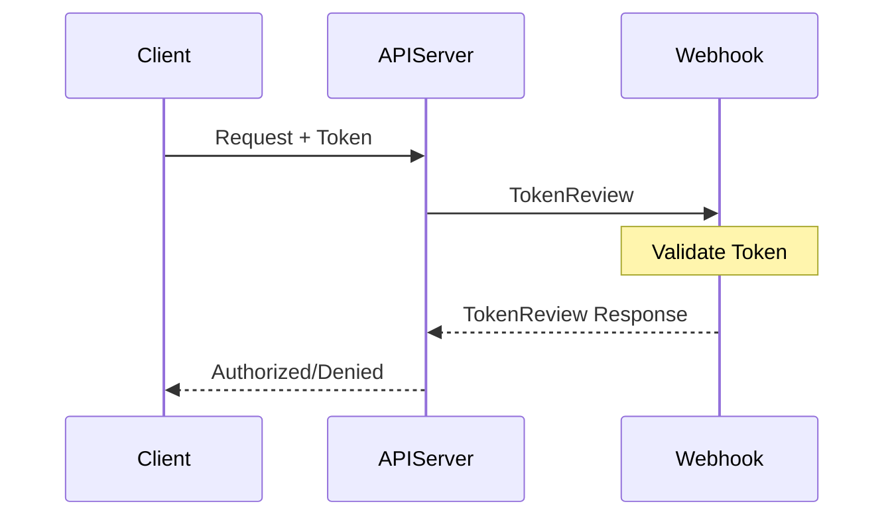

**TokenReview Request**:
```json
{
  "apiVersion": "authentication.k8s.io/v1",
  "kind": "TokenReview",
  "spec": {
    "token": "<bearer-token>",
    "audiences": ["https://kubernetes.default.svc"]
  }
}
```

**TokenReview Response**:
```json
{
  "apiVersion": "authentication.k8s.io/v1",
  "kind": "TokenReview",
  "status": {
    "authenticated": true,
    "user": {
      "username": "jane",
      "uid": "12345",
      "groups": ["developers", "team-b"]
    },
    "audiences": ["https://kubernetes.default.svc"]
  }
}
```

### 6. Bootstrap Tokens

Located in `token/bootstrap/`:

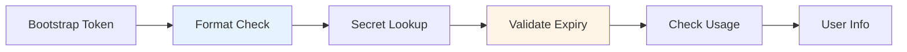

**Token Format**: `<token-id>.<token-secret>`
- Token ID: 6 characters
- Token Secret: 16 characters

**Use Cases**:
- Node bootstrapping
- Temporary cluster access
- Automated provisioning

**User Mapping**:
- **Username**: `system:bootstrap:<token-id>`
- **Groups**: Configured in token secret

### 7. Anonymous Authentication

Located in `request/anonymous/`:

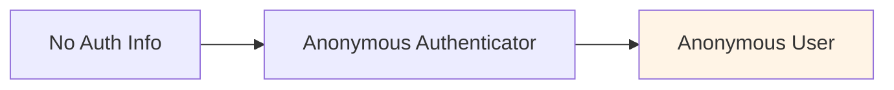

**Anonymous User**:
- **Username**: `system:anonymous`
- **Groups**: `["system:unauthenticated"]`

**Use Case**: Public endpoints (e.g., `/healthz`, `/version`)

## Authenticator Factory

Located in `authenticatorfactory/`:

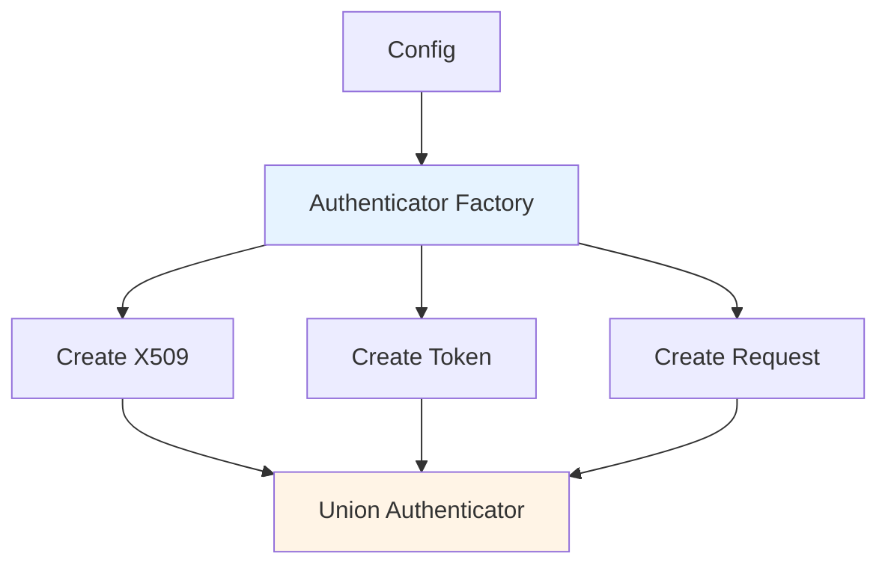

**Factory Pattern**:
```go
type Config struct {
    Anonymous bool
    ClientCAContentProvider CAContentProvider
    TokenAuthFile string
    OIDCIssuerURL string
    WebhookTokenAuthnConfigFile string
    ServiceAccountKeyFiles []string
    // ... more config
}

func (config Config) New() (authenticator.Request, error) {
    var authenticators []authenticator.Request
    
    // Add X509 authenticator
    if config.ClientCAContentProvider != nil {
        authenticators = append(authenticators, x509Authenticator)
    }
    
    // Add token authenticators
    tokenAuthenticators := []authenticator.Token{}
    // ... add various token authenticators
    
    // Combine into union
    return union.New(authenticators...), nil
}
```

## Union Authenticator

Located in `request/union/`:

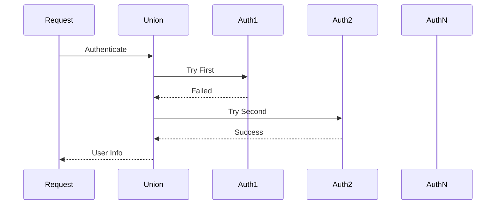

**Strategy**:
- Try each authenticator in order
- Return on first success
- Return error only if all fail

## User Information

### User Interface

```go
type Info interface {
    GetName() string
    GetUID() string
    GetGroups() []string
    GetExtra() map[string][]string
}
```

### Default User

```go
type DefaultInfo struct {
    Name   string
    UID    string
    Groups []string
    Extra  map[string][]string
}
```

### Special Users

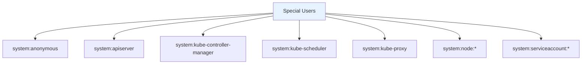

## Group Mapping

Located in `group/`:

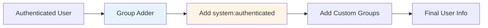

**Automatic Groups**:
- `system:authenticated`: All authenticated users
- `system:unauthenticated`: Anonymous users

## CEL Authentication

Located in `cel/`:

Supports CEL expressions for authentication decisions:

```yaml
apiVersion: authentication.k8s.io/v1alpha1
kind: AuthenticationConfiguration
jwt:
- issuer:
    url: https://issuer.example.com
    audiences:
    - my-app
  claimMappings:
    username:
      expression: 'claims.email'
    groups:
      expression: 'claims.groups'
  claimValidationRules:
  - expression: 'claims.exp > now'
    message: "token is expired"
```

## Request Decorators

### Header Authenticator

Located in `request/headerrequest/`:

Extracts user info from HTTP headers:

```
X-Remote-User: john
X-Remote-Group: developers
X-Remote-Group: team-a
```

**Use Case**: Reverse proxy authentication

### Union Authenticator

Combines multiple request authenticators:

```go
authenticator := union.New(
    x509Authenticator,
    bearerTokenAuthenticator,
    basicAuthAuthenticator,
)
```

## Caching

### Cache Authenticator

Located in `token/cache/`:

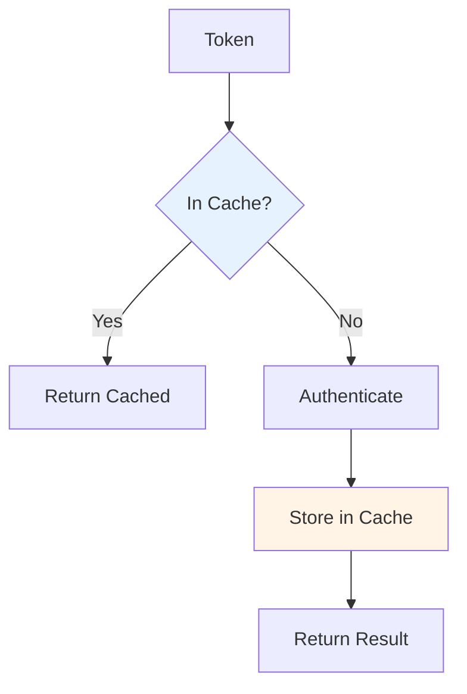

**Features**:
- TTL-based expiration
- Success and failure caching
- Reduces authenticator load

**Configuration**:
- Cache size
- Success TTL
- Failure TTL

## Package Structure

```
pkg/authentication/
├── authenticator/        # Core interfaces
│   └── interfaces.go
├── authenticatorfactory/ # Factory for building authenticators
│   └── delegating.go
├── request/              # Request-based authenticators
│   ├── anonymous/        # Anonymous authenticator
│   ├── bearertoken/      # Bearer token extraction
│   ├── headerrequest/    # Header-based auth
│   ├── union/            # Union authenticator
│   ├── websocket/        # WebSocket auth
│   └── x509/             # Client certificate auth
├── token/                # Token-based authenticators
│   ├── cache/            # Token caching
│   ├── oidc/             # OIDC authenticator
│   ├── webhook/          # Webhook token auth
│   └── bootstrap/        # Bootstrap tokens
├── serviceaccount/       # Service account tokens
│   └── jwt.go
├── group/                # Group mapping
│   └── group_adder.go
├── cel/                  # CEL expression support
│   └── compiler.go
└── user/                 # User info types
    └── user.go
```

## Integration with API Server

### Handler Chain

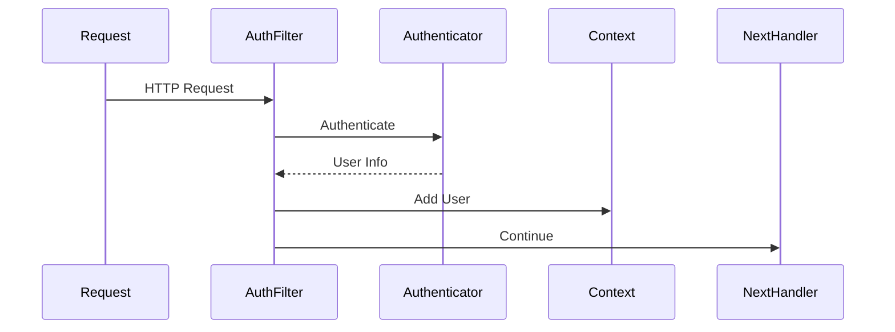

### Server Configuration

```go
config := &server.Config{
    Authentication: server.AuthenticationInfo{
        Authenticator: authenticator,
        // ...
    },
}
```

## Best Practices

### 1. Multiple Authenticators

Use union authenticator for flexibility:
```go
authenticators := []authenticator.Request{
    x509Auth,
    oidcAuth,
    webhookAuth,
}
unionAuth := union.New(authenticators...)
```

### 2. Token Caching

Enable caching for performance:
```go
cachedAuth := cache.New(
    tokenAuth,
    true,  // cache success
    2*time.Minute,  // success TTL
    30*time.Second, // failure TTL
)
```

### 3. Audience Validation

Always validate token audiences:
```go
if !response.Audiences.Has(expectedAudience) {
    return nil, false, errors.New("invalid audience")
}
```

### 4. Error Handling

Distinguish between auth failures and errors:
```go
user, ok, err := authenticator.AuthenticateRequest(req)
if err != nil {
    // System error - log and return 500
}
if !ok {
    // Authentication failed - return 401
}
// Success - continue with user
```

## Security Considerations

### 1. Token Validation

- Verify signatures
- Check expiration
- Validate audiences
- Verify issuer

### 2. Certificate Validation

- Check certificate chain
- Verify not revoked
- Validate usage
- Check expiration

### 3. Credential Storage

- Never log tokens
- Use secure storage
- Rotate regularly
- Limit scope

### 4. Anonymous Access

- Disable if not needed
- Limit to public endpoints
- Monitor usage

## Testing

### Mock Authenticator

```go
type fakeAuthenticator struct {
    user user.Info
    ok   bool
    err  error
}

func (f *fakeAuthenticator) AuthenticateRequest(req *http.Request) (*authenticator.Response, bool, error) {
    if f.err != nil {
        return nil, false, f.err
    }
    if !f.ok {
        return nil, false, nil
    }
    return &authenticator.Response{User: f.user}, true, nil
}
```

### Testing Tokens

```go
// Create test token
token := createTestJWT(t, claims)

// Test authentication
response, ok, err := tokenAuth.AuthenticateToken(ctx, token)
assert.NoError(t, err)
assert.True(t, ok)
assert.Equal(t, "john", response.User.GetName())
```

## Related Packages

- **pkg/authorization**: Uses user info for authorization
- **pkg/audit**: Logs user info in audit events
- **pkg/server**: Integrates authentication into handler chain
- **pkg/endpoints/request**: Extracts user from context

## References

- [Kubernetes Authentication](https://kubernetes.io/docs/reference/access-authn-authz/authentication/)
- [Service Account Tokens](https://kubernetes.io/docs/reference/access-authn-authz/service-accounts-admin/)
- [OIDC Authentication](https://kubernetes.io/docs/reference/access-authn-authz/authentication/#openid-connect-tokens)
- [Webhook Token Authentication](https://kubernetes.io/docs/reference/access-authn-authz/authentication/#webhook-token-authentication)
