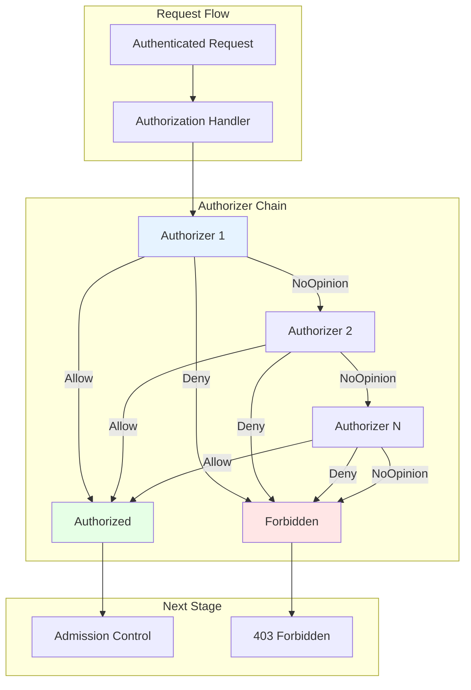
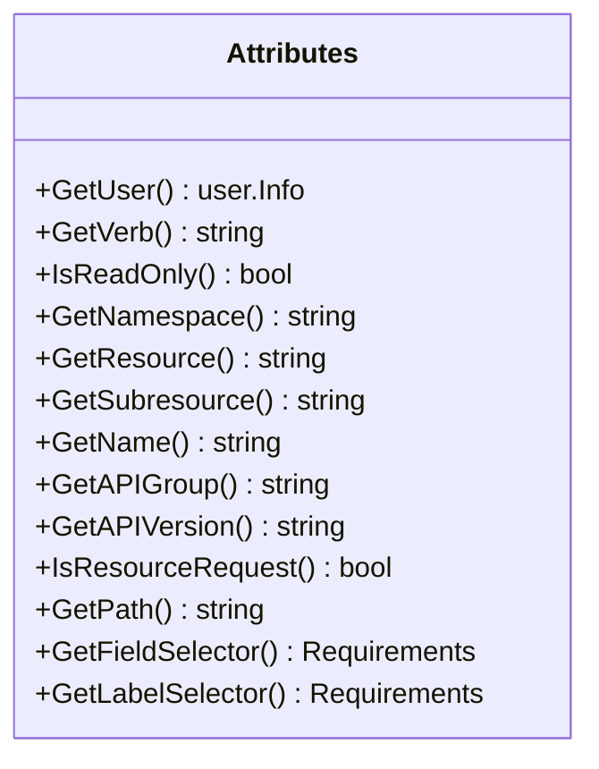
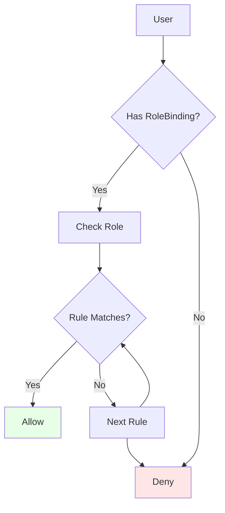
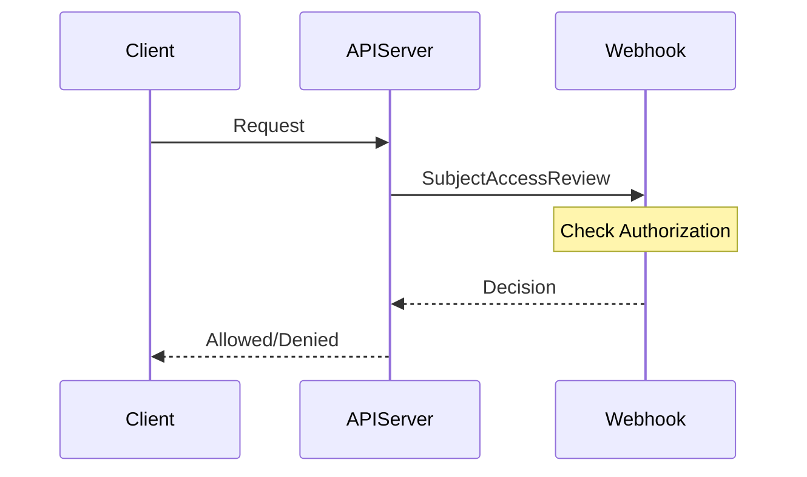
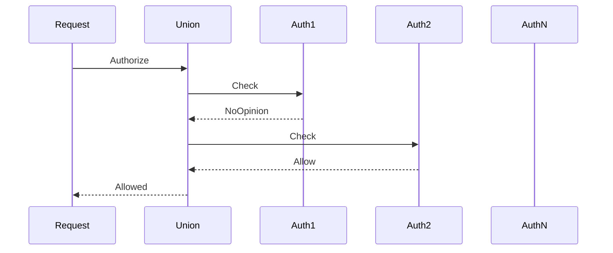
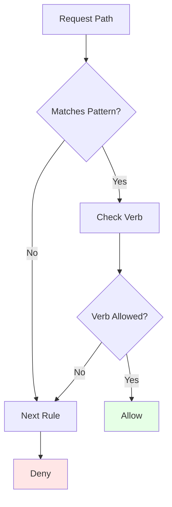
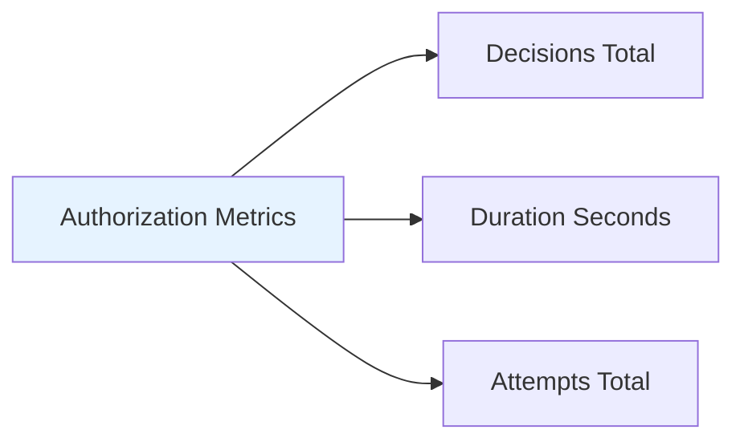
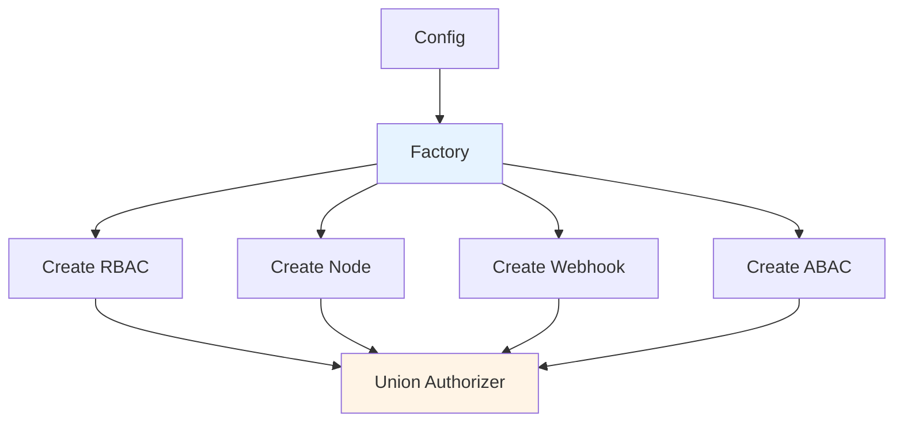
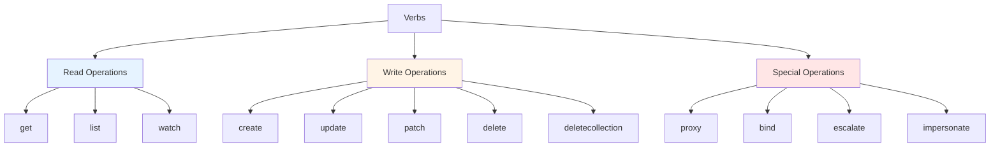
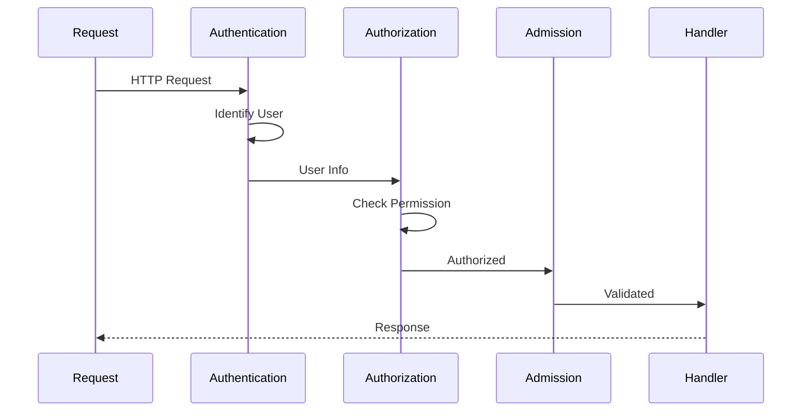

# pkg/authorization - Authorization Framework

## Overview

The `pkg/authorization` package provides the authorization framework for Kubernetes API servers. After authentication identifies *who* is making a request, authorization determines *what* they are allowed to do.

## Purpose

The authorization system:
- **Access Control**: Determines if a user can perform an action
- **Pluggable Architecture**: Supports multiple authorization modes
- **Union Strategy**: Combines multiple authorizers
- **Fine-Grained Control**: Resource, verb, namespace-level permissions
- **Rule Resolution**: Provides user permission discovery

## Architecture



## Core Interfaces

### Authorizer Interface

```go
type Authorizer interface {
    Authorize(ctx context.Context, a Attributes) (authorized Decision, reason string, err error)
}
```

**Decision Types**:
- **DecisionAllow**: Request is authorized
- **DecisionDeny**: Request is explicitly denied
- **DecisionNoOpinion**: Authorizer has no opinion (try next)

### Attributes Interface



**Attributes Provide**:
- **User**: Who is making the request
- **Verb**: What action (get, list, create, update, delete, etc.)
- **Resource**: What resource type
- **Namespace**: Which namespace (if applicable)
- **Name**: Specific resource name (if applicable)
- **Path**: Non-resource URL path

## Authorization Modes

### 1. RBAC (Role-Based Access Control)

Located in `authorizerfactory/`:



**RBAC Components**:
- **Role/ClusterRole**: Define permissions
- **RoleBinding/ClusterRoleBinding**: Bind roles to users/groups
- **Rules**: Specify allowed operations

**Not implemented in this package** - RBAC logic is in `k8s.io/kubernetes/plugin/pkg/auth/authorizer/rbac`

### 2. Node Authorization

**Purpose**: Authorize kubelet API access

**Rules**:
- Nodes can only access their own Node object
- Nodes can only access Pods scheduled to them
- Nodes can access secrets/configmaps for their pods

**User Pattern**: `system:node:<node-name>`

### 3. Webhook Authorization

Located in `authorizerfactory/`:



**SubjectAccessReview Request**:
```json
{
  "apiVersion": "authorization.k8s.io/v1",
  "kind": "SubjectAccessReview",
  "spec": {
    "user": "jane",
    "groups": ["developers"],
    "resourceAttributes": {
      "namespace": "default",
      "verb": "get",
      "group": "",
      "resource": "pods",
      "name": "my-pod"
    }
  }
}
```

**SubjectAccessReview Response**:
```json
{
  "apiVersion": "authorization.k8s.io/v1",
  "kind": "SubjectAccessReview",
  "status": {
    "allowed": true,
    "reason": "user has permission"
  }
}
```

### 4. AlwaysAllow / AlwaysDeny

Simple authorizers for testing:

```go
// AlwaysAllow - allows everything
type alwaysAllowAuthorizer struct{}

func (alwaysAllowAuthorizer) Authorize(ctx context.Context, a Attributes) (Decision, string, error) {
    return DecisionAllow, "", nil
}

// AlwaysDeny - denies everything
type alwaysDenyAuthorizer struct{}

func (alwaysDenyAuthorizer) Authorize(ctx context.Context, a Attributes) (Decision, string, error) {
    return DecisionDeny, "always deny", nil
}
```

## Union Authorizer

Located in `union/`:



**Strategy**:
- Try each authorizer in order
- **Allow** if any authorizer allows
- **Deny** if any authorizer denies (and none allow)
- **NoOpinion** only if all return NoOpinion

**Example**:
```go
authorizer := union.New(
    nodeAuthorizer,
    rbacAuthorizer,
    webhookAuthorizer,
)
```

## Rule Resolver

```go
type RuleResolver interface {
    RulesFor(ctx context.Context, user user.Info, namespace string) (
        []ResourceRuleInfo,
        []NonResourceRuleInfo,
        bool, // incomplete
        error,
    )
}
```

**Purpose**: Discover what a user can do

**Use Cases**:
- `kubectl auth can-i` command
- UI permission discovery
- Client-side validation

### ResourceRuleInfo

```go
type ResourceRuleInfo interface {
    GetVerbs() []string
    GetAPIGroups() []string
    GetResources() []string
    GetResourceNames() []string
}
```

**Example**:
```go
// User can get, list, watch pods in default namespace
rule := ResourceRuleInfo{
    Verbs: []string{"get", "list", "watch"},
    APIGroups: []string{""},
    Resources: []string{"pods"},
}
```

### NonResourceRuleInfo

```go
type NonResourceRuleInfo interface {
    GetVerbs() []string
    GetNonResourceURLs() []string
}
```

**Example**:
```go
// User can access /healthz
rule := NonResourceRuleInfo{
    Verbs: []string{"get"},
    NonResourceURLs: []string{"/healthz"},
}
```

## Path Authorization

Located in `path/`:

Authorizes non-resource URL paths:



**Common Paths**:
- `/healthz` - Health check
- `/readyz` - Readiness check
- `/livez` - Liveness check
- `/version` - Version information
- `/metrics` - Metrics endpoint
- `/api` - API discovery

## CEL Authorization

Located in `cel/`:

Supports CEL expressions for authorization:

```yaml
apiVersion: authorization.k8s.io/v1alpha1
kind: AuthorizationConfiguration
authorizers:
- type: CEL
  name: my-cel-authorizer
  cel:
    matchConditions:
    - expression: 'request.user.name == "admin"'
    authorizationConditions:
    - expression: 'request.verb == "get"'
      decision: "Allow"
```

**CEL Variables**:
- `request.user.name` - Username
- `request.user.groups` - User groups
- `request.verb` - Action verb
- `request.resource` - Resource type
- `request.namespace` - Namespace
- `request.name` - Resource name

## Metrics

Located in `metrics/`:



**Key Metrics**:
- `apiserver_authorization_decisions_total`: Total decisions by result
- `apiserver_authorization_duration_seconds`: Authorization latency
- `apiserver_authorization_attempts_total`: Authorization attempts

## Authorizer Factory

Located in `authorizerfactory/`:



**Configuration**:
```go
type Config struct {
    AuthorizationModes []string
    PolicyFile string
    WebhookConfigFile string
    WebhookCacheAuthorizedTTL time.Duration
    WebhookCacheUnauthorizedTTL time.Duration
    // ...
}
```

**Factory Method**:
```go
func (config Config) New() (authorizer.Authorizer, error) {
    var authorizers []authorizer.Authorizer
    
    for _, mode := range config.AuthorizationModes {
        switch mode {
        case "Node":
            authorizers = append(authorizers, nodeAuthorizer)
        case "RBAC":
            authorizers = append(authorizers, rbacAuthorizer)
        case "Webhook":
            authorizers = append(authorizers, webhookAuthorizer)
        }
    }
    
    return union.New(authorizers...), nil
}
```

## Verbs

Standard Kubernetes verbs:



**Read-Only Verbs**: get, list, watch
**Write Verbs**: create, update, patch, delete, deletecollection
**Special Verbs**: proxy, bind, escalate, impersonate

## Package Structure

```
pkg/authorization/
├── authorizer/           # Core interfaces
│   └── interfaces.go
├── authorizerfactory/    # Factory for building authorizers
│   └── delegating.go
├── union/                # Union authorizer
│   └── union.go
├── path/                 # Path-based authorization
│   └── path.go
├── cel/                  # CEL expression support
│   ├── compiler.go
│   └── evaluator.go
└── metrics/              # Authorization metrics
    └── metrics.go
```

## Integration with API Server

### Handler Chain



### Server Configuration

```go
config := &server.Config{
    Authorization: server.AuthorizationInfo{
        Authorizer: authorizer,
        RuleResolver: ruleResolver,
    },
}
```

## Best Practices

### 1. Least Privilege

Grant minimum necessary permissions:
```go
// Good: Specific permissions
rule := ResourceRuleInfo{
    Verbs: []string{"get", "list"},
    Resources: []string{"pods"},
    Namespaces: []string{"default"},
}

// Bad: Overly broad permissions
rule := ResourceRuleInfo{
    Verbs: []string{"*"},
    Resources: []string{"*"},
}
```

### 2. Multiple Authorizers

Use union for defense in depth:
```go
authorizer := union.New(
    nodeAuthorizer,      // Node-specific rules
    rbacAuthorizer,      // General RBAC
    webhookAuthorizer,   // External policy
)
```

### 3. Error Handling

Distinguish between authorization failures and errors:
```go
decision, reason, err := authorizer.Authorize(ctx, attrs)
if err != nil {
    // System error - log and return 500
    return err
}
if decision != DecisionAllow {
    // Not authorized - return 403
    return errors.NewForbidden(resource, name, errors.New(reason))
}
// Authorized - continue
```

### 4. Caching

Cache authorization decisions when possible:
```go
// Webhook authorizer with caching
webhookAuth := webhook.New(
    webhookConfig,
    2*time.Minute,  // cache authorized TTL
    30*time.Second, // cache unauthorized TTL
)
```

## Security Considerations

### 1. Privilege Escalation

Prevent users from granting themselves more permissions:
- Use `escalate` verb check
- Validate role changes
- Audit permission grants

### 2. Namespace Isolation

Enforce namespace boundaries:
- Check namespace in attributes
- Validate cross-namespace access
- Use RoleBindings for namespace-scoped permissions

### 3. Resource Name Restrictions

Limit access to specific resource names:
```go
attrs := AttributesRecord{
    Resource: "secrets",
    Name: "admin-token",  // Specific secret
}
```

### 4. Subresource Authorization

Check subresource access separately:
```go
attrs := AttributesRecord{
    Resource: "pods",
    Subresource: "exec",  // Requires separate permission
}
```

## Testing

### Mock Authorizer

```go
type fakeAuthorizer struct {
    decision Decision
    reason   string
    err      error
}

func (f *fakeAuthorizer) Authorize(ctx context.Context, a Attributes) (Decision, string, error) {
    return f.decision, f.reason, f.err
}
```

### Testing Authorization

```go
// Create test attributes
attrs := AttributesRecord{
    User: &user.DefaultInfo{Name: "jane"},
    Verb: "get",
    Namespace: "default",
    Resource: "pods",
    Name: "my-pod",
}

// Test authorization
decision, reason, err := authorizer.Authorize(ctx, attrs)
assert.NoError(t, err)
assert.Equal(t, DecisionAllow, decision)
```

## Common Patterns

### System Component Authorization

```go
// System components often have special permissions
if user.GetName() == "system:kube-controller-manager" {
    return DecisionAllow, "system component", nil
}
```

### Impersonation Check

```go
// Check if user can impersonate
attrs := AttributesRecord{
    User: user,
    Verb: "impersonate",
    Resource: "users",
    Name: targetUser,
}
```

### Self-Access

```go
// Users can typically access their own resources
if attrs.GetName() == user.GetName() {
    return DecisionAllow, "self-access", nil
}
```

## Related Packages

- **pkg/authentication**: Provides user information
- **pkg/audit**: Logs authorization decisions
- **pkg/admission**: Runs after authorization
- **pkg/endpoints/request**: Builds authorization attributes

## References

- [Kubernetes Authorization](https://kubernetes.io/docs/reference/access-authn-authz/authorization/)
- [RBAC Authorization](https://kubernetes.io/docs/reference/access-authn-authz/rbac/)
- [Node Authorization](https://kubernetes.io/docs/reference/access-authn-authz/node/)
- [Webhook Authorization](https://kubernetes.io/docs/reference/access-authn-authz/webhook/)
