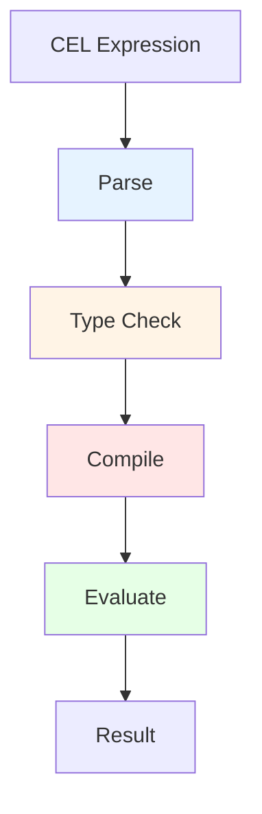

# pkg/cel - Common Expression Language Support

## Overview

The `pkg/cel` package provides Common Expression Language (CEL) support for the Kubernetes API server. CEL is used throughout the apiserver for expression evaluation in admission policies, authentication, authorization, and validation.

## Purpose

CEL support enables:
- **Declarative Validation**: Express validation rules without code
- **Admission Policies**: ValidatingAdmissionPolicy and MutatingAdmissionPolicy
- **Match Conditions**: Fine-grained targeting of policies
- **Field Validation**: CRD field validation rules
- **Performance**: Compiled expressions with type checking

## Architecture



## Key Features

### 1. Expression Compilation
- Parse CEL expressions
- Type checking against schema
- Compilation to efficient bytecode
- Caching of compiled expressions

### 2. Variable Binding
- Object fields
- Request attributes
- Authorizer results
- Custom variables

### 3. Cost Limiting
- Prevent expensive expressions
- Configurable cost budgets
- Timeout protection

## Package Structure

```
pkg/cel/
├── common.go           # Common CEL utilities
├── compiler.go         # Expression compilation
├── environment.go      # CEL environment setup
├── library/            # CEL function libraries
│   ├── authz.go       # Authorization functions
│   ├── lists.go       # List manipulation
│   ├── regex.go       # Regular expressions
│   ├── urls.go        # URL parsing
│   └── test.go        # Test utilities
├── mutation/           # Mutation support
│   └── unstructured.go
└── openapi/            # OpenAPI schema integration
    └── resolver.go
```

## Usage in API Server

### Validating Admission Policies
```yaml
apiVersion: admissionregistration.k8s.io/v1
kind: ValidatingAdmissionPolicy
metadata:
  name: "demo-policy"
spec:
  matchConstraints:
    resourceRules:
    - apiGroups: ["apps"]
      apiVersions: ["v1"]
      operations: ["CREATE", "UPDATE"]
      resources: ["deployments"]
  validations:
  - expression: "object.spec.replicas <= 100"
    message: "replica count must not exceed 100"
```

### CRD Validation Rules
```yaml
type: object
properties:
  spec:
    type: object
    properties:
      replicas:
        type: integer
        x-kubernetes-validations:
        - rule: "self >= 1 && self <= 100"
          message: "replicas must be between 1 and 100"
```

## Related Packages
- **pkg/admission/plugin/policy**: Uses CEL for admission policies
- **pkg/apis/apiserver**: CEL configuration types
