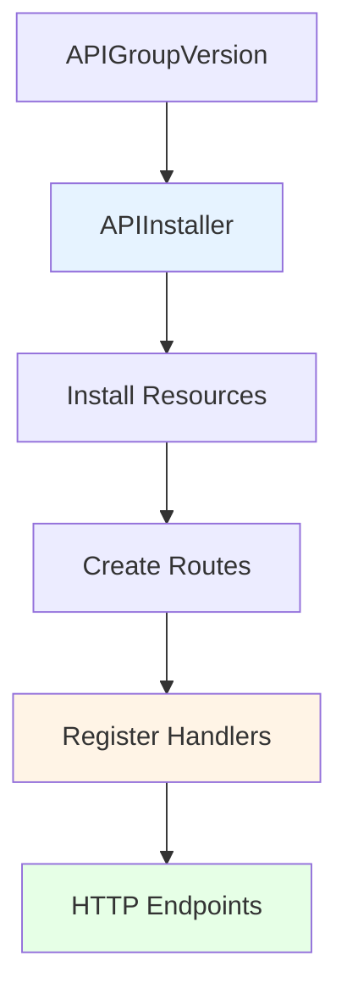
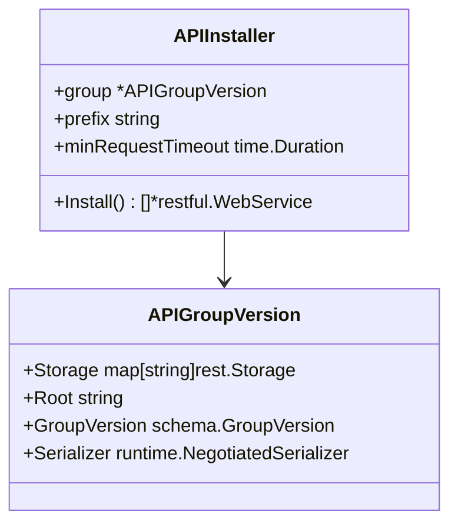
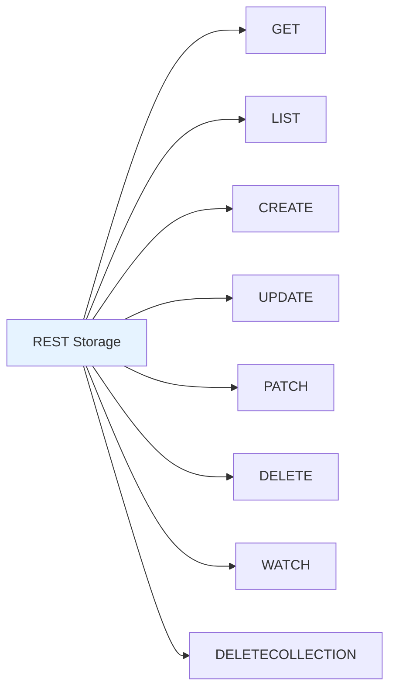
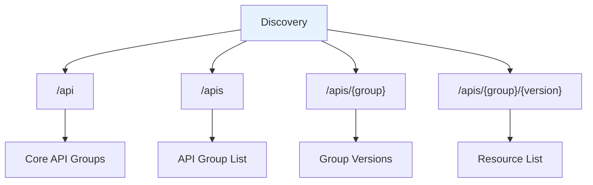
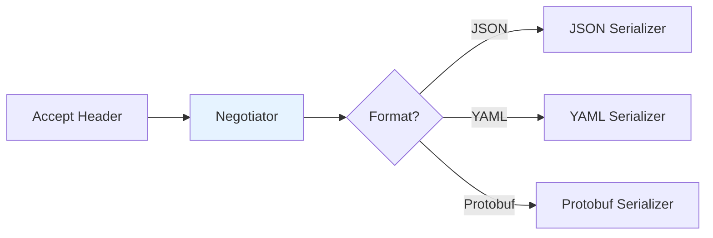

# pkg/endpoints - REST Endpoint Handling

## Overview

The `pkg/endpoints` package implements the REST endpoint handling for Kubernetes API servers. It provides the machinery for installing API resources as HTTP endpoints and handling CRUD operations.

## Purpose

The endpoints package:
- **API Installation**: Registers API resources as HTTP endpoints
- **Request Routing**: Routes requests to appropriate handlers
- **Content Negotiation**: Handles multiple serialization formats
- **Discovery**: Provides API discovery endpoints
- **Handlers**: Implements standard REST operations (GET, LIST, CREATE, UPDATE, PATCH, DELETE)

## Architecture



## Key Components

### APIInstaller

Installs API resources as HTTP endpoints:



### Request Handlers

Located in `handlers/`:

```
pkg/endpoints/handlers/
├── create.go           # CREATE handler
├── delete.go           # DELETE handler
├── get.go              # GET handler
├── patch.go            # PATCH handler
├── update.go           # UPDATE handler
├── watch.go            # WATCH handler
├── responsewriters.go  # Response writing
├── negotiation/        # Content negotiation
├── fieldmanager/       # Server-side apply
└── metrics/            # Handler metrics
```

## REST Operations

### Standard Verbs



### URL Patterns

| Operation | URL Pattern | Example |
|-----------|-------------|---------|
| GET | `/apis/{group}/{version}/namespaces/{ns}/{resource}/{name}` | `/apis/apps/v1/namespaces/default/deployments/nginx` |
| LIST | `/apis/{group}/{version}/namespaces/{ns}/{resource}` | `/apis/apps/v1/namespaces/default/deployments` |
| CREATE | `/apis/{group}/{version}/namespaces/{ns}/{resource}` | POST to `/apis/apps/v1/namespaces/default/deployments` |
| UPDATE | `/apis/{group}/{version}/namespaces/{ns}/{resource}/{name}` | PUT to `/apis/apps/v1/namespaces/default/deployments/nginx` |
| PATCH | `/apis/{group}/{version}/namespaces/{ns}/{resource}/{name}` | PATCH to `/apis/apps/v1/namespaces/default/deployments/nginx` |
| DELETE | `/apis/{group}/{version}/namespaces/{ns}/{resource}/{name}` | DELETE to `/apis/apps/v1/namespaces/default/deployments/nginx` |
| WATCH | `/apis/{group}/{version}/watch/namespaces/{ns}/{resource}` | `/apis/apps/v1/watch/namespaces/default/deployments` |

## Discovery

Located in `discovery/`:



### Aggregated Discovery

V2 discovery format provides efficient aggregated discovery:
- Single endpoint for all resources
- Includes subresources
- Reduced API calls

## Content Negotiation

Located in `handlers/negotiation/`:

Supports multiple serialization formats:
- **JSON**: Default format
- **YAML**: Human-readable
- **Protobuf**: Efficient binary format



## Filters

Located in `filters/`:

```
pkg/endpoints/filters/
├── audit.go            # Audit logging
├── authentication.go   # Authentication
├── authorization.go    # Authorization
├── cors.go             # CORS headers
├── impersonation.go    # User impersonation
├── maxinflight.go      # Concurrency limiting
├── requestinfo.go      # Request info extraction
├── timeout.go          # Request timeouts
├── trace.go            # Distributed tracing
└── warning.go          # Warning headers
```

## Package Structure

```
pkg/endpoints/
├── installer.go        # API installer
├── groupversion.go     # API group version
├── handlers/           # Request handlers
├── discovery/          # API discovery
├── filters/            # HTTP filters
├── metrics/            # Endpoint metrics
├── openapi/            # OpenAPI generation
├── request/            # Request context
└── warning/            # Warning system
```

## Related Packages
- **pkg/registry**: Provides REST storage implementations
- **pkg/server**: Integrates endpoints into server
- **pkg/admission**: Called by handlers
