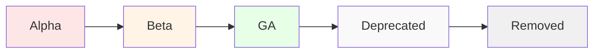

# pkg/features - Feature Gates

## Overview

The `pkg/features` package defines feature gates for the Kubernetes API server. Feature gates allow gradual rollout of new features and provide a mechanism to disable features if issues arise.

## Purpose

Feature gates enable:
- **Gradual Rollout**: Introduce features as alpha, beta, then GA
- **Risk Mitigation**: Disable problematic features
- **Backward Compatibility**: Maintain compatibility during transitions
- **Testing**: Test new features in production environments

## Feature Lifecycle



### Alpha Features
- **Default**: Disabled
- **Stability**: May have bugs
- **Support**: May be dropped without notice
- **Recommended**: Only in test clusters

### Beta Features
- **Default**: Enabled
- **Stability**: Well tested
- **Support**: Will not be dropped
- **Recommended**: Safe for production

### GA (General Availability) Features
- **Default**: Always enabled
- **Stability**: Stable
- **Support**: Fully supported
- **Gate Removal**: Gate removed after deprecation period

## Package Structure

```
pkg/features/
├── kube_features.go    # Feature gate definitions
└── OWNERS              # Code owners
```

## Key Feature Gates

Examples of apiserver feature gates:
- **APIServerIdentity**: API server instance identity
- **APIServerTracing**: Distributed tracing support
- **AggregatedDiscoveryEndpoint**: Aggregated discovery
- **CustomResourceValidationExpressions**: CEL validation for CRDs
- **ServerSideApply**: Server-side apply support
- **ServerSideFieldValidation**: Field validation on server
- **WatchList**: Efficient list+watch

## Usage

```go
import (
    utilfeature "k8s.io/apiserver/pkg/util/feature"
    "k8s.io/apiserver/pkg/features"
)

// Check if feature is enabled
if utilfeature.DefaultFeatureGate.Enabled(features.ServerSideApply) {
    // Use server-side apply
}
```

## Related Packages
- **pkg/util/feature**: Feature gate implementation
- **pkg/server**: Uses feature gates for server configuration
