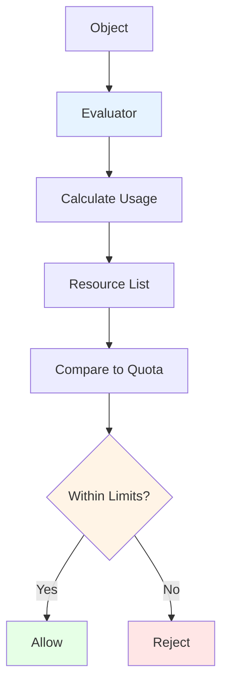

# pkg/quota - Resource Quota Evaluation

## Overview

The `pkg/quota` package provides resource quota evaluation utilities for the Kubernetes API server. It helps calculate resource usage and enforce quota limits.

## Purpose

Resource quota evaluation:
- **Usage Calculation**: Compute resource usage from objects
- **Quota Enforcement**: Check against limits
- **Multiple Resources**: Support various resource types
- **Extensibility**: Pluggable evaluators

## Architecture



## Package Structure

```
pkg/quota/
└── v1/
    ├── evaluator.go    # Quota evaluators
    ├── generic.go      # Generic evaluator
    ├── install.go      # Evaluator registration
    └── resources.go    # Resource helpers
```

## Resource Types

Quota can limit:
- **Compute Resources**: CPU, memory, storage
- **Object Counts**: Pods, services, secrets, configmaps
- **Extended Resources**: GPUs, custom resources

## Evaluator Interface

```go
type Evaluator interface {
    // Constraints returns the constraints that must be satisfied
    Constraints(required []corev1.ResourceName, object runtime.Object) []corev1.ResourceName
    
    // Usage returns the resource usage for the object
    Usage(object runtime.Object) (corev1.ResourceList, error)
    
    // UsageStats returns usage statistics
    UsageStats(options UsageStatsOptions) (UsageStats, error)
}
```

## Related Packages
- **pkg/admission/plugin/resourcequota**: Admission plugin using quota
- **pkg/registry**: Storage layer for quota objects
