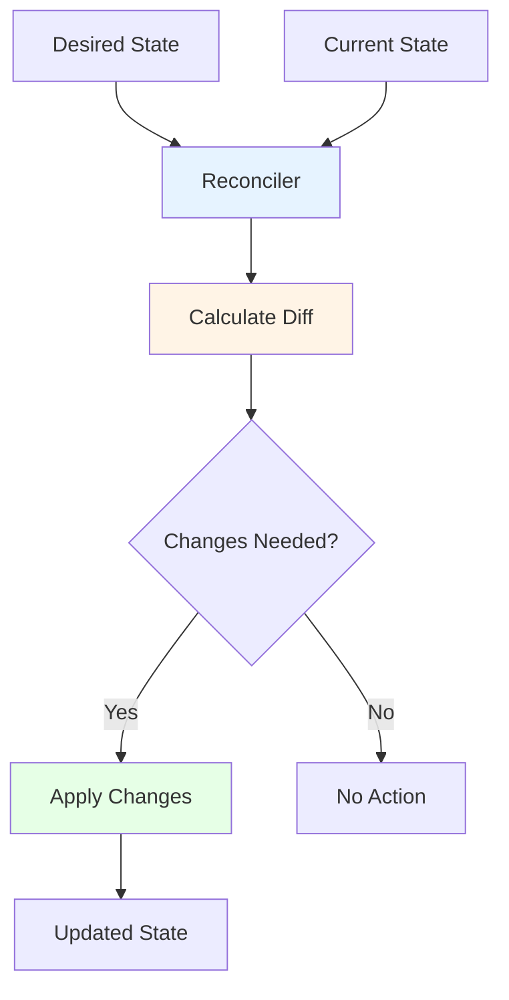
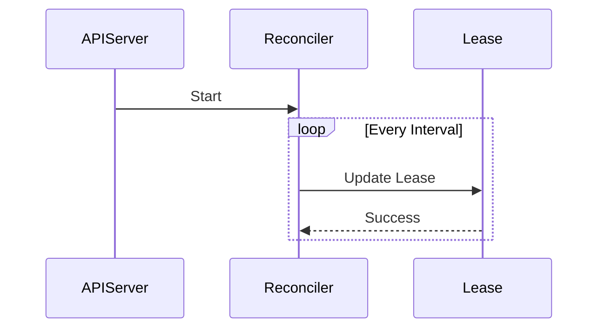

# pkg/reconcilers - Reconciliation Utilities

## Overview

The `pkg/reconcilers` package provides reconciliation utilities for the Kubernetes API server. It includes helpers for reconciling API server state with desired state.

## Purpose

Reconciliation utilities for:
- **Lease Management**: API server lease reconciliation
- **Endpoint Management**: API server endpoint reconciliation
- **State Synchronization**: Keep actual state aligned with desired state

## Architecture



## Key Components

### Peer Endpoint Lease Reconciler

Located in `peer_endpoint_lease.go`:

Manages API server instance leases for peer discovery:



**Features**:
- Creates/updates API server leases
- Heartbeat mechanism
- Peer discovery support
- Garbage collection of stale leases

## Package Structure

```
pkg/reconcilers/
├── peer_endpoint_lease.go      # Lease reconciler
└── peer_endpoint_lease_test.go # Tests
```

## Use Cases

### 1. API Server Identity
- Each API server instance has a unique lease
- Leases used for peer discovery
- Enables distributed coordination

### 2. High Availability
- Track active API server instances
- Load balancing decisions
- Failover handling

### 3. Garbage Collection
- Clean up leases from terminated instances
- Prevent resource leaks
- Maintain accurate cluster state

## Reconciliation Pattern

```go
type Reconciler interface {
    // Reconcile brings actual state to desired state
    Reconcile() error
    
    // Destroy cleans up resources
    Destroy() error
}
```

## Related Packages
- **pkg/server**: Uses reconcilers for server lifecycle
- **k8s.io/client-go/tools/leaderelection**: Leader election using leases
