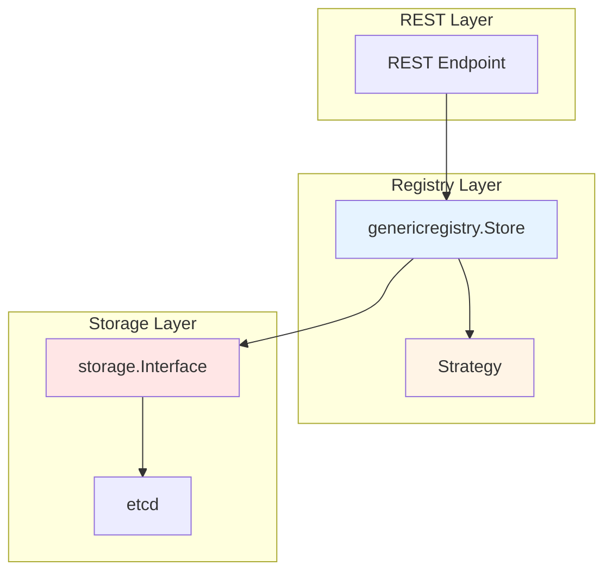
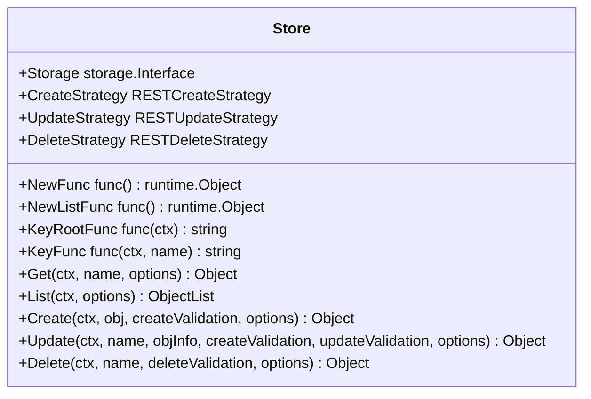
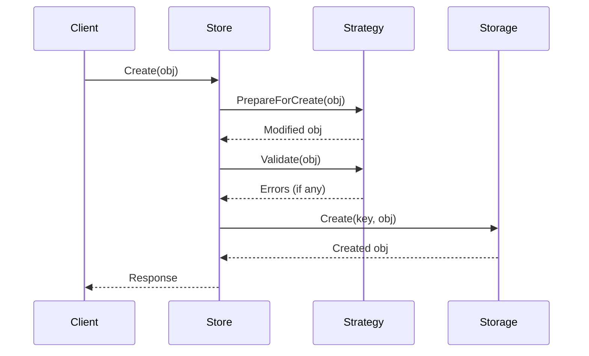
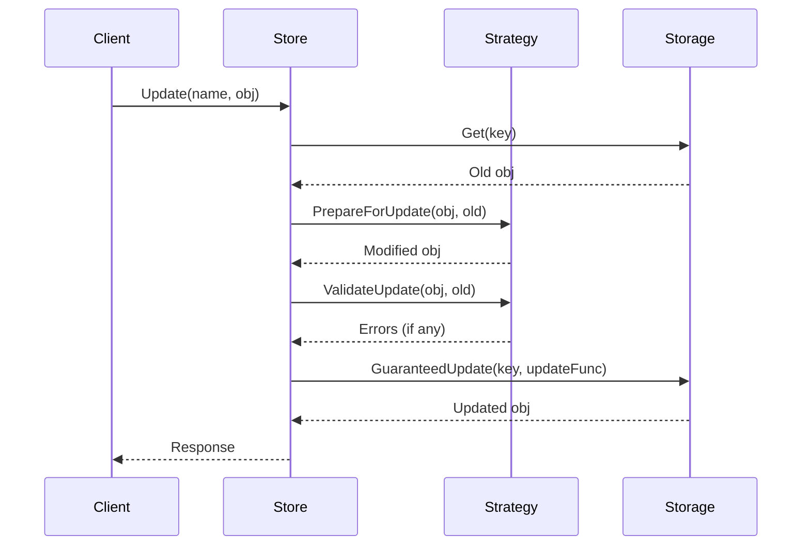
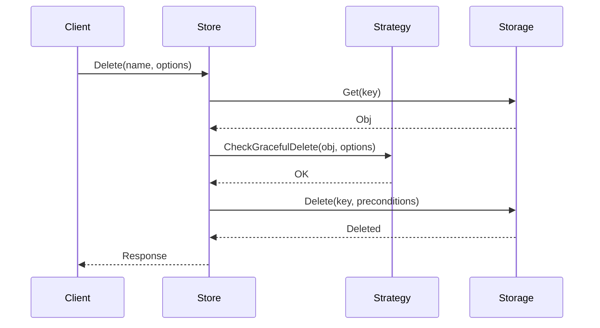

# pkg/registry - Storage Registry

## Overview

The `pkg/registry` package provides the storage registry layer that bridges REST endpoints and the storage backend. It implements the standard CRUD operations for Kubernetes resources.

## Purpose

The registry layer:
- **REST Storage**: Implements REST storage interface for resources
- **Strategy Pattern**: Encapsulates resource-specific business logic
- **Generic Implementation**: Provides reusable CRUD operations
- **Storage Abstraction**: Abstracts underlying storage (etcd)

## Architecture



## Key Components

### genericregistry.Store

The core implementation of REST storage:



### Strategy Interfaces

Located in `pkg/registry/rest/`:

```go
// RESTCreateStrategy defines the minimum validation and accepted input for creating an object
type RESTCreateStrategy interface {
    runtime.ObjectTyper
    names.NameGenerator
    
    // PrepareForCreate is invoked on create before validation
    PrepareForCreate(ctx context.Context, obj runtime.Object)
    
    // Validate returns validation errors
    Validate(ctx context.Context, obj runtime.Object) field.ErrorList
    
    // WarningsOnCreate returns warnings
    WarningsOnCreate(ctx context.Context, obj runtime.Object) []string
    
    // Canonicalize allows an object to be mutated into a canonical form
    Canonicalize(obj runtime.Object)
}

// RESTUpdateStrategy defines the minimum validation and accepted input for updating an object
type RESTUpdateStrategy interface {
    runtime.ObjectTyper
    
    // PrepareForUpdate is invoked on update before validation
    PrepareForUpdate(ctx context.Context, obj, old runtime.Object)
    
    // ValidateUpdate returns validation errors
    ValidateUpdate(ctx context.Context, obj, old runtime.Object) field.ErrorList
    
    // WarningsOnUpdate returns warnings
    WarningsOnUpdate(ctx context.Context, obj, old runtime.Object) []string
    
    // AllowCreateOnUpdate returns true if the object can be created via update
    AllowCreateOnUpdate() bool
    
    // AllowUnconditionalUpdate returns true if unconditional update is allowed
    AllowUnconditionalUpdate() bool
    
    // Canonicalize allows an object to be mutated into a canonical form
    Canonicalize(obj runtime.Object)
}

// RESTDeleteStrategy defines deletion behavior
type RESTDeleteStrategy interface {
    runtime.ObjectTyper
}
```

## CRUD Operations

### Create



### Update



### Delete



## Storage Options

### CreateOptions

```go
type CreateOptions struct {
    DryRun []string
    FieldManager string
    FieldValidation string
}
```

### UpdateOptions

```go
type UpdateOptions struct {
    DryRun []string
    FieldManager string
    FieldValidation string
}
```

### DeleteOptions

```go
type DeleteOptions struct {
    GracePeriodSeconds *int64
    Preconditions *Preconditions
    OrphanDependents *bool
    PropagationPolicy *DeletionPropagation
    DryRun []string
}
```

### ListOptions

```go
type ListOptions struct {
    LabelSelector labels.Selector
    FieldSelector fields.Selector
    Watch bool
    AllowWatchBookmarks bool
    ResourceVersion string
    ResourceVersionMatch ResourceVersionMatch
    TimeoutSeconds *int64
    Limit int64
    Continue string
}
```

## Key Functions

### Storage Key Functions

```go
// KeyRootFunc returns the root etcd key for this resource
KeyRootFunc: func(ctx context.Context) string {
    return "/registry/pods"
}

// KeyFunc returns the etcd key for a specific object
KeyFunc: func(ctx context.Context, name string) (string, error) {
    namespace := genericapirequest.NamespaceValue(ctx)
    return fmt.Sprintf("/registry/pods/%s/%s", namespace, name), nil
}
```

### Object Name Function

```go
ObjectNameFunc: func(obj runtime.Object) (string, error) {
    accessor, err := meta.Accessor(obj)
    if err != nil {
        return "", err
    }
    return accessor.GetName(), nil
}
```

### Predicate Function

```go
PredicateFunc: func(label labels.Selector, field fields.Selector) storage.SelectionPredicate {
    return storage.SelectionPredicate{
        Label: label,
        Field: field,
        GetAttrs: func(obj runtime.Object) (labels.Set, fields.Set, error) {
            pod, ok := obj.(*api.Pod)
            if !ok {
                return nil, nil, fmt.Errorf("not a pod")
            }
            return labels.Set(pod.Labels), PodToSelectableFields(pod), nil
        },
    }
}
```

## REST Storage Interfaces

Located in `pkg/registry/rest/`:

```go
// Storage is a generic interface for RESTful storage services
type Storage interface {
    // New returns an empty object that can be used with Create and Update
    New() runtime.Object
}

// Getter is an interface for retrieving a single object
type Getter interface {
    Get(ctx context.Context, name string, options *metav1.GetOptions) (runtime.Object, error)
}

// Lister is an interface for listing objects
type Lister interface {
    NewList() runtime.Object
    List(ctx context.Context, options *metainternalversion.ListOptions) (runtime.Object, error)
}

// CreaterUpdater is an interface for creating and updating objects
type CreaterUpdater interface {
    Creater
    Updater
}

// StandardStorage is the interface for standard REST storage
type StandardStorage interface {
    Getter
    Lister
    CreaterUpdater
    GracefulDeleter
    CollectionDeleter
    Watcher
}
```

## Subresources

Subresources are implemented as separate REST storage:

```go
// Status subresource
type StatusREST struct {
    store *genericregistry.Store
}

func (r *StatusREST) New() runtime.Object {
    return &api.Pod{}
}

func (r *StatusREST) Get(ctx context.Context, name string, options *metav1.GetOptions) (runtime.Object, error) {
    return r.store.Get(ctx, name, options)
}

func (r *StatusREST) Update(ctx context.Context, name string, objInfo rest.UpdatedObjectInfo, createValidation rest.ValidateObjectFunc, updateValidation rest.ValidateObjectUpdateFunc, forceAllowCreate bool, options *metav1.UpdateOptions) (runtime.Object, bool, error) {
    // Update only the status subresource
    return r.store.Update(ctx, name, objInfo, createValidation, updateValidation, false, options)
}
```

## Package Structure

```
pkg/registry/
├── doc.go              # Package documentation
├── generic/            # Generic registry implementation
│   ├── registry/       # Generic store implementation
│   │   ├── store.go    # Main Store implementation
│   │   └── storage_*.go # Storage helpers
│   └── options/        # Storage options
└── rest/               # REST storage interfaces
    ├── rest.go         # Core interfaces
    ├── create.go       # Create interfaces
    ├── update.go       # Update interfaces
    ├── delete.go       # Delete interfaces
    └── watch.go        # Watch interfaces
```

## Example: Pod Storage

```go
// PodStorage implements REST storage for pods
type PodStorage struct {
    Pod    *REST
    Status *StatusREST
    Log    *LogREST
    Exec   *ExecREST
    Attach *AttachREST
}

// REST implements the main pod storage
type REST struct {
    *genericregistry.Store
}

// NewREST returns a RESTStorage object for pods
func NewREST(optsGetter generic.RESTOptionsGetter) (*REST, *StatusREST, error) {
    store := &genericregistry.Store{
        NewFunc:     func() runtime.Object { return &api.Pod{} },
        NewListFunc: func() runtime.Object { return &api.PodList{} },
        DefaultQualifiedResource: api.Resource("pods"),
        
        CreateStrategy: pod.Strategy,
        UpdateStrategy: pod.Strategy,
        DeleteStrategy: pod.Strategy,
        
        TableConvertor: printerstorage.TableConvertor{TableGenerator: printers.NewTableGenerator()},
    }
    
    options := &generic.StoreOptions{RESTOptions: optsGetter}
    if err := store.CompleteWithOptions(options); err != nil {
        return nil, nil, err
    }
    
    statusStore := *store
    statusStore.UpdateStrategy = pod.StatusStrategy
    
    return &REST{store}, &StatusREST{store: &statusStore}, nil
}
```

## Decorators and Hooks

### BeginCreate/AfterCreate

```go
store.BeginCreate = func(ctx context.Context, obj runtime.Object, options *metav1.CreateOptions) (FinishFunc, error) {
    // Pre-create logic
    return func(ctx context.Context, success bool) {
        // Post-create logic
    }, nil
}

store.AfterCreate = func(obj runtime.Object, options *metav1.CreateOptions) {
    // After create hook
}
```

### BeginUpdate/AfterUpdate

```go
store.BeginUpdate = func(ctx context.Context, obj, old runtime.Object, options *metav1.UpdateOptions) (FinishFunc, error) {
    // Pre-update logic
    return func(ctx context.Context, success bool) {
        // Post-update logic
    }, nil
}

store.AfterUpdate = func(obj runtime.Object, options *metav1.UpdateOptions) {
    // After update hook
}
```

### AfterDelete

```go
store.AfterDelete = func(obj runtime.Object, options *metav1.DeleteOptions) {
    // After delete hook
}
```

## Best Practices

### 1. Use Generic Store

Leverage genericregistry.Store for standard resources:
```go
store := &genericregistry.Store{
    NewFunc:     func() runtime.Object { return &MyResource{} },
    NewListFunc: func() runtime.Object { return &MyResourceList{} },
    // ... configure strategies
}
```

### 2. Implement Strategies

Encapsulate business logic in strategies:
```go
type myStrategy struct {
    runtime.ObjectTyper
    names.NameGenerator
}

func (s *myStrategy) PrepareForCreate(ctx context.Context, obj runtime.Object) {
    // Set defaults, generate names, etc.
}

func (s *myStrategy) Validate(ctx context.Context, obj runtime.Object) field.ErrorList {
    // Validate the object
    return validation.ValidateMyResource(obj.(*api.MyResource))
}
```

### 3. Handle Subresources

Implement subresources as separate REST storage:
```go
type StatusREST struct {
    store *genericregistry.Store
}

// Implement only the operations needed for status
```

## Related Packages

- **pkg/storage**: Underlying storage interface
- **pkg/endpoints**: REST endpoint installation
- **pkg/admission**: Validation and mutation
- **k8s.io/apimachinery/pkg/runtime**: Object type system

## References

- [API Conventions](https://github.com/kubernetes/community/blob/master/contributors/devel/sig-architecture/api-conventions.md)
- [API Changes](https://github.com/kubernetes/community/blob/master/contributors/devel/sig-architecture/api_changes.md)
