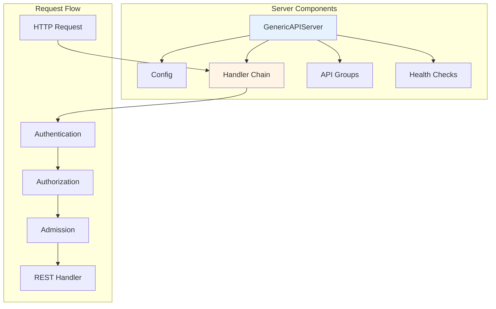
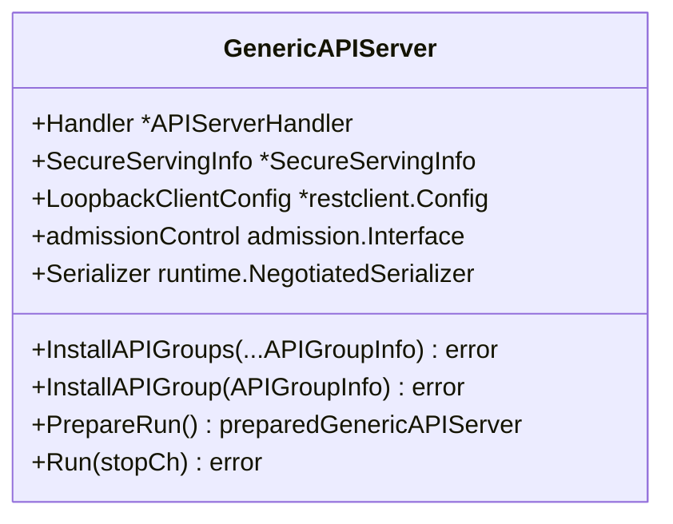
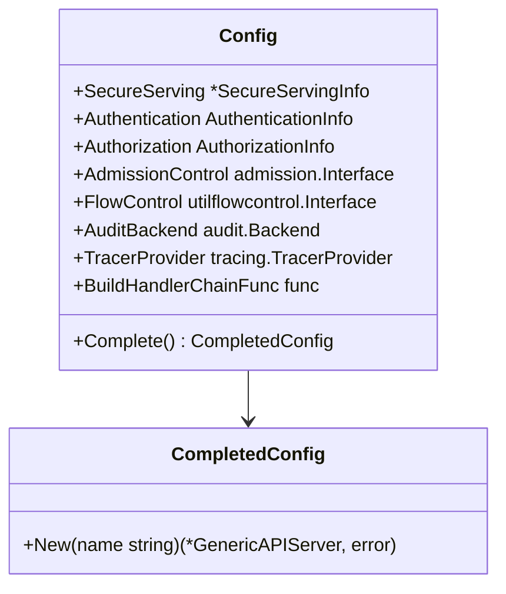
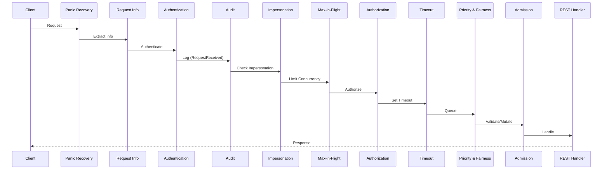
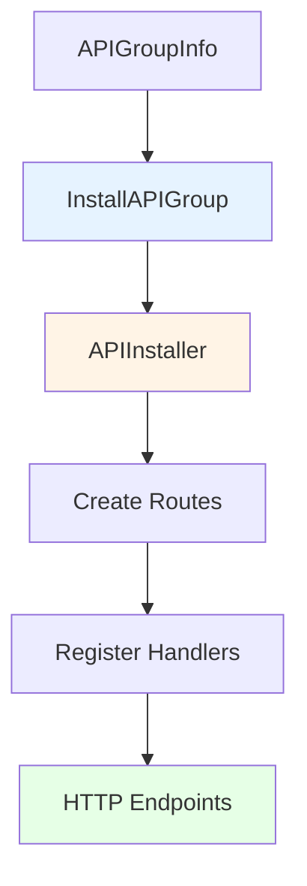
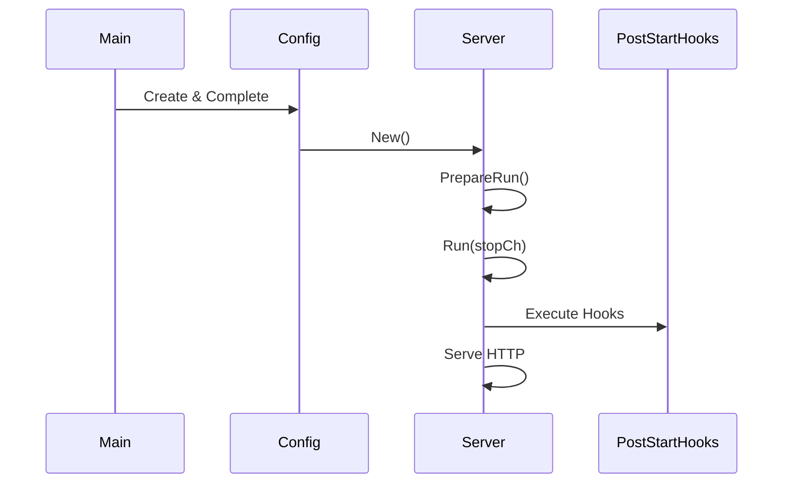
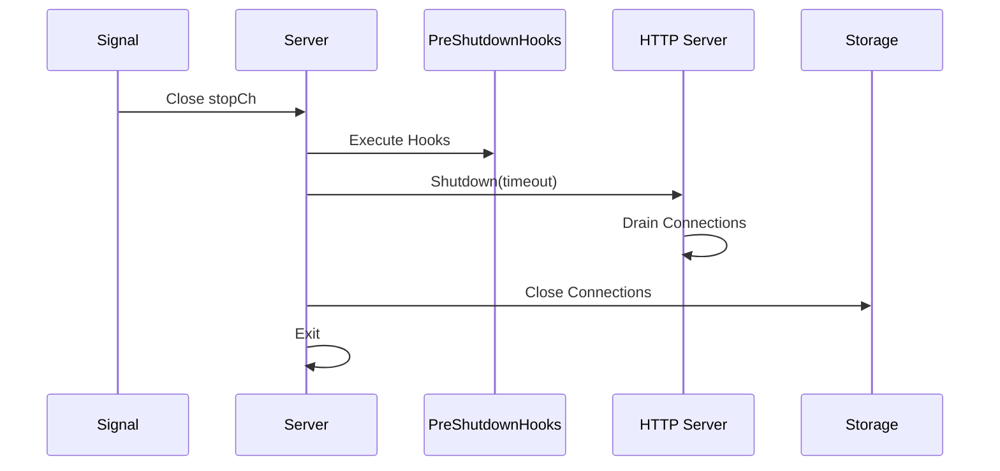
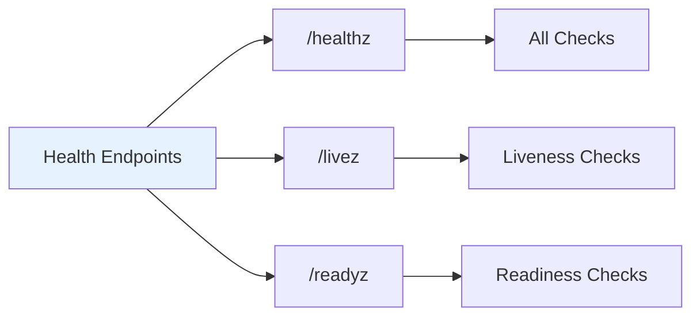
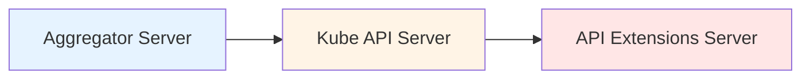
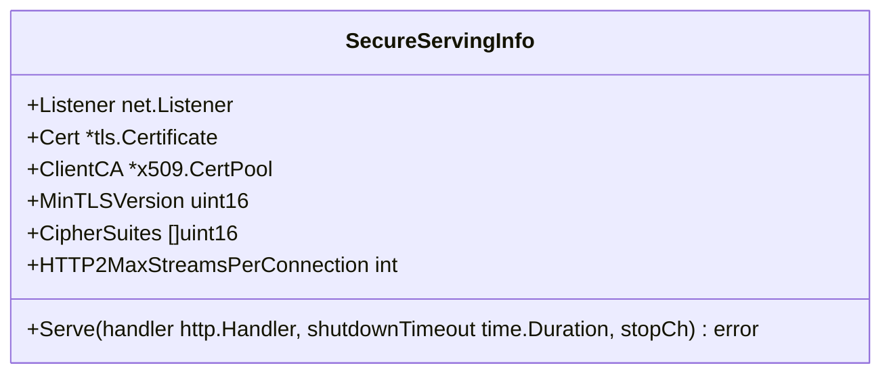

# pkg/server - GenericAPIServer Core

## Overview

The `pkg/server` package contains the core GenericAPIServer implementation, which is the heart of any Kubernetes API server. It assembles and runs the complete HTTP serving stack with all necessary components.

## Purpose

The server package provides:
- **GenericAPIServer**: Main server implementation
- **Configuration**: Server configuration and options
- **Handler Chain**: HTTP request processing pipeline
- **Lifecycle Management**: Startup, shutdown, and health checks
- **API Group Installation**: Register and serve API groups
- **Server Delegation**: Chain multiple servers together

## Architecture



## GenericAPIServer

The main server struct:



### Key Fields

- **Handler**: HTTP handler for all requests
- **SecureServingInfo**: TLS configuration
- **LoopbackClientConfig**: Privileged client for internal use
- **admissionControl**: Admission control chain
- **Serializer**: Object serialization

## Server Configuration



### Configuration Steps

1. **Create Config**: Initialize configuration
2. **Set Options**: Configure authentication, authorization, etc.
3. **Complete**: Validate and finalize configuration
4. **New Server**: Create GenericAPIServer instance

## Handler Chain

The default handler chain processes requests through multiple filters:



### Handler Chain Filters

Located in `pkg/server/filters/` and `pkg/endpoints/filters/`:

| Filter | Purpose |
|--------|---------|
| **Panic Recovery** | Catch panics and return 500 |
| **Request Info** | Extract request metadata |
| **Authentication** | Identify user |
| **Audit** | Log request (RequestReceived stage) |
| **Impersonation** | Handle user impersonation |
| **Max-in-Flight** | Limit concurrent requests |
| **Authorization** | Check permissions |
| **Timeout** | Set request timeout |
| **Priority & Fairness** | Queue and prioritize requests |
| **Admission** | Validate and mutate objects |

## API Group Installation



### APIGroupInfo Structure

```go
type APIGroupInfo struct {
    // Prioritized versions for this group
    PrioritizedVersions []schema.GroupVersion
    
    // Map from version to resource to storage
    VersionedResourcesStorageMap map[string]map[string]rest.Storage
    
    // Scheme for type conversion
    Scheme *runtime.Scheme
    
    // Serializer for encoding/decoding
    NegotiatedSerializer runtime.NegotiatedSerializer
    
    // Parameter codec for query parameters
    ParameterCodec runtime.ParameterCodec
}
```

### Installation Process

```go
// Create API group info
apiGroupInfo := genericapiserver.APIGroupInfo{
    PrioritizedVersions: []schema.GroupVersion{
        {Group: "apps", Version: "v1"},
    },
    VersionedResourcesStorageMap: map[string]map[string]rest.Storage{
        "v1": {
            "deployments": deploymentStorage,
            "replicasets": replicasetStorage,
        },
    },
    Scheme: scheme,
    NegotiatedSerializer: codecs,
    ParameterCodec: parameterCodec,
}

// Install API group
if err := server.InstallAPIGroup(&apiGroupInfo); err != nil {
    return err
}
```

## Server Lifecycle

### Startup



### Shutdown



## Health Checks

Located in `pkg/server/healthz/`:



### Health Check Types

- **/healthz**: Overall health (deprecated, use /livez and /readyz)
- **/livez**: Liveness probe (should restart if fails)
- **/readyz**: Readiness probe (should not receive traffic if fails)

### Built-in Checks

- **ping**: Always succeeds
- **log**: Check if logging is working
- **etcd**: Check etcd connectivity
- **poststarthook/{name}**: Check if post-start hook completed
- **shutdown**: Check if server is shutting down

## Post-Start Hooks

Hooks that run after server starts:

```go
// Add post-start hook
server.AddPostStartHook("my-hook", func(context PostStartHookContext) error {
    // Initialization logic
    return nil
})
```

**Common Uses**:
- Start informers
- Initialize caches
- Start background controllers
- Perform health checks

## Pre-Shutdown Hooks

Hooks that run before server shuts down:

```go
// Add pre-shutdown hook
server.AddPreShutdownHook("my-hook", func() error {
    // Cleanup logic
    return nil
})
```

**Common Uses**:
- Graceful degradation
- Notify external systems
- Flush buffers
- Close connections

## Server Delegation

Chaining multiple servers:



```go
// Create delegated server
delegateConfig := &server.Config{
    // ... configuration
}
delegateServer, err := delegateConfig.Complete().New("delegate", delegationTarget)

// Create aggregator with delegation
aggregatorConfig := &server.Config{
    // ... configuration
}
aggregatorServer, err := aggregatorConfig.Complete().New("aggregator", delegateServer)
```

## Secure Serving



### TLS Configuration

- **Server Certificate**: For HTTPS
- **Client CA**: For client certificate authentication
- **TLS Version**: Minimum TLS 1.2
- **Cipher Suites**: Secure cipher configuration
- **HTTP/2**: Support for HTTP/2

## Package Structure

```
pkg/server/
├── config.go               # Server configuration
├── genericapiserver.go     # GenericAPIServer implementation
├── handler.go              # HTTP handler
├── options/                # Server options
│   ├── recommended.go      # Recommended options
│   ├── authentication.go   # Authentication options
│   ├── authorization.go    # Authorization options
│   └── admission.go        # Admission options
├── filters/                # HTTP filters
│   ├── cors.go            # CORS support
│   ├── maxinflight.go     # Concurrency limiting
│   └── timeout.go         # Request timeouts
├── healthz/                # Health check framework
│   ├── healthz.go         # Health check implementation
│   └── ping.go            # Ping check
├── routes/                 # Standard routes
│   ├── index.go           # Index page
│   ├── profiling.go       # Profiling endpoints
│   ├── metrics.go         # Metrics endpoints
│   └── openapi.go         # OpenAPI endpoints
├── storage/                # Storage configuration
│   └── resource_config.go
├── dynamiccertificates/    # Dynamic certificate loading
├── egressselector/         # Egress network configuration
└── httplog/                # HTTP logging
```

## Best Practices

### 1. Use Recommended Options

Start with recommended options:
```go
recommendedOptions := options.NewRecommendedOptions(
    defaultEtcdPathPrefix,
    apiserver.Codecs.LegacyCodec(v1.SchemeGroupVersion),
)
```

### 2. Complete Configuration

Always complete configuration before creating server:
```go
completedConfig := config.Complete()
server, err := completedConfig.New("my-server", delegationTarget)
```

### 3. Add Health Checks

Add custom health checks:
```go
server.AddHealthChecks(
    healthz.NamedCheck("my-check", func(r *http.Request) error {
        // Check logic
        return nil
    }),
)
```

### 4. Use Post-Start Hooks

Initialize resources after server starts:
```go
server.AddPostStartHook("start-informers", func(context PostStartHookContext) error {
    informerFactory.Start(context.StopCh)
    return nil
})
```

## Related Packages

- **pkg/endpoints**: REST endpoint handling
- **pkg/registry**: Storage layer
- **pkg/admission**: Admission control
- **pkg/authentication**: Authentication
- **pkg/authorization**: Authorization
- **pkg/audit**: Audit logging

## References

- [API Server Architecture](https://kubernetes.io/docs/concepts/overview/kubernetes-api/)
- [Aggregation Layer](https://kubernetes.io/docs/concepts/extend-kubernetes/api-extension/apiserver-aggregation/)
