# pkg/storage - Storage Layer

## Overview

The `pkg/storage` package provides the storage interface and implementations for persisting Kubernetes objects. It abstracts the underlying storage backend (typically etcd) and provides features like watch caching, encryption, and efficient list/watch operations.

## Purpose

The storage layer:
- **Storage Abstraction**: Unified interface for different storage backends
- **Watch Cache**: In-memory cache for efficient watch operations
- **Encryption**: Transparent encryption at rest
- **Optimistic Concurrency**: ResourceVersion-based conflict detection
- **Efficient Operations**: Optimized list, watch, and pagination

## Architecture

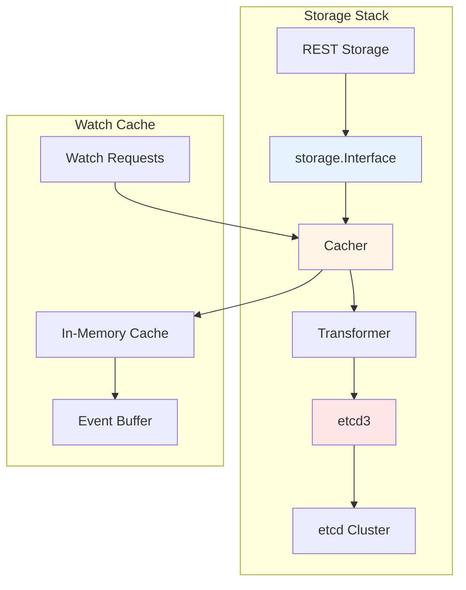

## Core Interface

```go
type Interface interface {
    Versioner() Versioner
    Create(ctx context.Context, key string, obj, out runtime.Object, ttl uint64) error
    Delete(ctx context.Context, key string, out runtime.Object, preconditions *Preconditions, validateDeletion ValidateObjectFunc, cachedExistingObject runtime.Object) error
    Watch(ctx context.Context, key string, opts ListOptions) (watch.Interface, error)
    Get(ctx context.Context, key string, opts GetOptions, objPtr runtime.Object) error
    GetList(ctx context.Context, key string, opts ListOptions, listObj runtime.Object) error
    GuaranteedUpdate(ctx context.Context, key string, destination runtime.Object, ignoreNotFound bool, preconditions *Preconditions, tryUpdate UpdateFunc, cachedExistingObject runtime.Object) error
    Count(key string) (int64, error)
}
```

## Key Components

### 1. Cacher

Located in `cacher/`:

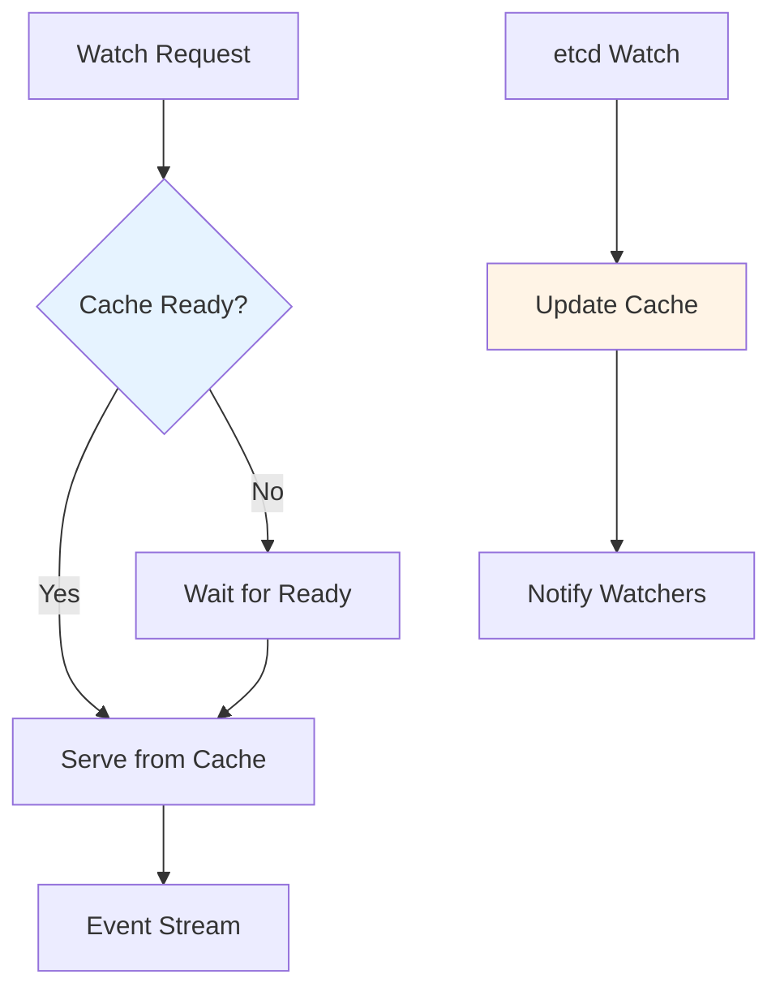

**Features**:
- In-memory object cache
- Event history buffer
- Bookmark support
- Consistent reads
- Fall-through to etcd

### 2. etcd3 Storage

Located in `etcd3/`:

Direct etcd v3 client implementation:

```go
type store struct {
    client *clientv3.Client
    codec runtime.Codec
    versioner Versioner
    transformer value.Transformer
    pathPrefix string
    watcher *watcher
    pagingEnabled bool
    leaseManager *leaseManager
}
```

### 3. Value Transformer

Located in `value/`:

Transforms values before storage (e.g., encryption):

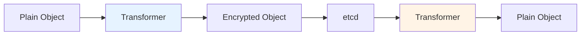

**Transformers**:
- **Identity**: No transformation
- **Prefix**: Add prefix
- **AES-CBC**: AES encryption
- **AES-GCM**: AES-GCM encryption
- **KMS**: External KMS encryption

## Operations

### Create

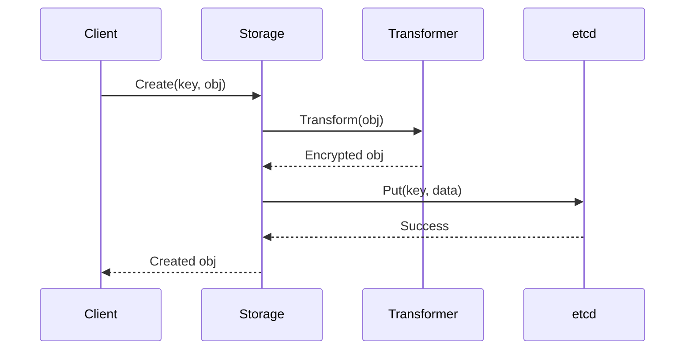

### Get

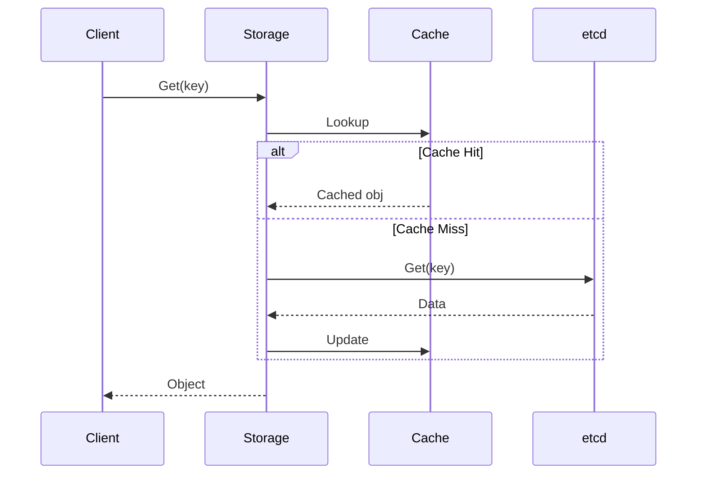

### List

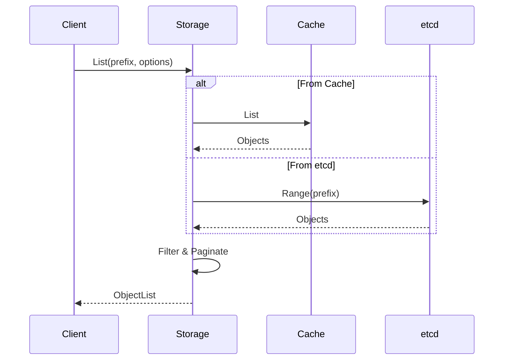

### Watch

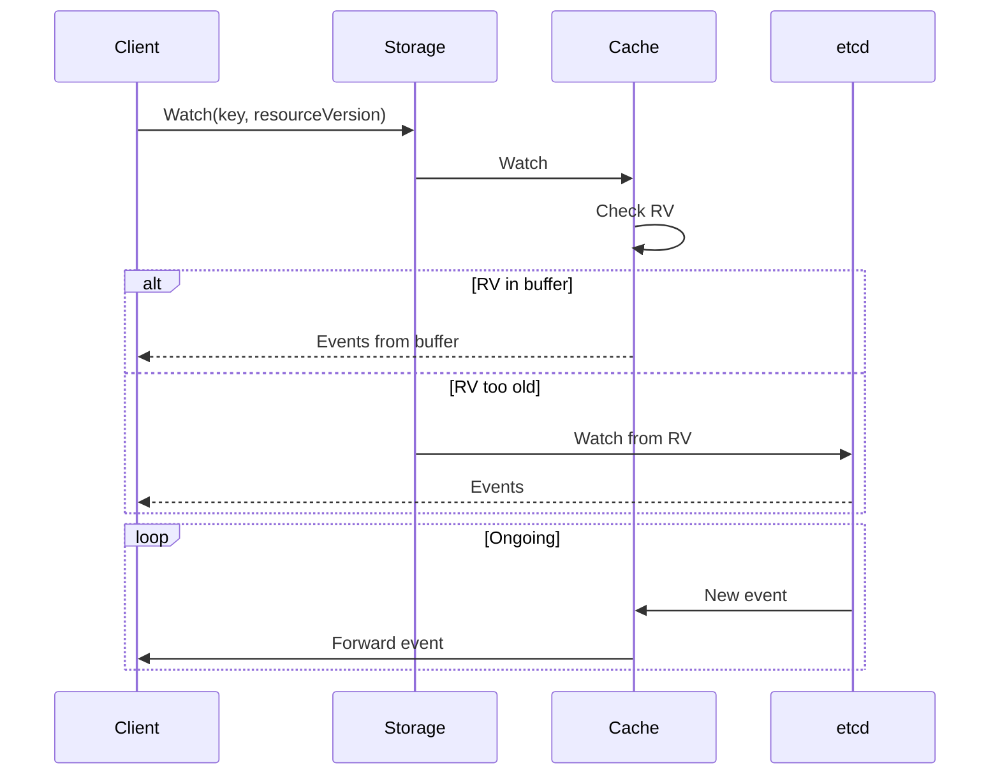

### GuaranteedUpdate

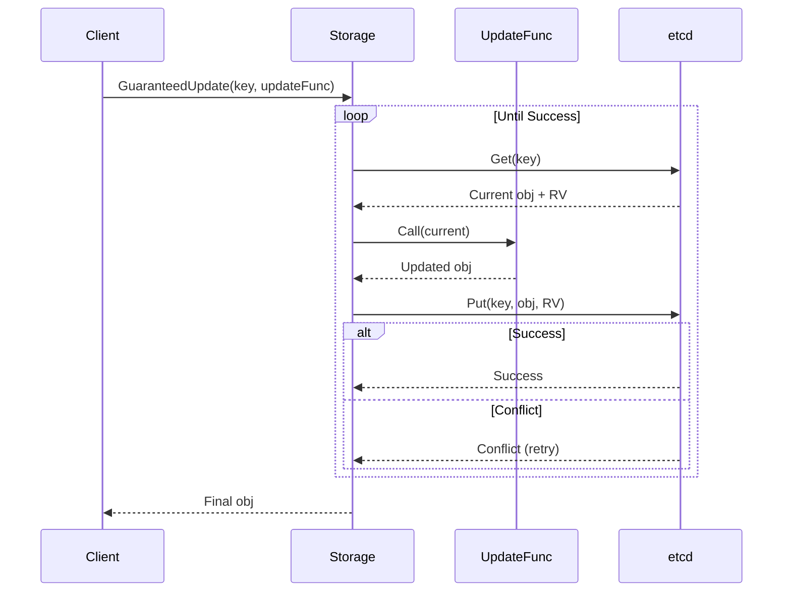

## Watch Cache

### Initialization

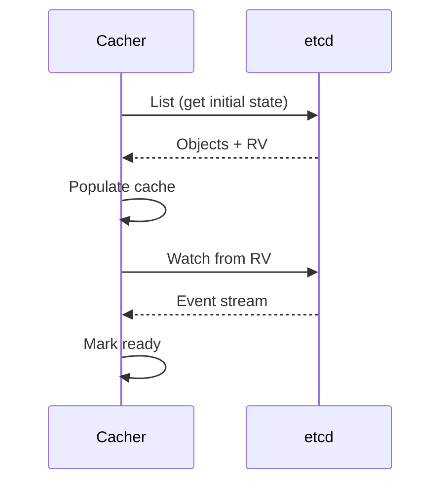

### Event Processing

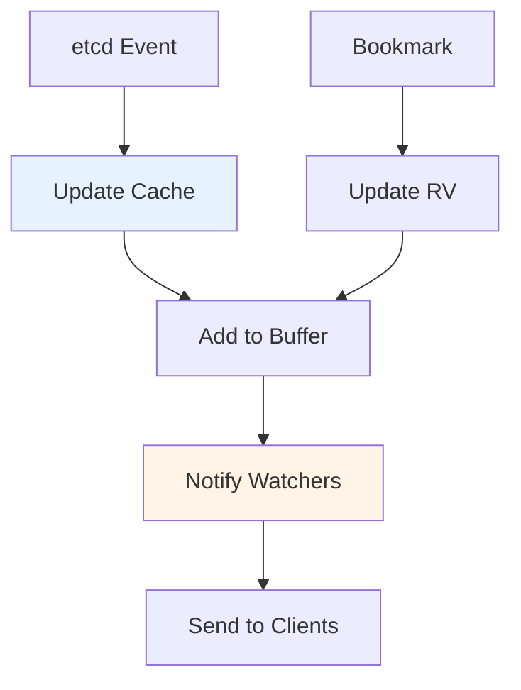

## Pagination

```go
type ListOptions struct {
    Predicate SelectionPredicate
    Recursive bool
    ResourceVersion string
    ResourceVersionMatch ResourceVersionMatch
    Limit int64
    Continue string
}
```

**Pagination Flow**:
1. Client requests with Limit
2. Server returns up to Limit items
3. Server includes Continue token if more items exist
4. Client uses Continue token for next page

## Consistency Guarantees

### Resource Version

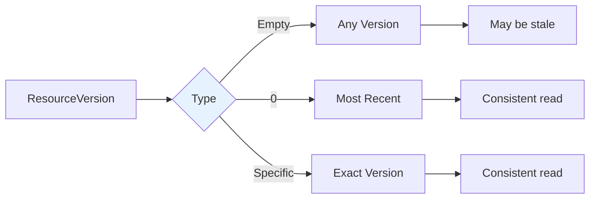

### ResourceVersionMatch

- **NotOlderThan**: Return data at least as fresh as provided RV
- **Exact**: Return data at exactly the provided RV

## Package Structure

```
pkg/storage/
├── interfaces.go           # Core storage interface
├── selection_predicate.go  # Filtering predicates
├── cacher/                 # Watch cache implementation
│   ├── cacher.go          # Main cacher
│   ├── watch_cache.go     # Watch cache
│   └── cache_watcher.go   # Cache watcher
├── etcd3/                  # etcd v3 implementation
│   ├── store.go           # Main store
│   ├── watcher.go         # Watch implementation
│   ├── compact.go         # Compaction
│   └── metrics/           # Storage metrics
├── value/                  # Value transformation
│   ├── transformer.go     # Transformer interface
│   ├── encrypt/           # Encryption transformers
│   └── metrics/           # Transformation metrics
├── storagebackend/         # Storage backend configuration
│   └── factory.go
└── testing/                # Testing utilities
    └── utils.go
```

## Encryption at Rest

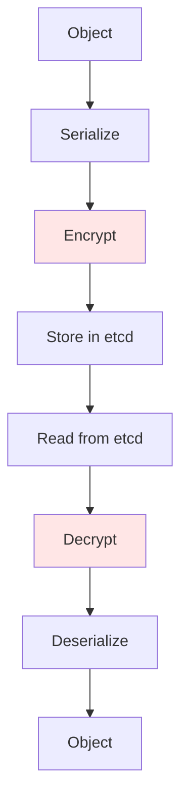

**Encryption Providers**:
- **identity**: No encryption
- **aescbc**: AES-CBC encryption
- **aesgcm**: AES-GCM encryption
- **secretbox**: NaCl Secretbox
- **kms**: External KMS (v1 and v2)

## Best Practices

### 1. Use Watch Cache

Enable watch cache for better performance:
```go
config := storagebackend.Config{
    Type: "etcd3",
    CacherConfig: &storage.CacherConfig{
        Size: 100,
        Clock: clock.RealClock{},
    },
}
```

### 2. Set Appropriate TTL

Use TTL for temporary objects:
```go
err := storage.Create(ctx, key, obj, out, 3600) // 1 hour TTL
```

### 3. Use Pagination

Paginate large lists:
```go
opts := storage.ListOptions{
    Predicate: predicate,
    Limit: 500,
}
```

### 4. Handle Conflicts

Retry on conflicts in GuaranteedUpdate:
```go
err := storage.GuaranteedUpdate(ctx, key, out, true, nil,
    func(input runtime.Object, res storage.ResponseMeta) (runtime.Object, *uint64, error) {
        // Update logic
        return updated, nil, nil
    }, nil)
```

## Related Packages

- **pkg/registry**: Uses storage interface
- **pkg/server**: Configures storage
- **k8s.io/apimachinery/pkg/watch**: Watch interface

## References

- [etcd Documentation](https://etcd.io/docs/)
- [Encryption at Rest](https://kubernetes.io/docs/tasks/administer-cluster/encrypt-data/)
