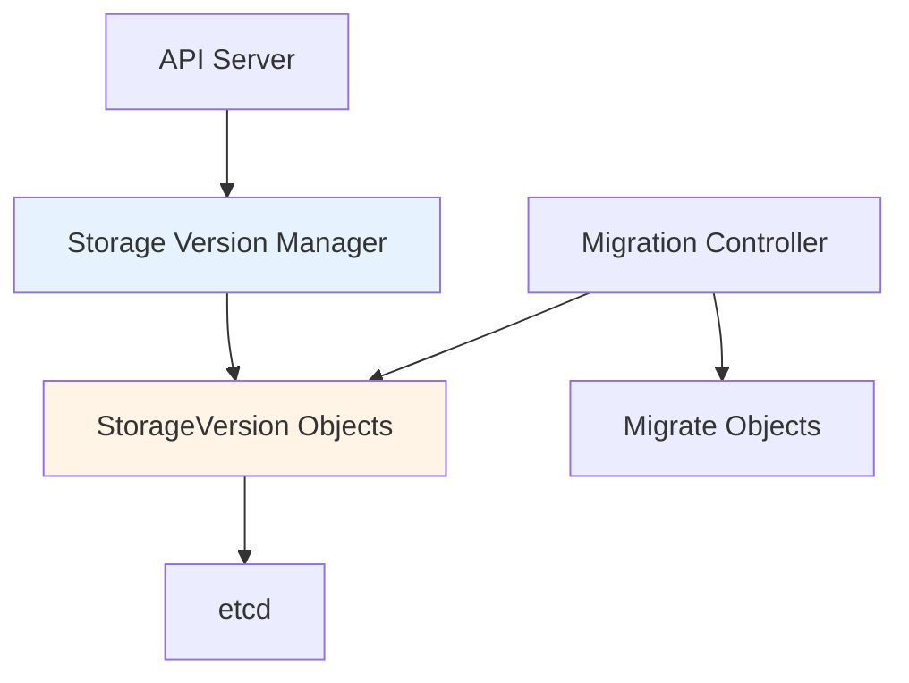

# pkg/storageversion - Storage Version Management

## Overview

The `pkg/storageversion` package manages storage version information for API resources. It tracks which version of each resource is used for persistence in etcd.

## Purpose

Storage version management:
- **Version Tracking**: Track storage versions for resources
- **Migration Support**: Enable storage version migration
- **Version Discovery**: Expose storage versions via API
- **Consistency**: Ensure consistent storage format

## Architecture



## StorageVersion API

```yaml
apiVersion: internal.apiserver.k8s.io/v1alpha1
kind: StorageVersion
metadata:
  name: pods.core
spec:
  # Not used
status:
  storageVersions:
  - apiServerID: "kube-apiserver-1"
    encodingVersion: "v1"
    decodableVersions:
    - "v1"
  commonEncodingVersion: "v1"
```

## Package Structure

```
pkg/storageversion/
├── manager.go              # Storage version manager
├── updater.go              # Version updater
└── testing/                # Testing utilities
```

## Use Cases

### 1. Storage Migration
- Track current storage version
- Plan migration to new version
- Verify migration completion

### 2. Multi-Version Support
- Support multiple API versions
- Maintain backward compatibility
- Gradual version rollout

## Related Packages
- **pkg/storage**: Storage layer
- **pkg/registry**: REST storage
