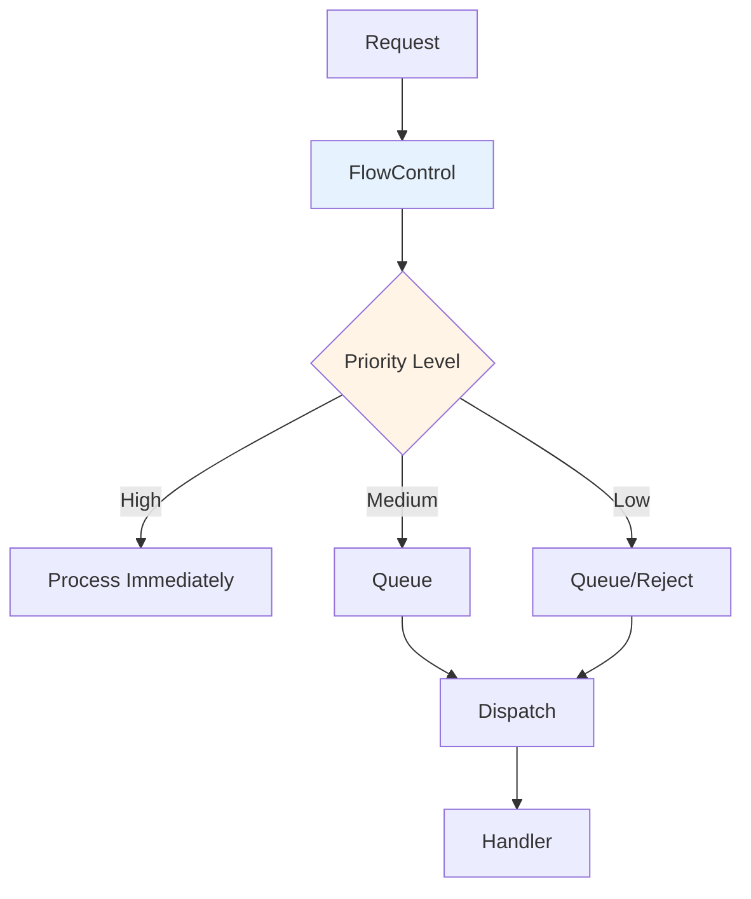
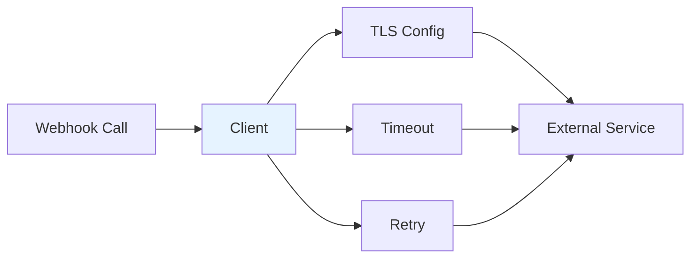

# pkg/util - Utility Packages

## Overview

The `pkg/util` package contains various utility subpackages used throughout the apiserver. These utilities provide common functionality for flow control, webhooks, feature gates, and more.

## Key Subpackages

### flowcontrol

Priority and fairness request management:



**Features**:
- Request classification
- Priority levels
- Fair queuing
- Concurrency limiting
- Metrics and monitoring

### webhook

Webhook client utilities:



**Features**:
- Webhook client creation
- TLS configuration
- Timeout handling
- Retry logic
- Metrics

### feature

Feature gate utilities:

```go
// Check if feature is enabled
if utilfeature.DefaultFeatureGate.Enabled(features.ServerSideApply) {
    // Use feature
}
```

### dryrun

Dry-run request handling:

```go
// Check if request is dry-run
if dryrun.IsDryRun(options.DryRun) {
    // Skip persistence
}
```

## Package Structure

```
pkg/util/
├── flowcontrol/            # Priority and fairness
│   ├── fairqueuing/       # Fair queuing implementation
│   ├── metrics/           # Flow control metrics
│   └── request/           # Request classification
├── webhook/                # Webhook utilities
│   ├── client.go          # Webhook client
│   └── metrics.go         # Webhook metrics
├── feature/                # Feature gate utilities
│   └── feature.go
├── dryrun/                 # Dry-run utilities
│   └── dryrun.go
├── proxy/                  # Proxy utilities
│   └── upgradeaware.go
└── x509/                   # X.509 utilities
    └── cert.go
```

## Related Packages
- **pkg/server**: Uses utilities
- **pkg/endpoints**: Uses utilities
- **pkg/admission**: Uses utilities
