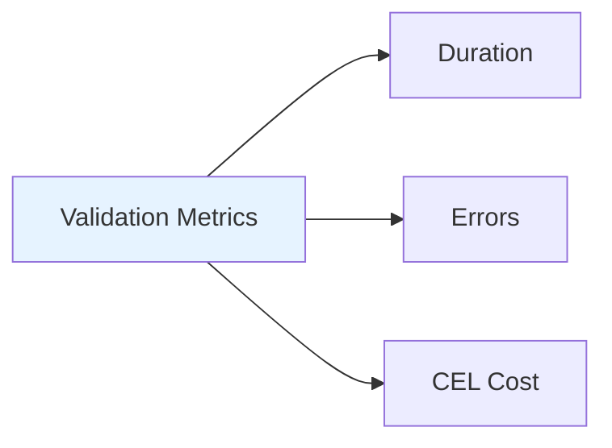

# pkg/validation - Validation Metrics

## Overview

The `pkg/validation` package provides validation metrics for the API server. It tracks validation operations and their performance.

## Purpose

Validation metrics:
- **Performance Tracking**: Monitor validation latency
- **Error Tracking**: Count validation failures
- **CEL Metrics**: Track CEL expression evaluation

## Metrics



### Key Metrics

- **validation_duration_seconds**: Validation latency
- **validation_errors_total**: Validation error count
- **cel_compilation_duration_seconds**: CEL compilation time
- **cel_evaluation_duration_seconds**: CEL evaluation time
- **cel_cost_total**: CEL evaluation cost

## Package Structure

```
pkg/validation/
├── metrics.go              # Validation metrics
└── metrics_test.go         # Tests
```

## Usage

```go
import "k8s.io/apiserver/pkg/validation"

// Record validation duration
validation.RecordValidationDuration(duration, result)

// Record CEL evaluation
validation.RecordCELEvaluation(cost, duration)
```

## Related Packages
- **pkg/admission**: Uses validation metrics
- **pkg/cel**: CEL evaluation metrics
