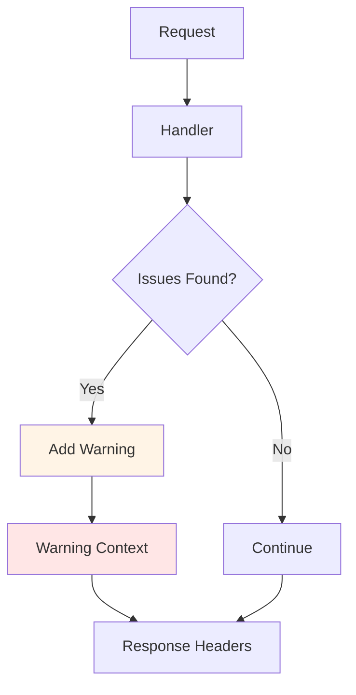

# pkg/warning - Warning Header Support

## Overview

The `pkg/warning` package provides support for HTTP Warning headers in API responses. Warnings allow the API server to communicate non-fatal issues to clients.

## Purpose

Warning system:
- **Deprecation Notices**: Warn about deprecated APIs
- **Validation Warnings**: Non-fatal validation issues
- **Best Practice Hints**: Suggest improvements
- **Client Communication**: Inform without failing requests

## Architecture



## Warning Format

HTTP Warning header format (RFC 7234):

```
Warning: 299 - "message" "date"
```

Example:
```
Warning: 299 - "apps/v1beta1 Deployment is deprecated; use apps/v1 Deployment" "Sat, 25 Aug 2018 12:00:00 GMT"
```

## Context Integration

```go
// Add warning to context
ctx = warning.AddWarning(ctx, "", "This API is deprecated")

// Add warning with agent
ctx = warning.AddWarning(ctx, "my-agent", "Consider using v2 API")

// Retrieve warnings
warnings := warning.WarningsFrom(ctx)
```

## Package Structure

```
pkg/warning/
└── context.go              # Warning context
```

## Usage Examples

### In Admission Plugin

```go
func (p *Plugin) Validate(ctx context.Context, a admission.Attributes, o admission.ObjectInterfaces) error {
    // Add warning
    warning.AddWarning(ctx, "", "This configuration is not recommended")
    
    // Continue validation
    return nil
}
```

### In REST Handler

```go
func (r *REST) Create(ctx context.Context, obj runtime.Object, ...) (runtime.Object, error) {
    // Check for deprecated fields
    if hasDeprecatedField(obj) {
        warning.AddWarning(ctx, "", "Field 'oldField' is deprecated, use 'newField' instead")
    }
    
    // Continue creation
    return r.store.Create(ctx, obj, ...)
}
```

## Common Warning Scenarios

### 1. API Deprecation

```go
warning.AddWarning(ctx, "", 
    fmt.Sprintf("%s %s is deprecated in v1.%d+, use %s %s",
        oldGVK.GroupVersion(), oldGVK.Kind,
        deprecatedVersion,
        newGVK.GroupVersion(), newGVK.Kind))
```

### 2. Field Deprecation

```go
warning.AddWarning(ctx, "",
    fmt.Sprintf("spec.%s is deprecated, use spec.%s instead",
        oldField, newField))
```

### 3. Validation Warnings

```go
warning.AddWarning(ctx, "",
    "Resource limits not set; this may cause issues in production")
```

### 4. Best Practices

```go
warning.AddWarning(ctx, "",
    "Consider using a more specific selector for better performance")
```

## Client Handling

Clients receive warnings in HTTP headers:

```bash
$ kubectl create -f deprecated-resource.yaml
Warning: apps/v1beta1 Deployment is deprecated; use apps/v1 Deployment
deployment.apps/my-app created
```

## Best Practices

### 1. Clear Messages

Provide actionable warning messages:
```go
// Good
warning.AddWarning(ctx, "", "Field 'foo' is deprecated, use 'bar' instead")

// Bad
warning.AddWarning(ctx, "", "Deprecated field")
```

### 2. Avoid Spam

Don't warn on every request:
```go
// Use rate limiting or deduplication
if !recentlyWarned(key) {
    warning.AddWarning(ctx, "", message)
    markWarned(key)
}
```

### 3. Include Version Info

Mention when deprecation takes effect:
```go
warning.AddWarning(ctx, "",
    "This API is deprecated in v1.20+, will be removed in v1.25")
```

### 4. Provide Alternatives

Always suggest what to use instead:
```go
warning.AddWarning(ctx, "",
    "Use 'newAPI' instead of 'oldAPI' for better performance")
```

## Related Packages

- **pkg/endpoints**: Adds warnings to responses
- **pkg/admission**: Admission plugins add warnings
- **pkg/registry**: Storage layer adds warnings

## References

- [RFC 7234 - HTTP Caching](https://tools.ietf.org/html/rfc7234#section-5.5)
- [Kubernetes API Deprecation Policy](https://kubernetes.io/docs/reference/using-api/deprecation-policy/)
