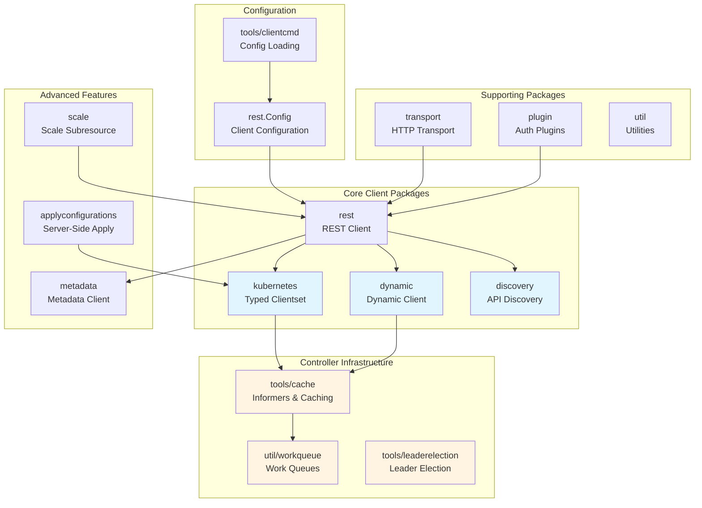
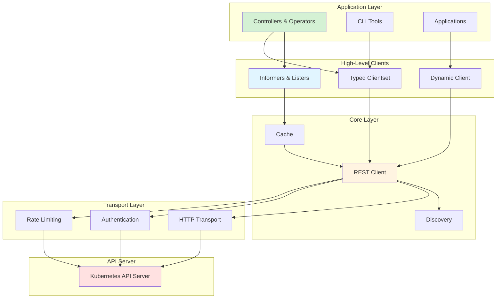
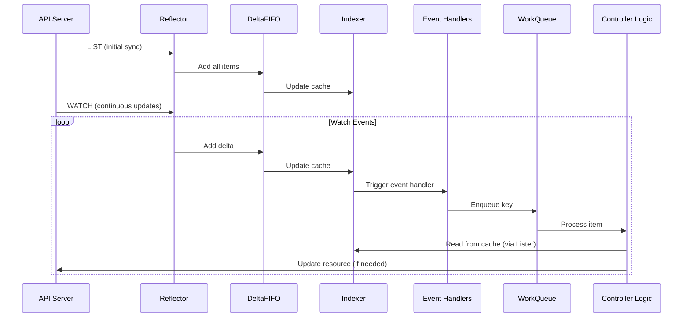

# client-go: Kubernetes Go Client Library

## Overview

`client-go` is the official Go client library for interacting with Kubernetes clusters. It provides a comprehensive set of tools, clients, and utilities for building applications, controllers, and operators that communicate with the Kubernetes API server.

## Project Structure



## Key Components

### 1. Client Types

- **`kubernetes.Clientset`**: Type-safe client for built-in Kubernetes resources (Pods, Deployments, Services, etc.)
- **`dynamic.DynamicClient`**: Generic client for any Kubernetes resource, including Custom Resources (CRDs)
- **`rest.RESTClient`**: Low-level HTTP client for direct API server communication
- **`metadata.Client`**: Optimized client for metadata-only operations
- **`discovery.DiscoveryClient`**: Client for discovering available API resources

### 2. Configuration

- **`rest.Config`**: In-memory representation of client configuration
- **`tools/clientcmd`**: Kubeconfig file parsing and loading
- **In-cluster configuration**: Automatic configuration for pods running inside Kubernetes

### 3. Controller Infrastructure

- **`tools/cache`**: Core controller pattern implementation
  - **Reflector**: Watches API server and syncs changes to local cache
  - **Informer**: High-level abstraction combining Reflector, DeltaFIFO, and Indexer
  - **Lister**: Read-only interface to cached data
  - **DeltaFIFO**: Queue for tracking resource changes
  - **Indexer**: Thread-safe in-memory cache with indexing capabilities

- **`util/workqueue`**: Rate-limiting work queues for controllers
- **`tools/leaderelection`**: Leader election for high-availability controllers

### 4. Advanced Features

- **Server-Side Apply**: Declarative object management with field ownership tracking
- **Apply Configurations**: Type-safe builders for Server-Side Apply operations
- **Paging**: Efficient pagination for large list operations
- **Watch Bookmarks**: Optimized watch resumption
- **Streaming**: Watch list streaming for efficient initial synchronization

## Architecture Principles

### Layered Design



### Code Generation

A significant portion of `client-go` is code-generated to ensure type safety and consistency:

- **Typed Clientsets**: Generated from API type definitions
- **Typed Informers**: Generated for each resource type
- **Typed Listers**: Generated for cached access patterns
- **Apply Configurations**: Generated for Server-Side Apply

### Event-Driven Controller Pattern

The controller pattern is central to Kubernetes architecture:



## Versioning and Compatibility

- **Version Mapping**: `client-go v0.X.Y` corresponds to Kubernetes `v1.X.Y`
- **Backward Compatibility**: Older clients work with newer API servers
- **Forward Compatibility**: Not guaranteed; newer clients may not work with older servers
- **Stability**: Uses semantic versioning with `v0.x.y` indicating potential breaking changes

## Common Use Cases

### 1. Simple Client Operations
```go
// Create a clientset
config, _ := rest.InClusterConfig()
clientset, _ := kubernetes.NewForConfig(config)

// Get a pod
pod, _ := clientset.CoreV1().Pods("default").Get(ctx, "my-pod", metav1.GetOptions{})
```

### 2. Building Controllers
```go
// Create an informer
informerFactory := informers.NewSharedInformerFactory(clientset, time.Minute)
podInformer := informerFactory.Core().V1().Pods()

// Add event handlers
podInformer.Informer().AddEventHandler(cache.ResourceEventHandlerFuncs{
    AddFunc: func(obj interface{}) { /* handle add */ },
    UpdateFunc: func(old, new interface{}) { /* handle update */ },
    DeleteFunc: func(obj interface{}) { /* handle delete */ },
})
```

### 3. Working with Custom Resources
```go
// Use dynamic client for CRDs
dynamicClient, _ := dynamic.NewForConfig(config)
gvr := schema.GroupVersionResource{Group: "example.com", Version: "v1", Resource: "myresources"}
resource, _ := dynamicClient.Resource(gvr).Namespace("default").Get(ctx, "my-resource", metav1.GetOptions{})
```

### 4. Server-Side Apply
```go
// Use apply configurations
deployment := appsv1.Deployment("my-deployment", "default").
    WithSpec(appsv1.DeploymentSpec().
        WithReplicas(3))
        
result, _ := clientset.AppsV1().Deployments("default").
    Apply(ctx, deployment, metav1.ApplyOptions{FieldManager: "my-controller"})
```

## Performance Considerations

### Client-Side Rate Limiting
- **QPS**: Queries per second limit
- **Burst**: Maximum burst size for rate limiter
- Default: QPS=5, Burst=10 (can be configured in `rest.Config`)

### Caching and Informers
- Reduces API server load by maintaining local cache
- Event-driven updates instead of polling
- Shared informers reduce memory footprint

### Pagination
- Large list operations should use pagination
- Controlled via `limit` and `continue` parameters
- Automatic pagination in Reflector for initial sync

### Connection Pooling
- HTTP/2 connection reuse
- Shared transport across clients
- Configurable connection limits

## Documentation Structure

This documentation is organized into the following sections:

1. **[Overview](00-overview.md)** - This document
2. **[Core Packages](01-core-packages.md)** - REST, Kubernetes, Dynamic, Discovery clients
3. **[Configuration](02-configuration.md)** - Client configuration and kubeconfig handling
4. **[Controller Infrastructure](03-controller-infrastructure.md)** - Informers, caches, and work queues
5. **[Advanced Features](04-advanced-features.md)** - Server-Side Apply, metadata, scale
6. **[Utilities](05-utilities.md)** - Supporting packages and helpers
7. **[Examples](06-examples.md)** - Practical examples and patterns

## References

- **Official Repository**: https://github.com/kubernetes/client-go
- **API Documentation**: https://pkg.go.dev/k8s.io/client-go
- **Kubernetes Documentation**: https://kubernetes.io/docs/reference/using-api/client-libraries/
- **Sample Controller**: https://github.com/kubernetes/sample-controller
