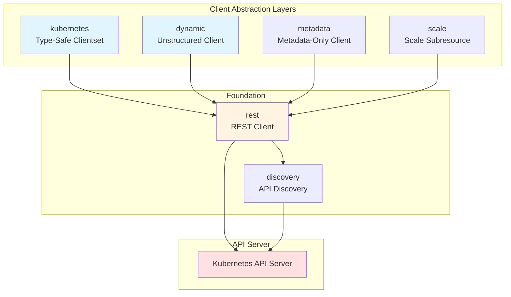
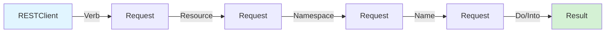
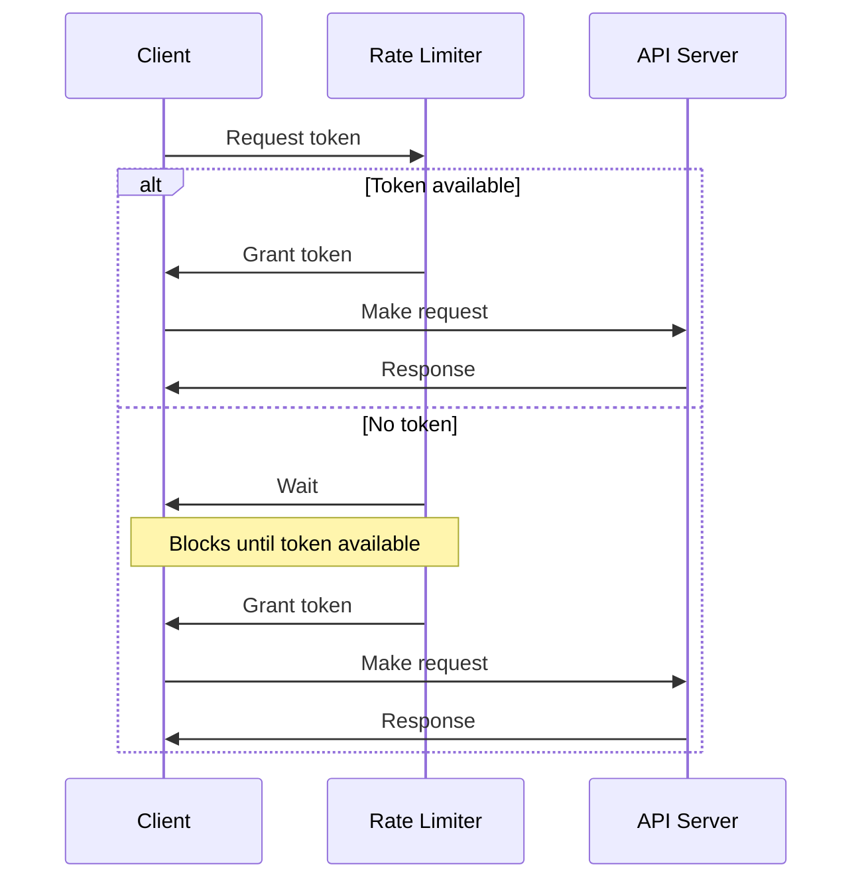
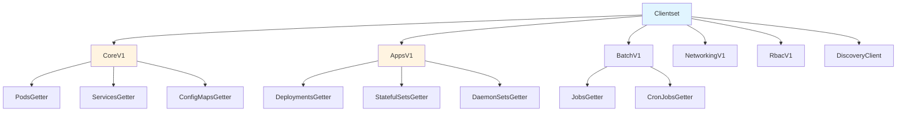

# Core Packages

This document covers the core client packages in `client-go` that provide different ways to interact with the Kubernetes API server.

## Package Hierarchy



## 1. rest Package

**Location**: `rest/`

The `rest` package provides the foundational HTTP client for all Kubernetes API interactions.

### Key Components

#### rest.Config

The `rest.Config` struct is the in-memory representation of client configuration:

```go
type Config struct {
    // Host is the base URL for the API server
    Host string
    
    // APIPath is a sub-path that points to an API root
    APIPath string
    
    // ContentConfig contains settings for content negotiation
    ContentConfig ClientContentConfig
    
    // Authentication
    Username        string
    Password        string
    BearerToken     string
    BearerTokenFile string
    
    // TLS configuration
    TLSClientConfig TLSClientConfig
    
    // Rate limiting
    QPS   float32  // Queries per second
    Burst int      // Maximum burst for rate limiter
    
    // Timeout for requests
    Timeout time.Duration
    
    // UserAgent is an optional field that specifies the caller
    UserAgent string
    
    // Transport and HTTP client customization
    Transport     http.RoundTripper
    WrapTransport func(rt http.RoundTripper) http.RoundTripper
}
```

#### rest.RESTClient

The `RESTClient` is the core HTTP client implementation:

```go
type RESTClient struct {
    base             *url.URL
    versionedAPIPath string
    content          requestClientContentConfigProvider
    createBackoffMgr func() BackoffManagerWithContext
    rateLimiter      flowcontrol.RateLimiter
    warningHandler   WarningHandler
    Client           *http.Client
}
```

### Request Builder Pattern

The REST client uses a fluent builder pattern for constructing requests:



**Example**:
```go
// Build and execute a request
result := client.
    Get().                              // HTTP verb
    Namespace("default").               // Namespace scope
    Resource("pods").                   // Resource type
    Name("my-pod").                     // Resource name
    VersionedParams(&opts, scheme).     // Query parameters
    Do(ctx).                            // Execute
    Into(&pod)                          // Decode into object
```

### Content Negotiation

The REST client supports multiple serialization formats:

- **JSON**: Default format (`application/json`)
- **Protobuf**: Binary format for efficiency (`application/vnd.kubernetes.protobuf`)
- **Custom Accept Headers**: For metadata-only or table responses

### Error Handling

The REST client converts HTTP errors into structured `errors.StatusError`:

```go
err := client.Get().
    Resource("pods").
    Name("nonexistent").
    Do(ctx).
    Into(&pod)

if errors.IsNotFound(err) {
    // Handle not found
} else if errors.IsConflict(err) {
    // Handle conflict
}
```

### Rate Limiting

Client-side rate limiting prevents overwhelming the API server:



Configuration:
```go
config := &rest.Config{
    Host:  "https://kubernetes.default.svc",
    QPS:   50,    // 50 queries per second
    Burst: 100,   // Allow bursts up to 100
}
```

## 2. kubernetes Package

**Location**: `kubernetes/`

The `kubernetes` package provides type-safe, generated clients for all built-in Kubernetes resources.

### Clientset Structure



### Creating a Clientset

```go
// From rest.Config
config, err := rest.InClusterConfig()
clientset, err := kubernetes.NewForConfig(config)

// Or panic on error
clientset := kubernetes.NewForConfigOrDie(config)
```

### Resource Operations

Each resource type provides a consistent interface:

```go
type PodInterface interface {
    Create(ctx context.Context, pod *v1.Pod, opts metav1.CreateOptions) (*v1.Pod, error)
    Update(ctx context.Context, pod *v1.Pod, opts metav1.UpdateOptions) (*v1.Pod, error)
    UpdateStatus(ctx context.Context, pod *v1.Pod, opts metav1.UpdateOptions) (*v1.Pod, error)
    Delete(ctx context.Context, name string, opts metav1.DeleteOptions) error
    DeleteCollection(ctx context.Context, opts metav1.DeleteOptions, listOpts metav1.ListOptions) error
    Get(ctx context.Context, name string, opts metav1.GetOptions) (*v1.Pod, error)
    List(ctx context.Context, opts metav1.ListOptions) (*v1.PodList, error)
    Watch(ctx context.Context, opts metav1.ListOptions) (watch.Interface, error)
    Patch(ctx context.Context, name string, pt types.PatchType, data []byte, opts metav1.PatchOptions, subresources ...string) (*v1.Pod, error)
    Apply(ctx context.Context, pod *corev1.PodApplyConfiguration, opts metav1.ApplyOptions) (*v1.Pod, error)
    ApplyStatus(ctx context.Context, pod *corev1.PodApplyConfiguration, opts metav1.ApplyOptions) (*v1.Pod, error)
}
```

### CRUD Operations

```go
// CREATE
pod := &corev1.Pod{
    ObjectMeta: metav1.ObjectMeta{
        Name: "my-pod",
    },
    Spec: corev1.PodSpec{
        Containers: []corev1.Container{
            {Name: "nginx", Image: "nginx:latest"},
        },
    },
}
createdPod, err := clientset.CoreV1().Pods("default").Create(ctx, pod, metav1.CreateOptions{})

// READ
pod, err := clientset.CoreV1().Pods("default").Get(ctx, "my-pod", metav1.GetOptions{})

// UPDATE
pod.Spec.Containers[0].Image = "nginx:1.21"
updatedPod, err := clientset.CoreV1().Pods("default").Update(ctx, pod, metav1.UpdateOptions{})

// DELETE
err := clientset.CoreV1().Pods("default").Delete(ctx, "my-pod", metav1.DeleteOptions{})

// LIST
podList, err := clientset.CoreV1().Pods("default").List(ctx, metav1.ListOptions{})

// WATCH
watcher, err := clientset.CoreV1().Pods("default").Watch(ctx, metav1.ListOptions{})
for event := range watcher.ResultChan() {
    pod := event.Object.(*corev1.Pod)
    fmt.Printf("Event: %s, Pod: %s\n", event.Type, pod.Name)
}
```

### Subresources

Some resources have subresources for specific operations:

```go
// Status subresource
pod.Status.Phase = corev1.PodRunning
updatedPod, err := clientset.CoreV1().Pods("default").UpdateStatus(ctx, pod, metav1.UpdateOptions{})

// Scale subresource
scale, err := clientset.AppsV1().Deployments("default").GetScale(ctx, "my-deployment", metav1.GetOptions{})
scale.Spec.Replicas = 5
updatedScale, err := clientset.AppsV1().Deployments("default").UpdateScale(ctx, "my-deployment", scale, metav1.UpdateOptions{})

// Logs subresource
req := clientset.CoreV1().Pods("default").GetLogs("my-pod", &corev1.PodLogOptions{})
logs, err := req.Stream(ctx)
```

## 3. dynamic Package

**Location**: `dynamic/`

The `dynamic` package provides a client that works with unstructured data, enabling interaction with any Kubernetes resource including Custom Resources.

### Dynamic Client Interface

```go
type Interface interface {
    Resource(resource schema.GroupVersionResource) NamespaceableResourceInterface
}

type NamespaceableResourceInterface interface {
    Namespace(string) ResourceInterface
    ResourceInterface
}

type ResourceInterface interface {
    Create(ctx context.Context, obj *unstructured.Unstructured, options metav1.CreateOptions, subresources ...string) (*unstructured.Unstructured, error)
    Update(ctx context.Context, obj *unstructured.Unstructured, options metav1.UpdateOptions, subresources ...string) (*unstructured.Unstructured, error)
    Delete(ctx context.Context, name string, options metav1.DeleteOptions, subresources ...string) error
    Get(ctx context.Context, name string, options metav1.GetOptions, subresources ...string) (*unstructured.Unstructured, error)
    List(ctx context.Context, opts metav1.ListOptions) (*unstructured.UnstructuredList, error)
    Watch(ctx context.Context, opts metav1.ListOptions) (watch.Interface, error)
    Patch(ctx context.Context, name string, pt types.PatchType, data []byte, options metav1.PatchOptions, subresources ...string) (*unstructured.Unstructured, error)
    Apply(ctx context.Context, name string, obj *unstructured.Unstructured, options metav1.ApplyOptions, subresources ...string) (*unstructured.Unstructured, error)
}
```

### Working with Unstructured Data

```go
// Create dynamic client
dynamicClient, err := dynamic.NewForConfig(config)

// Define the resource
gvr := schema.GroupVersionResource{
    Group:    "apps",
    Version:  "v1",
    Resource: "deployments",
}

// Create unstructured object
deployment := &unstructured.Unstructured{
    Object: map[string]interface{}{
        "apiVersion": "apps/v1",
        "kind":       "Deployment",
        "metadata": map[string]interface{}{
            "name": "my-deployment",
        },
        "spec": map[string]interface{}{
            "replicas": 3,
            "selector": map[string]interface{}{
                "matchLabels": map[string]interface{}{
                    "app": "myapp",
                },
            },
            "template": map[string]interface{}{
                "metadata": map[string]interface{}{
                    "labels": map[string]interface{}{
                        "app": "myapp",
                    },
                },
                "spec": map[string]interface{}{
                    "containers": []interface{}{
                        map[string]interface{}{
                            "name":  "nginx",
                            "image": "nginx:latest",
                        },
                    },
                },
            },
        },
    },
}

// Create the resource
result, err := dynamicClient.Resource(gvr).Namespace("default").
    Create(ctx, deployment, metav1.CreateOptions{})

// Get nested fields
replicas, found, err := unstructured.NestedInt64(result.Object, "spec", "replicas")
```

### Use Cases for Dynamic Client

1. **Custom Resource Definitions (CRDs)**: Working with CRDs without generated clients
2. **Generic Tools**: Building tools that work with any Kubernetes resource
3. **Discovery-Based Operations**: Operations based on runtime discovery
4. **Schema-Agnostic Processing**: Processing resources without compile-time type information

## 4. discovery Package

**Location**: `discovery/`

The `discovery` package provides clients for discovering available API resources, groups, and versions.

### Discovery Client

```go
type DiscoveryInterface interface {
    ServerGroupsInterface
    ServerResourcesInterface
    ServerVersionInterface
    OpenAPISchemaInterface
    OpenAPIV3SchemaInterface
}
```

### Discovery Operations

```go
// Create discovery client
discoveryClient, err := discovery.NewDiscoveryClientForConfig(config)

// Get server version
version, err := discoveryClient.ServerVersion()
fmt.Printf("Server version: %s\n", version.GitVersion)

// Get API groups
groups, err := discoveryClient.ServerGroups()
for _, group := range groups.Groups {
    fmt.Printf("Group: %s, Versions: %v\n", group.Name, group.Versions)
}

// Get resources for a specific group/version
resources, err := discoveryClient.ServerResourcesForGroupVersion("apps/v1")
for _, resource := range resources.APIResources {
    fmt.Printf("Resource: %s, Namespaced: %v, Verbs: %v\n", 
        resource.Name, resource.Namespaced, resource.Verbs)
}

// Get all server resources
_, resourceMap, err := discoveryClient.ServerGroupsAndResources()
for gv, resourceList := range resourceMap {
    fmt.Printf("GroupVersion: %s, Resources: %d\n", gv, len(resourceList.APIResources))
}
```

### Cached Discovery

For performance, use cached discovery to avoid repeated API calls:

```go
// Create cached discovery client
cachedClient, err := disk.NewCachedDiscoveryClientForConfig(
    config,
    cacheDir,
    httpCacheDir,
    cacheDuration,
)

// Use like regular discovery client
resources, err := cachedClient.ServerResourcesForGroupVersion("apps/v1")

// Invalidate cache when needed
cachedClient.Invalidate()
```

### Aggregated Discovery

Kubernetes 1.26+ supports aggregated discovery for improved performance:

```go
// Aggregated discovery returns groups and resources in a single call
groups, resources, err := discoveryClient.GroupsAndMaybeResources()
```

## 5. metadata Package

**Location**: `metadata/`

The `metadata` package provides an optimized client for metadata-only operations, reducing network bandwidth and improving performance.

### Metadata Client

```go
// Create metadata client
metadataClient, err := metadata.NewForConfig(config)

// Get metadata only (no spec or status)
obj, err := metadataClient.Resource(gvr).Namespace("default").
    Get(ctx, "my-resource", metav1.GetOptions{})

// obj is a *metav1.PartialObjectMetadata with only metadata fields
fmt.Printf("Name: %s, UID: %s, Labels: %v\n", 
    obj.Name, obj.UID, obj.Labels)
```

### Benefits

- **Reduced Bandwidth**: Only metadata is transferred, not full spec/status
- **Faster Operations**: Less data to serialize/deserialize
- **Lower Memory**: Smaller objects in memory
- **Ideal for**: Label/annotation management, ownership tracking, garbage collection

## 6. scale Package

**Location**: `scale/`

The `scale` package provides a generic interface for scaling resources.

### Scale Client

```go
// Create scale client
scaleClient, err := scale.NewForConfig(config, mapper, dynamic.LegacyAPIPathResolverFunc, schema.GroupResource{})

// Get current scale
currentScale, err := scaleClient.Scales("default").Get(ctx, 
    schema.GroupResource{Group: "apps", Resource: "deployments"}, 
    "my-deployment", 
    metav1.GetOptions{})

// Update scale
currentScale.Spec.Replicas = 5
updatedScale, err := scaleClient.Scales("default").Update(ctx,
    schema.GroupResource{Group: "apps", Resource: "deployments"},
    currentScale,
    metav1.UpdateOptions{})
```

## Client Comparison

| Feature | kubernetes.Clientset | dynamic.DynamicClient | metadata.Client | rest.RESTClient |
|---------|---------------------|----------------------|-----------------|-----------------|
| Type Safety | ✅ Strong | ❌ Weak | ✅ Metadata only | ❌ None |
| CRD Support | ❌ No | ✅ Yes | ✅ Yes | ✅ Yes |
| Code Generation | ✅ Required | ❌ Not needed | ❌ Not needed | ❌ Not needed |
| Performance | ⚡ Fast | ⚡ Fast | ⚡⚡ Very Fast | ⚡ Fast |
| Ease of Use | ⭐⭐⭐ Easy | ⭐⭐ Moderate | ⭐⭐ Moderate | ⭐ Complex |
| Use Case | Built-in resources | Any resource | Metadata ops | Custom needs |

## Best Practices

### 1. Choose the Right Client

- **Use `kubernetes.Clientset`** for built-in resources when type safety is important
- **Use `dynamic.DynamicClient`** for CRDs or when building generic tools
- **Use `metadata.Client`** for operations that only need metadata
- **Use `rest.RESTClient`** only for advanced use cases

### 2. Reuse Clients

```go
// ✅ Good: Create once, reuse
var clientset *kubernetes.Clientset

func init() {
    config, _ := rest.InClusterConfig()
    clientset, _ = kubernetes.NewForConfig(config)
}

func getResource() {
    pod, _ := clientset.CoreV1().Pods("default").Get(ctx, "my-pod", metav1.GetOptions{})
}

// ❌ Bad: Create client every time
func getResource() {
    config, _ := rest.InClusterConfig()
    clientset, _ := kubernetes.NewForConfig(config)
    pod, _ := clientset.CoreV1().Pods("default").Get(ctx, "my-pod", metav1.GetOptions{})
}
```

### 3. Configure Rate Limiting

```go
config := &rest.Config{
    Host:  apiServerURL,
    QPS:   50,   // Adjust based on your needs
    Burst: 100,  // Should be >= QPS
}
```

### 4. Handle Errors Properly

```go
pod, err := clientset.CoreV1().Pods("default").Get(ctx, "my-pod", metav1.GetOptions{})
if err != nil {
    if errors.IsNotFound(err) {
        // Resource doesn't exist
        return nil
    }
    if errors.IsConflict(err) {
        // Conflict during update, retry
        return retry()
    }
    // Other error
    return err
}
```

### 5. Use Context for Cancellation

```go
ctx, cancel := context.WithTimeout(context.Background(), 30*time.Second)
defer cancel()

pod, err := clientset.CoreV1().Pods("default").Get(ctx, "my-pod", metav1.GetOptions{})
```

## Summary

The core packages in `client-go` provide a layered approach to Kubernetes API interaction:

- **`rest`**: Foundation for all HTTP communication
- **`kubernetes`**: Type-safe access to built-in resources
- **`dynamic`**: Flexible access to any resource
- **`discovery`**: API resource discovery
- **`metadata`**: Optimized metadata-only operations
- **`scale`**: Generic scaling interface

Choose the appropriate client based on your use case, performance requirements, and whether you need type safety or flexibility.
