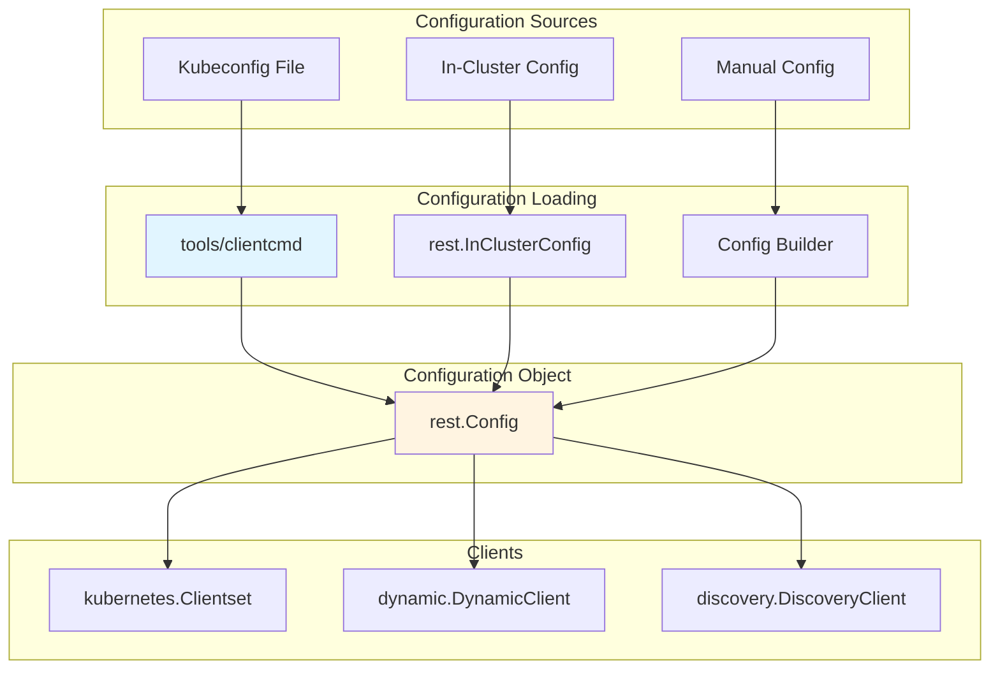
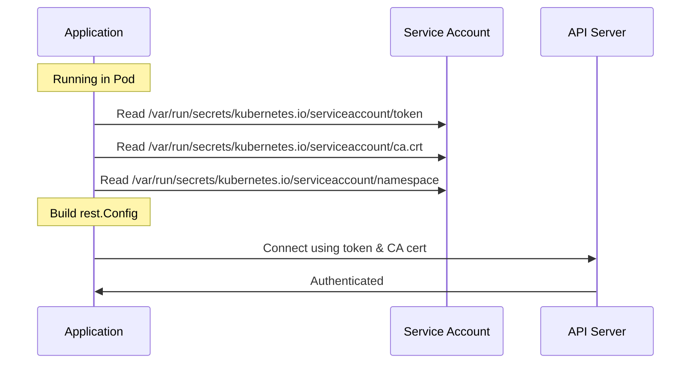
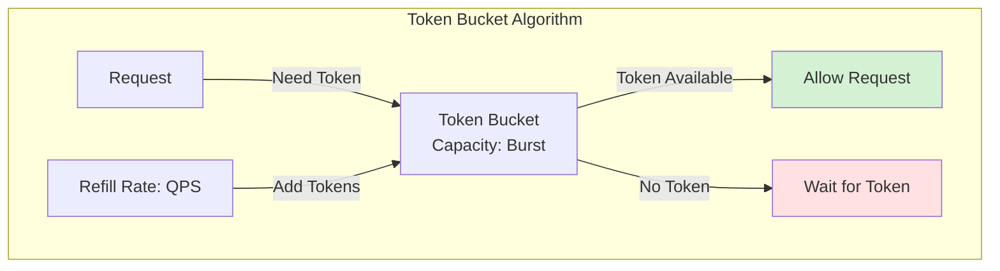

# Configuration

This document covers how to configure `client-go` clients to connect to Kubernetes clusters.

## Configuration Overview



## rest.Config Structure

The `rest.Config` struct is the central configuration object:

```go
type Config struct {
    // Core connection settings
    Host    string  // API server URL (e.g., "https://kubernetes.default.svc")
    APIPath string  // API path prefix (e.g., "/api" or "/apis")
    
    // Content negotiation
    ContentConfig ClientContentConfig
    
    // Authentication - multiple methods supported
    Username        string  // Basic auth username
    Password        string  // Basic auth password
    BearerToken     string  // Bearer token for authentication
    BearerTokenFile string  // Path to file containing bearer token
    Impersonate     ImpersonationConfig  // Impersonation settings
    
    // Authentication provider (exec, oidc, etc.)
    AuthProvider    *clientcmdapi.AuthProviderConfig
    AuthConfigPersister AuthProviderConfigPersister
    ExecProvider    *clientcmdapi.ExecConfig
    
    // TLS configuration
    TLSClientConfig TLSClientConfig
    
    // Client-side rate limiting
    QPS   float32  // Maximum queries per second (default: 5)
    Burst int      // Maximum burst for rate limiter (default: 10)
    
    // Request timeout
    Timeout time.Duration  // Timeout for requests (0 = no timeout)
    
    // Dial and TLS handshake timeout
    Dial func(ctx context.Context, network, address string) (net.Conn, error)
    
    // Proxy function
    Proxy func(*http.Request) (*url.URL, error)
    
    // User agent
    UserAgent string  // User agent string for requests
    
    // Disable compression
    DisableCompression bool
    
    // Transport customization
    Transport     http.RoundTripper
    WrapTransport func(rt http.RoundTripper) http.RoundTripper
    
    // Warning handler
    WarningHandler WarningHandler
    
    // Rate limiter
    RateLimiter flowcontrol.RateLimiter
}
```

### TLS Configuration

```go
type TLSClientConfig struct {
    // Server should be accessed without verifying the TLS certificate
    Insecure bool
    
    // ServerName is passed to the server for SNI
    ServerName string
    
    // Server certificate authority
    CAFile string  // Path to CA cert file
    CAData []byte  // CA cert data
    
    // Client certificate for mutual TLS
    CertFile string  // Path to client cert file
    CertData []byte  // Client cert data
    KeyFile  string  // Path to client key file
    KeyData  []byte  // Client key data
    
    // NextProtos is a list of supported application level protocols
    NextProtos []string
}
```

## Configuration Methods

### 1. In-Cluster Configuration

For applications running inside Kubernetes pods:

```go
// Automatic configuration from pod's service account
config, err := rest.InClusterConfig()
if err != nil {
    panic(err.Error())
}

clientset, err := kubernetes.NewForConfig(config)
```

**How it works**:



**What InClusterConfig does**:
1. Reads service account token from `/var/run/secrets/kubernetes.io/serviceaccount/token`
2. Reads CA certificate from `/var/run/secrets/kubernetes.io/serviceaccount/ca.crt`
3. Reads namespace from `/var/run/secrets/kubernetes.io/serviceaccount/namespace`
4. Sets host to `https://kubernetes.default.svc`
5. Configures TLS with the CA certificate

### 2. Kubeconfig File Configuration

For applications running outside the cluster:

#### Basic Usage

```go
// Use default kubeconfig location (~/.kube/config)
config, err := clientcmd.BuildConfigFromFlags("", "")
if err != nil {
    panic(err.Error())
}

clientset, err := kubernetes.NewForConfig(config)
```

#### Custom Kubeconfig Path

```go
// Specify custom kubeconfig path
kubeconfigPath := "/path/to/kubeconfig"
config, err := clientcmd.BuildConfigFromFlags("", kubeconfigPath)
if err != nil {
    panic(err.Error())
}
```

#### Using Environment Variable

```go
// Use KUBECONFIG environment variable
var kubeconfig string
if envKubeconfig := os.Getenv("KUBECONFIG"); envKubeconfig != "" {
    kubeconfig = envKubeconfig
} else {
    kubeconfig = filepath.Join(os.Getenv("HOME"), ".kube", "config")
}

config, err := clientcmd.BuildConfigFromFlags("", kubeconfig)
```

### 3. Advanced Kubeconfig Loading

#### Loading Rules

```go
// Create loading rules
loadingRules := clientcmd.NewDefaultClientConfigLoadingRules()
loadingRules.ExplicitPath = "/path/to/kubeconfig"

// Create config overrides
configOverrides := &clientcmd.ConfigOverrides{
    CurrentContext: "my-context",
}

// Build config
kubeConfig := clientcmd.NewNonInteractiveDeferredLoadingClientConfig(
    loadingRules,
    configOverrides,
)

config, err := kubeConfig.ClientConfig()
```

#### Context Selection

```go
// List available contexts
rawConfig, err := kubeConfig.RawConfig()
for name := range rawConfig.Contexts {
    fmt.Printf("Context: %s\n", name)
}

// Use specific context
configOverrides := &clientcmd.ConfigOverrides{
    CurrentContext: "production-cluster",
}
```

#### Namespace Override

```go
// Override namespace
configOverrides := &clientcmd.ConfigOverrides{
    Context: clientcmdapi.Context{
        Namespace: "my-namespace",
    },
}
```

### 4. Manual Configuration

For complete control over configuration:

```go
config := &rest.Config{
    Host: "https://my-k8s-cluster.example.com:6443",
    TLSClientConfig: rest.TLSClientConfig{
        CAFile:   "/path/to/ca.crt",
        CertFile: "/path/to/client.crt",
        KeyFile:  "/path/to/client.key",
    },
    QPS:   50,
    Burst: 100,
}

clientset, err := kubernetes.NewForConfig(config)
```

## Authentication Methods

### 1. Bearer Token

```go
config := &rest.Config{
    Host:        "https://kubernetes.example.com",
    BearerToken: "eyJhbGciOiJSUzI1NiIsInR5cCI6IkpXVCJ9...",
    TLSClientConfig: rest.TLSClientConfig{
        CAFile: "/path/to/ca.crt",
    },
}
```

### 2. Bearer Token from File

```go
config := &rest.Config{
    Host:            "https://kubernetes.example.com",
    BearerTokenFile: "/var/run/secrets/kubernetes.io/serviceaccount/token",
    TLSClientConfig: rest.TLSClientConfig{
        CAFile: "/path/to/ca.crt",
    },
}
```

### 3. Basic Authentication

```go
config := &rest.Config{
    Host:     "https://kubernetes.example.com",
    Username: "admin",
    Password: "password",
    TLSClientConfig: rest.TLSClientConfig{
        CAFile: "/path/to/ca.crt",
    },
}
```

### 4. Client Certificate (Mutual TLS)

```go
config := &rest.Config{
    Host: "https://kubernetes.example.com",
    TLSClientConfig: rest.TLSClientConfig{
        CAFile:   "/path/to/ca.crt",
        CertFile: "/path/to/client.crt",
        KeyFile:  "/path/to/client.key",
    },
}
```

### 5. Exec Plugin (External Authentication)

```go
config := &rest.Config{
    Host: "https://kubernetes.example.com",
    ExecProvider: &clientcmdapi.ExecConfig{
        APIVersion: "client.authentication.k8s.io/v1",
        Command:    "aws",
        Args:       []string{"eks", "get-token", "--cluster-name", "my-cluster"},
    },
    TLSClientConfig: rest.TLSClientConfig{
        CAFile: "/path/to/ca.crt",
    },
}
```

### 6. OIDC Authentication

Configured via kubeconfig:

```yaml
users:
- name: oidc-user
  user:
    auth-provider:
      name: oidc
      config:
        client-id: kubernetes
        client-secret: secret
        id-token: eyJhbGciOiJSUzI1NiIsInR5cCI6IkpXVCJ9...
        idp-issuer-url: https://accounts.google.com
        refresh-token: refresh-token-value
```

## Rate Limiting Configuration

### Client-Side Rate Limiting

```go
config := &rest.Config{
    Host:  "https://kubernetes.example.com",
    QPS:   50.0,  // 50 queries per second
    Burst: 100,   // Allow bursts up to 100 requests
}
```

**Rate Limiting Behavior**:



### Custom Rate Limiter

```go
// Create custom rate limiter
rateLimiter := flowcontrol.NewTokenBucketRateLimiter(
    100.0,  // QPS
    200,    // Burst
)

config := &rest.Config{
    Host:        "https://kubernetes.example.com",
    RateLimiter: rateLimiter,
}
```

### Disable Rate Limiting

```go
config := &rest.Config{
    Host:        "https://kubernetes.example.com",
    QPS:         -1,  // Disable rate limiting
}
```

## Timeout Configuration

### Request Timeout

```go
config := &rest.Config{
    Host:    "https://kubernetes.example.com",
    Timeout: 30 * time.Second,  // 30 second timeout for all requests
}
```

### Per-Request Timeout

```go
// Use context for per-request timeout
ctx, cancel := context.WithTimeout(context.Background(), 10*time.Second)
defer cancel()

pod, err := clientset.CoreV1().Pods("default").Get(ctx, "my-pod", metav1.GetOptions{})
```

## Transport Customization

### Custom HTTP Transport

```go
transport := &http.Transport{
    TLSClientConfig: &tls.Config{
        InsecureSkipVerify: true,
    },
    MaxIdleConns:        100,
    MaxIdleConnsPerHost: 100,
    IdleConnTimeout:     90 * time.Second,
}

config := &rest.Config{
    Host:      "https://kubernetes.example.com",
    Transport: transport,
}
```

### Transport Wrapper

```go
// Add custom behavior to transport
config := &rest.Config{
    Host: "https://kubernetes.example.com",
    WrapTransport: func(rt http.RoundTripper) http.RoundTripper {
        return &loggingTransport{
            base: rt,
        }
    },
}

type loggingTransport struct {
    base http.RoundTripper
}

func (t *loggingTransport) RoundTrip(req *http.Request) (*http.Response, error) {
    fmt.Printf("Request: %s %s\n", req.Method, req.URL)
    resp, err := t.base.RoundTrip(req)
    if err == nil {
        fmt.Printf("Response: %d\n", resp.StatusCode)
    }
    return resp, err
}
```

## User Agent Configuration

```go
config := &rest.Config{
    Host:      "https://kubernetes.example.com",
    UserAgent: "my-application/v1.0.0",
}

// Or use default
config.UserAgent = rest.DefaultKubernetesUserAgent()
```

## Impersonation

```go
config := &rest.Config{
    Host: "https://kubernetes.example.com",
    Impersonate: rest.ImpersonationConfig{
        UserName: "user-to-impersonate",
        Groups:   []string{"system:masters"},
        Extra: map[string][]string{
            "scopes": {"read", "write"},
        },
    },
}
```

## Warning Handler

Handle API server warnings:

```go
config := &rest.Config{
    Host: "https://kubernetes.example.com",
    WarningHandler: rest.WarningHandlerFunc(func(warning rest.WarningInfo) {
        fmt.Printf("Warning: %s (code=%d, agent=%s)\n", 
            warning.Text, warning.Code, warning.Agent)
    }),
}
```

## Configuration Patterns

### Pattern 1: Try In-Cluster, Fall Back to Kubeconfig

```go
func GetConfig() (*rest.Config, error) {
    // Try in-cluster config first
    config, err := rest.InClusterConfig()
    if err == nil {
        return config, nil
    }
    
    // Fall back to kubeconfig
    kubeconfig := os.Getenv("KUBECONFIG")
    if kubeconfig == "" {
        kubeconfig = filepath.Join(os.Getenv("HOME"), ".kube", "config")
    }
    
    return clientcmd.BuildConfigFromFlags("", kubeconfig)
}
```

### Pattern 2: Configuration with Overrides

```go
func GetConfigWithOverrides(qps float32, burst int) (*rest.Config, error) {
    config, err := GetConfig()
    if err != nil {
        return nil, err
    }
    
    // Apply overrides
    config.QPS = qps
    config.Burst = burst
    config.Timeout = 30 * time.Second
    config.UserAgent = "my-app/v1.0.0"
    
    return config, nil
}
```

### Pattern 3: Multiple Cluster Configuration

```go
type ClusterConfig struct {
    Name   string
    Config *rest.Config
}

func LoadMultipleConfigs(kubeconfigPath string) ([]ClusterConfig, error) {
    loadingRules := &clientcmd.ClientConfigLoadingRules{
        ExplicitPath: kubeconfigPath,
    }
    
    rawConfig, err := loadingRules.Load()
    if err != nil {
        return nil, err
    }
    
    var configs []ClusterConfig
    for contextName := range rawConfig.Contexts {
        overrides := &clientcmd.ConfigOverrides{
            CurrentContext: contextName,
        }
        
        clientConfig := clientcmd.NewNonInteractiveDeferredLoadingClientConfig(
            loadingRules,
            overrides,
        )
        
        config, err := clientConfig.ClientConfig()
        if err != nil {
            continue
        }
        
        configs = append(configs, ClusterConfig{
            Name:   contextName,
            Config: config,
        })
    }
    
    return configs, nil
}
```

## Environment Variables

Common environment variables used by client-go:

| Variable | Description | Default |
|----------|-------------|---------|
| `KUBECONFIG` | Path to kubeconfig file | `~/.kube/config` |
| `KUBERNETES_SERVICE_HOST` | API server host (in-cluster) | Set by Kubernetes |
| `KUBERNETES_SERVICE_PORT` | API server port (in-cluster) | Set by Kubernetes |
| `KUBE_CLIENT_BACKOFF_BASE` | Backoff base duration | 1 second |
| `KUBE_CLIENT_BACKOFF_DURATION` | Backoff max duration | 120 seconds |

## Best Practices

### 1. Use In-Cluster Config for Pods

```go
// ✅ Good: Use in-cluster config for applications running in pods
config, err := rest.InClusterConfig()
```

### 2. Configure Appropriate Rate Limits

```go
// ✅ Good: Set rate limits based on your application's needs
config.QPS = 50
config.Burst = 100

// ❌ Bad: Disabling rate limiting can overwhelm the API server
config.QPS = -1
```

### 3. Set Reasonable Timeouts

```go
// ✅ Good: Set timeout to prevent hanging
config.Timeout = 30 * time.Second

// ❌ Bad: No timeout can cause indefinite hangs
config.Timeout = 0
```

### 4. Reuse Configuration

```go
// ✅ Good: Create config once, reuse for multiple clients
config, _ := rest.InClusterConfig()
clientset, _ := kubernetes.NewForConfig(config)
dynamicClient, _ := dynamic.NewForConfig(config)

// ❌ Bad: Creating config multiple times
config1, _ := rest.InClusterConfig()
clientset, _ := kubernetes.NewForConfig(config1)
config2, _ := rest.InClusterConfig()
dynamicClient, _ := dynamic.NewForConfig(config2)
```

### 5. Handle Configuration Errors

```go
// ✅ Good: Proper error handling
config, err := rest.InClusterConfig()
if err != nil {
    return fmt.Errorf("failed to get config: %w", err)
}

// ❌ Bad: Ignoring errors
config, _ := rest.InClusterConfig()
```

### 6. Use Context for Cancellation

```go
// ✅ Good: Use context for request cancellation
ctx, cancel := context.WithTimeout(context.Background(), 30*time.Second)
defer cancel()

pod, err := clientset.CoreV1().Pods("default").Get(ctx, "my-pod", metav1.GetOptions{})
```

## Troubleshooting

### Common Configuration Issues

#### 1. Certificate Verification Failures

```go
// Temporary workaround (not recommended for production)
config.TLSClientConfig.Insecure = true

// Better: Use proper CA certificate
config.TLSClientConfig.CAFile = "/path/to/ca.crt"
```

#### 2. Authentication Failures

```go
// Check token validity
token, err := ioutil.ReadFile("/var/run/secrets/kubernetes.io/serviceaccount/token")
if err != nil {
    log.Printf("Failed to read token: %v", err)
}

// Verify RBAC permissions
// kubectl auth can-i <verb> <resource> --as=<user>
```

#### 3. Connection Timeouts

```go
// Increase timeout
config.Timeout = 60 * time.Second

// Or use context with timeout
ctx, cancel := context.WithTimeout(context.Background(), 60*time.Second)
defer cancel()
```

#### 4. Rate Limiting Issues

```go
// Increase rate limits if you have permission
config.QPS = 100
config.Burst = 200

// Or implement backoff retry logic
```

## Summary

Configuration in `client-go` is flexible and supports multiple authentication methods and deployment scenarios:

- **In-Cluster**: Automatic configuration for pods using service accounts
- **Kubeconfig**: File-based configuration for out-of-cluster applications
- **Manual**: Programmatic configuration for advanced use cases

Key configuration aspects:
- **Authentication**: Tokens, certificates, exec plugins, OIDC
- **Rate Limiting**: Client-side throttling to protect API server
- **Timeouts**: Request and connection timeouts
- **TLS**: Certificate verification and mutual TLS
- **Transport**: HTTP transport customization

Choose the appropriate configuration method based on your deployment environment and security requirements.
