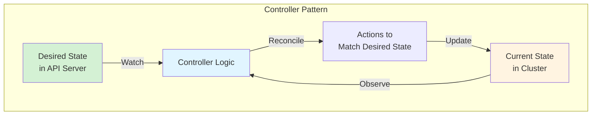
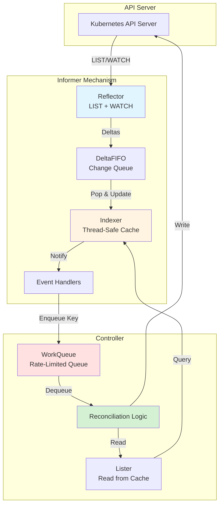
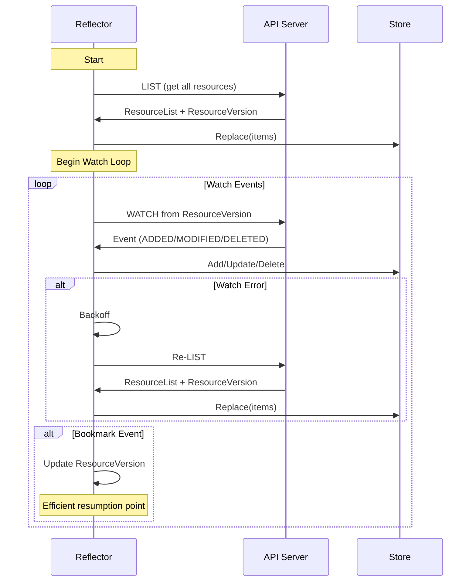
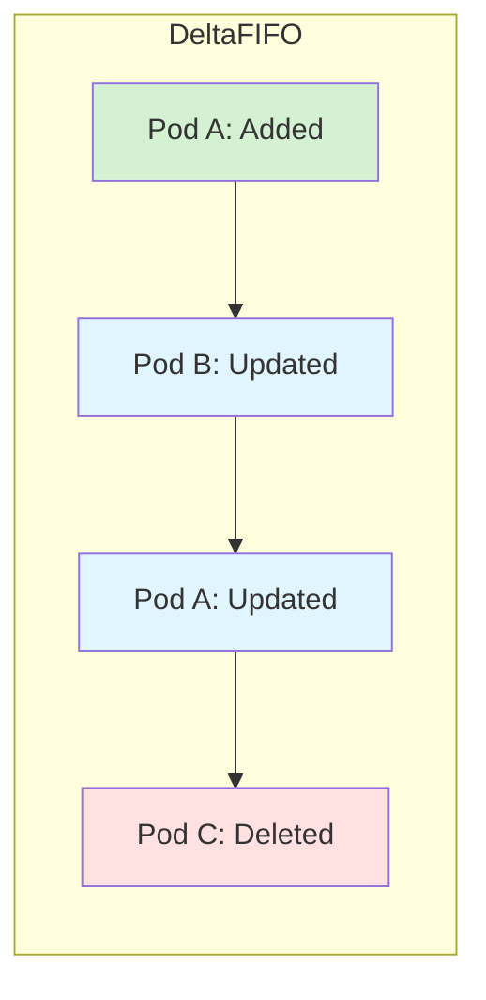
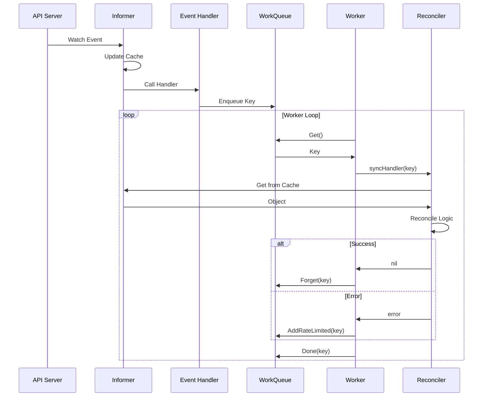
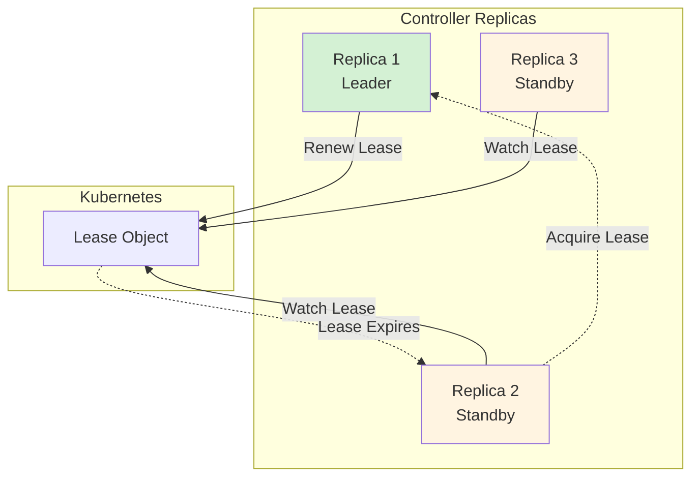

# Controller Infrastructure

This document covers the controller infrastructure in `client-go`, which provides the foundation for building Kubernetes controllers and operators.

## Controller Pattern Overview

The controller pattern is the heart of Kubernetes' control plane. Controllers watch the desired state and current state of resources, then take actions to reconcile any differences.



## Architecture



## tools/cache Package

**Location**: `tools/cache/`

The `tools/cache` package provides the core infrastructure for controllers.

### Key Components

#### 1. Reflector

The Reflector watches a specified resource and causes all changes to be reflected in a given store.

**Key Features**:
- Performs initial LIST to get current state
- Starts WATCH from the resourceVersion of the LIST
- Handles watch errors and reconnection
- Supports watch bookmarks for efficient resumption
- Implements exponential backoff for retries

**Structure**:
```go
type Reflector struct {
    name              string
    typeDescription   string
    expectedType      reflect.Type
    expectedGVK       *schema.GroupVersionKind
    store             ReflectorStore
    listerWatcher     ListerWatcherWithContext
    backoffManager    wait.BackoffManager
    resyncPeriod      time.Duration
    minWatchTimeout   time.Duration
    clock             clock.Clock
    paginatedResult   bool
    lastSyncResourceVersion string
    isLastSyncResourceVersionUnavailable bool
    WatchListPageSize int64
    ShouldResync      func() bool
    useWatchList      bool
}
```

**Lifecycle**:



#### 2. DeltaFIFO

DeltaFIFO is a queue that tracks changes (deltas) to objects.

**Key Features**:
- Stores deltas (changes) rather than just objects
- Ensures FIFO ordering per object
- Supports multiple delta types: Added, Updated, Deleted, Replaced, Sync
- Deduplicates redundant deltas
- Thread-safe

**Delta Types**:
```go
type DeltaType string

const (
    Added   DeltaType = "Added"
    Updated DeltaType = "Updated"
    Deleted DeltaType = "Deleted"
    Replaced DeltaType = "Replaced"  // From initial LIST
    Sync    DeltaType = "Sync"       // From periodic resync
)

type Delta struct {
    Type   DeltaType
    Object interface{}
}
```

**Example**:


#### 3. Indexer

The Indexer is a thread-safe in-memory cache with indexing capabilities.

**Key Features**:
- Thread-safe storage
- Multiple index functions
- Fast lookups by index
- Namespace/name key format

**Interface**:
```go
type Indexer interface {
    Store
    // Index returns the stored objects whose set of indexed values
    // intersects the set of indexed values of the given object
    Index(indexName string, obj interface{}) ([]interface{}, error)
    
    // IndexKeys returns the storage keys of the stored objects whose
    // set of indexed values for the named index includes the given
    // indexed value
    IndexKeys(indexName, indexedValue string) ([]string, error)
    
    // ListIndexFuncValues returns all the indexed values of the given index
    ListIndexFuncValues(indexName string) []string
    
    // ByIndex returns the stored objects whose set of indexed values
    // for the named index includes the given indexed value
    ByIndex(indexName, indexedValue string) ([]interface{}, error)
    
    // GetIndexers return the indexers
    GetIndexers() Indexers
    
    // AddIndexers adds more indexers to this store
    AddIndexers(newIndexers Indexers) error
}
```

**Common Index Functions**:
```go
// Index by namespace
NamespaceIndexFunc := func(obj interface{}) ([]string, error) {
    meta, err := meta.Accessor(obj)
    if err != nil {
        return []string{""}, fmt.Errorf("object has no meta: %v", err)
    }
    return []string{meta.GetNamespace()}, nil
}

// Index by labels
LabelIndexFunc := func(obj interface{}) ([]string, error) {
    meta, err := meta.Accessor(obj)
    if err != nil {
        return nil, err
    }
    labels := meta.GetLabels()
    var keys []string
    for k, v := range labels {
        keys = append(keys, k+"="+v)
    }
    return keys, nil
}
```

#### 4. SharedInformer

SharedInformer combines Reflector, DeltaFIFO, and Indexer into a high-level abstraction.

**Key Features**:
- Shared cache across multiple event handlers
- Automatic LIST and WATCH management
- Periodic resync capability
- Event handler registration
- Thread-safe

**Interface**:
```go
type SharedInformer interface {
    // AddEventHandler adds an event handler
    AddEventHandler(handler ResourceEventHandler) (ResourceEventHandlerRegistration, error)
    
    // AddEventHandlerWithResyncPeriod adds an event handler with a custom resync period
    AddEventHandlerWithResyncPeriod(handler ResourceEventHandler, resyncPeriod time.Duration) (ResourceEventHandlerRegistration, error)
    
    // RemoveEventHandler removes an event handler
    RemoveEventHandler(handle ResourceEventHandlerRegistration) error
    
    // GetStore returns the informer's local cache
    GetStore() Store
    
    // GetController is deprecated
    GetController() Controller
    
    // Run starts the informer
    Run(stopCh <-chan struct{})
    
    // HasSynced returns true if the informer's store has been synced at least once
    HasSynced() bool
    
    // LastSyncResourceVersion returns the resource version observed when last synced
    LastSyncResourceVersion() string
    
    // SetWatchErrorHandler sets the error handler for watch errors
    SetWatchErrorHandler(handler WatchErrorHandler) error
    
    // SetTransform sets a transform function
    SetTransform(f TransformFunc) error
    
    // IsStopped returns true if the informer has been stopped
    IsStopped() bool
}
```

**Event Handlers**:
```go
type ResourceEventHandler interface {
    OnAdd(obj interface{}, isInInitialList bool)
    OnUpdate(oldObj, newObj interface{})
    OnDelete(obj interface{})
}

// Convenience implementation
type ResourceEventHandlerFuncs struct {
    AddFunc    func(obj interface{}, isInInitialList bool)
    UpdateFunc func(oldObj, newObj interface{})
    DeleteFunc func(obj interface{})
}
```

**Example Usage**:
```go
// Create informer
informerFactory := informers.NewSharedInformerFactory(clientset, time.Minute)
podInformer := informerFactory.Core().V1().Pods()

// Add event handler
podInformer.Informer().AddEventHandler(cache.ResourceEventHandlerFuncs{
    AddFunc: func(obj interface{}, isInInitialList bool) {
        pod := obj.(*corev1.Pod)
        fmt.Printf("Pod added: %s/%s\n", pod.Namespace, pod.Name)
    },
    UpdateFunc: func(oldObj, newObj interface{}) {
        oldPod := oldObj.(*corev1.Pod)
        newPod := newObj.(*corev1.Pod)
        if oldPod.ResourceVersion != newPod.ResourceVersion {
            fmt.Printf("Pod updated: %s/%s\n", newPod.Namespace, newPod.Name)
        }
    },
    DeleteFunc: func(obj interface{}) {
        pod := obj.(*corev1.Pod)
        fmt.Printf("Pod deleted: %s/%s\n", pod.Namespace, pod.Name)
    },
})

// Start informer
stopCh := make(chan struct{})
defer close(stopCh)
informerFactory.Start(stopCh)

// Wait for cache sync
if !cache.WaitForCacheSync(stopCh, podInformer.Informer().HasSynced) {
    panic("failed to sync cache")
}
```

#### 5. Lister

Listers provide a read-only interface to the cached data.

**Key Features**:
- Read from local cache (no API calls)
- Namespace-scoped and cluster-scoped operations
- Label selector support
- Thread-safe

**Interface**:
```go
type PodLister interface {
    // List lists all Pods in the indexer
    List(selector labels.Selector) ([]*v1.Pod, error)
    
    // Pods returns an object that can list and get Pods in a namespace
    Pods(namespace string) PodNamespaceLister
}

type PodNamespaceLister interface {
    // List lists all Pods in the namespace
    List(selector labels.Selector) ([]*v1.Pod, error)
    
    // Get retrieves the Pod from the indexer for a given namespace and name
    Get(name string) (*v1.Pod, error)
}
```

**Example Usage**:
```go
// Get lister from informer
podLister := podInformer.Lister()

// List all pods
allPods, err := podLister.List(labels.Everything())

// List pods with label selector
selector := labels.SelectorFromSet(labels.Set{"app": "myapp"})
appPods, err := podLister.List(selector)

// Get specific pod
pod, err := podLister.Pods("default").Get("my-pod")
```

### SharedInformerFactory

The SharedInformerFactory creates and manages multiple informers efficiently.

**Key Features**:
- Shares HTTP connections across informers
- Manages informer lifecycle
- Configurable default resync period
- Namespace filtering support

**Example**:
```go
// Create factory
factory := informers.NewSharedInformerFactory(clientset, 30*time.Second)

// Create multiple informers
podInformer := factory.Core().V1().Pods()
deploymentInformer := factory.Apps().V1().Deployments()
serviceInformer := factory.Core().V1().Services()

// Start all informers
stopCh := make(chan struct{})
defer close(stopCh)
factory.Start(stopCh)

// Wait for all caches to sync
factory.WaitForCacheSync(stopCh)
```

**Namespace-Filtered Factory**:
```go
// Create factory that only watches specific namespace
factory := informers.NewSharedInformerFactoryWithOptions(
    clientset,
    30*time.Second,
    informers.WithNamespace("production"),
)
```

## util/workqueue Package

**Location**: `util/workqueue/`

The workqueue package provides rate-limited work queues for controllers.

### Queue Types

#### 1. Basic Queue

Simple FIFO queue with deduplication.

```go
// Create queue
queue := workqueue.New()

// Add items
queue.Add("item1")
queue.Add("item2")
queue.Add("item1")  // Deduplicated

// Get item
item, shutdown := queue.Get()
if shutdown {
    return
}

// Process item
processItem(item)

// Mark as done
queue.Done(item)

// Shutdown
queue.ShutDown()
```

#### 2. Delaying Queue

Queue with delayed item processing.

```go
// Create delaying queue
queue := workqueue.NewDelayingQueue()

// Add item with delay
queue.AddAfter("item1", 5*time.Second)

// Item will be available after 5 seconds
item, shutdown := queue.Get()
```

#### 3. Rate-Limited Queue

Queue with rate limiting and exponential backoff.

```go
// Create rate-limited queue
queue := workqueue.NewRateLimitingQueue(
    workqueue.DefaultControllerRateLimiter(),
)

// Add item
queue.Add("item1")

// Add item with rate limiting (after failure)
queue.AddRateLimited("item1")

// Forget item (reset rate limit)
queue.Forget("item1")

// Get number of times item has been requeued
numRequeues := queue.NumRequeues("item1")
```

### Rate Limiters

#### Built-in Rate Limiters

```go
// 1. Bucket rate limiter
bucketLimiter := workqueue.NewItemExponentialFailureRateLimiter(
    5*time.Millisecond,  // Base delay
    1000*time.Second,    // Max delay
)

// 2. Exponential backoff
backoffLimiter := workqueue.NewItemExponentialFailureRateLimiter(
    time.Second,      // Base delay
    5*time.Minute,    // Max delay
)

// 3. Max retries limiter
maxRetriesLimiter := workqueue.NewMaxOfRateLimiter(
    workqueue.NewItemExponentialFailureRateLimiter(time.Second, 5*time.Minute),
    &workqueue.BucketRateLimiter{Limiter: rate.NewLimiter(rate.Limit(10), 100)},
)

// 4. Default controller rate limiter
defaultLimiter := workqueue.DefaultControllerRateLimiter()
```

#### Custom Rate Limiter

```go
type CustomRateLimiter struct{}

func (r *CustomRateLimiter) When(item interface{}) time.Duration {
    // Return delay duration based on item
    return time.Second
}

func (r *CustomRateLimiter) Forget(item interface{}) {
    // Reset rate limit state for item
}

func (r *CustomRateLimiter) NumRequeues(item interface{}) int {
    // Return number of times item has been requeued
    return 0
}
```

## Controller Pattern Implementation

### Complete Controller Example

```go
type Controller struct {
    clientset      kubernetes.Interface
    podLister      corelisters.PodLister
    podSynced      cache.InformerSynced
    workqueue      workqueue.RateLimitingInterface
}

func NewController(
    clientset kubernetes.Interface,
    podInformer coreinformers.PodInformer,
) *Controller {
    controller := &Controller{
        clientset:  clientset,
        podLister:  podInformer.Lister(),
        podSynced:  podInformer.Informer().HasSynced,
        workqueue:  workqueue.NewRateLimitingQueue(workqueue.DefaultControllerRateLimiter()),
    }
    
    // Add event handlers
    podInformer.Informer().AddEventHandler(cache.ResourceEventHandlerFuncs{
        AddFunc: controller.enqueuePod,
        UpdateFunc: func(old, new interface{}) {
            controller.enqueuePod(new)
        },
        DeleteFunc: controller.enqueuePod,
    })
    
    return controller
}

func (c *Controller) enqueuePod(obj interface{}) {
    key, err := cache.MetaNamespaceKeyFunc(obj)
    if err != nil {
        utilruntime.HandleError(err)
        return
    }
    c.workqueue.Add(key)
}

func (c *Controller) Run(workers int, stopCh <-chan struct{}) error {
    defer utilruntime.HandleCrash()
    defer c.workqueue.ShutDown()
    
    // Wait for cache sync
    if !cache.WaitForCacheSync(stopCh, c.podSynced) {
        return fmt.Errorf("failed to wait for caches to sync")
    }
    
    // Start workers
    for i := 0; i < workers; i++ {
        go wait.Until(c.runWorker, time.Second, stopCh)
    }
    
    <-stopCh
    return nil
}

func (c *Controller) runWorker() {
    for c.processNextWorkItem() {
    }
}

func (c *Controller) processNextWorkItem() bool {
    obj, shutdown := c.workqueue.Get()
    if shutdown {
        return false
    }
    
    err := func(obj interface{}) error {
        defer c.workqueue.Done(obj)
        
        key, ok := obj.(string)
        if !ok {
            c.workqueue.Forget(obj)
            return fmt.Errorf("expected string in workqueue but got %#v", obj)
        }
        
        if err := c.syncHandler(key); err != nil {
            c.workqueue.AddRateLimited(key)
            return fmt.Errorf("error syncing '%s': %s, requeuing", key, err.Error())
        }
        
        c.workqueue.Forget(obj)
        return nil
    }(obj)
    
    if err != nil {
        utilruntime.HandleError(err)
    }
    
    return true
}

func (c *Controller) syncHandler(key string) error {
    // Parse namespace and name
    namespace, name, err := cache.SplitMetaNamespaceKey(key)
    if err != nil {
        return err
    }
    
    // Get object from cache
    pod, err := c.podLister.Pods(namespace).Get(name)
    if err != nil {
        if errors.IsNotFound(err) {
            // Object was deleted
            return nil
        }
        return err
    }
    
    // Reconciliation logic here
    fmt.Printf("Syncing pod: %s/%s\n", pod.Namespace, pod.Name)
    
    return nil
}
```

### Controller Flow



## tools/leaderelection Package

**Location**: `tools/leaderelection/`

The leaderelection package provides leader election for high-availability controllers.

### Leader Election Concept



### Leader Election Configuration

```go
import (
    "k8s.io/client-go/tools/leaderelection"
    "k8s.io/client-go/tools/leaderelection/resourcelock"
)

// Create resource lock
lock := &resourcelock.LeaseLock{
    LeaseMeta: metav1.ObjectMeta{
        Name:      "my-controller",
        Namespace: "kube-system",
    },
    Client: clientset.CoordinationV1(),
    LockConfig: resourcelock.ResourceLockConfig{
        Identity: "pod-1",  // Unique identifier for this instance
    },
}

// Configure leader election
leaderElectionConfig := leaderelection.LeaderElectionConfig{
    Lock:          lock,
    LeaseDuration: 15 * time.Second,  // Duration that non-leader candidates will wait to force acquire leadership
    RenewDeadline: 10 * time.Second,  // Duration that the acting leader will retry refreshing leadership before giving up
    RetryPeriod:   2 * time.Second,   // Duration the LeaderElector clients should wait between tries of actions
    
    Callbacks: leaderelection.LeaderCallbacks{
        OnStartedLeading: func(ctx context.Context) {
            // Start controller
            controller.Run(ctx)
        },
        OnStoppedLeading: func() {
            // Cleanup
            fmt.Println("Lost leadership")
        },
        OnNewLeader: func(identity string) {
            if identity == "pod-1" {
                return
            }
            fmt.Printf("New leader elected: %s\n", identity)
        },
    },
}

// Run leader election
ctx := context.Background()
leaderelection.RunOrDie(ctx, leaderElectionConfig)
```

### Resource Lock Types

```go
// 1. Lease lock (recommended)
lock := &resourcelock.LeaseLock{...}

// 2. ConfigMap lock (legacy)
lock := &resourcelock.ConfigMapLock{...}

// 3. Endpoint lock (legacy)
lock := &resourcelock.EndpointsLock{...}

// 4. Multi-lock (for migration)
lock := &resourcelock.MultiLock{...}
```

## Best Practices

### 1. Use Informers, Not Direct Watches

```go
// ✅ Good: Use informer with cache
podInformer := informerFactory.Core().V1().Pods()
pod, err := podInformer.Lister().Pods("default").Get("my-pod")

// ❌ Bad: Direct API call
pod, err := clientset.CoreV1().Pods("default").Get(ctx, "my-pod", metav1.GetOptions{})
```

### 2. Enqueue Keys, Not Objects

```go
// ✅ Good: Enqueue key
key, _ := cache.MetaNamespaceKeyFunc(obj)
workqueue.Add(key)

// ❌ Bad: Enqueue object (wastes memory)
workqueue.Add(obj)
```

### 3. Use Rate-Limited Queues

```go
// ✅ Good: Rate-limited queue with backoff
queue := workqueue.NewRateLimitingQueue(workqueue.DefaultControllerRateLimiter())

// ❌ Bad: Basic queue (no retry logic)
queue := workqueue.New()
```

### 4. Handle Errors Properly

```go
// ✅ Good: Requeue on error, forget on success
if err := syncHandler(key); err != nil {
    workqueue.AddRateLimited(key)
    return err
}
workqueue.Forget(key)

// ❌ Bad: No retry on error
if err := syncHandler(key); err != nil {
    return err
}
```

### 5. Wait for Cache Sync

```go
// ✅ Good: Wait for cache sync before processing
if !cache.WaitForCacheSync(stopCh, informer.HasSynced) {
    return fmt.Errorf("failed to sync cache")
}

// ❌ Bad: Start processing immediately
go controller.Run()
```

### 6. Use Multiple Workers

```go
// ✅ Good: Multiple workers for parallelism
for i := 0; i < 5; i++ {
    go wait.Until(c.runWorker, time.Second, stopCh)
}

// ❌ Bad: Single worker (bottleneck)
go wait.Until(c.runWorker, time.Second, stopCh)
```

### 7. Implement Proper Shutdown

```go
// ✅ Good: Graceful shutdown
defer utilruntime.HandleCrash()
defer workqueue.ShutDown()

<-stopCh
// Wait for workers to finish
```

## Summary

The controller infrastructure in `client-go` provides:

- **Informers**: Efficient caching and event notification
- **Reflector**: LIST and WATCH management
- **DeltaFIFO**: Change tracking queue
- **Indexer**: Thread-safe in-memory cache
- **Listers**: Read-only cache interface
- **WorkQueue**: Rate-limited work queues
- **Leader Election**: High-availability support

These components work together to enable efficient, scalable, and resilient controllers that form the backbone of Kubernetes' control plane.
