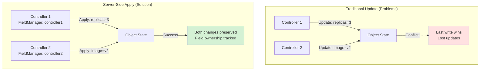
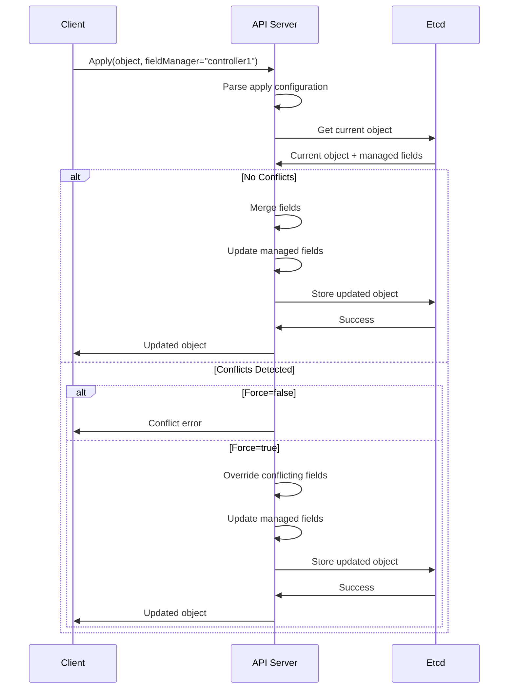
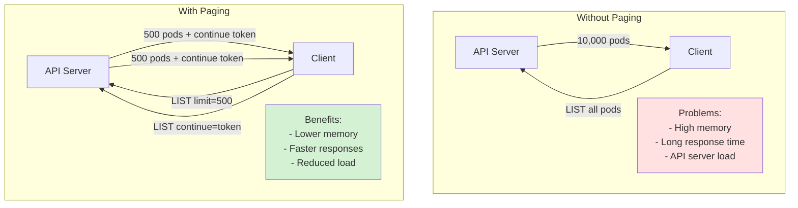
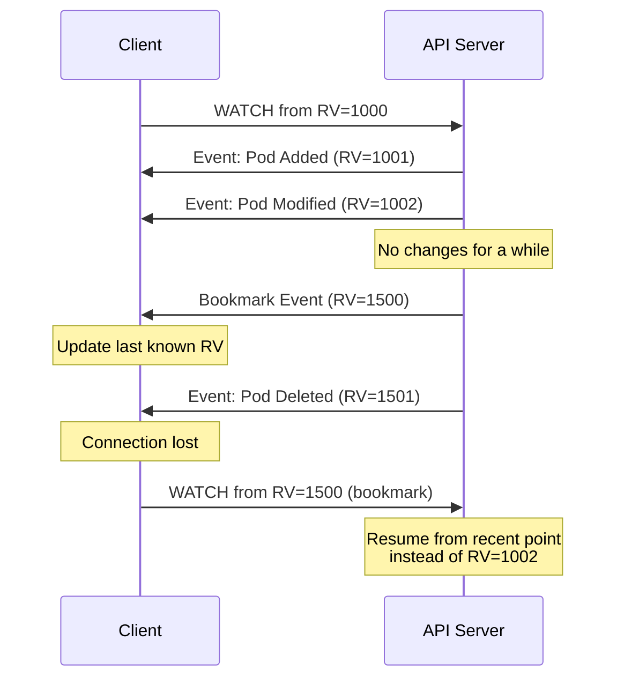
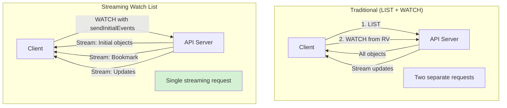

# Advanced Features

This document covers advanced features in `client-go` including Server-Side Apply, metadata operations, scaling, and other specialized functionality.

## Server-Side Apply

Server-Side Apply (SSA) is a declarative API for managing Kubernetes resources with field-level ownership tracking.

### Why Server-Side Apply?

Traditional Update operations have several limitations:



**Benefits**:
- **Field Ownership**: Each field is owned by a specific field manager
- **Conflict Detection**: Conflicts are detected and can be resolved
- **Declarative**: Specify desired state, not operations
- **Partial Updates**: Only specify fields you care about
- **Multi-Actor**: Multiple controllers can safely manage the same object

### Apply Configurations Package

**Location**: `applyconfigurations/`

Apply configurations are generated types that represent partial objects for Server-Side Apply.

#### Key Differences from Regular Types

| Regular Types | Apply Configuration Types |
|--------------|---------------------------|
| All fields are values | All fields are pointers |
| Required fields must be set | All fields are optional |
| Zero values are sent | Nil pointers are omitted |
| For Create/Update | For Apply operations |

#### Creating Apply Configurations

```go
import (
    corev1 "k8s.io/api/core/v1"
    metav1 "k8s.io/apimachinery/pkg/apis/meta/v1"
    appsv1ac "k8s.io/client-go/applyconfigurations/apps/v1"
    corev1ac "k8s.io/client-go/applyconfigurations/core/v1"
)

// Create a deployment apply configuration
deployment := appsv1ac.Deployment("my-deployment", "default").
    WithLabels(map[string]string{
        "app": "myapp",
    }).
    WithSpec(appsv1ac.DeploymentSpec().
        WithReplicas(3).
        WithSelector(metav1ac.LabelSelector().
            WithMatchLabels(map[string]string{
                "app": "myapp",
            }),
        ).
        WithTemplate(corev1ac.PodTemplateSpec().
            WithLabels(map[string]string{
                "app": "myapp",
            }).
            WithSpec(corev1ac.PodSpec().
                WithContainers(
                    corev1ac.Container().
                        WithName("nginx").
                        WithImage("nginx:1.21"),
                ),
            ),
        ),
    )

// Apply the configuration
result, err := clientset.AppsV1().Deployments("default").
    Apply(ctx, deployment, metav1.ApplyOptions{
        FieldManager: "my-controller",
        Force:        false,
    })
```

### Apply Options

```go
type ApplyOptions struct {
    // FieldManager is the name of the actor applying the configuration
    // Required for tracking field ownership
    FieldManager string
    
    // Force forces the apply operation to succeed even if there are conflicts
    // Use with caution as it can override other field managers
    Force bool
    
    // DryRun specifies whether to perform a dry run
    // Options: "", "All"
    DryRun []string
    
    // FieldValidation specifies the level of field validation
    // Options: "Ignore", "Warn", "Strict"
    FieldValidation string
}
```

### Field Manager Best Practices

```go
// ✅ Good: Unique field manager per controller/component
applyOptions := metav1.ApplyOptions{
    FieldManager: "my-controller-v1",
    Force:        false,
}

// ❌ Bad: Generic field manager name
applyOptions := metav1.ApplyOptions{
    FieldManager: "controller",
    Force:        false,
}

// ✅ Good: Use Force only when necessary (e.g., taking over fields)
applyOptions := metav1.ApplyOptions{
    FieldManager: "migration-controller",
    Force:        true,  // Taking over fields from old controller
}
```

### Extract/Modify/Apply Pattern

For controllers that need to update existing resources:

```go
// 1. Get the current object
deployment, err := clientset.AppsV1().Deployments("default").
    Get(ctx, "my-deployment", metav1.GetOptions{})
if err != nil {
    return err
}

// 2. Extract the apply configuration for your field manager
deploymentApplyConfig, err := appsv1ac.ExtractDeployment(deployment, "my-controller")
if err != nil {
    return err
}

// 3. Modify the apply configuration
deploymentApplyConfig.Spec.WithReplicas(5)

// 4. Apply the modified configuration
result, err := clientset.AppsV1().Deployments("default").
    Apply(ctx, deploymentApplyConfig, metav1.ApplyOptions{
        FieldManager: "my-controller",
    })
```

### Viewing Managed Fields

```go
// Get object with managed fields
deployment, err := clientset.AppsV1().Deployments("default").
    Get(ctx, "my-deployment", metav1.GetOptions{})

// Inspect managed fields
for _, mf := range deployment.ManagedFields {
    fmt.Printf("Manager: %s, Operation: %s, Time: %s\n",
        mf.Manager, mf.Operation, mf.Time)
    fmt.Printf("Fields: %s\n", mf.FieldsV1)
}
```

### Server-Side Apply Flow



## Metadata Client

**Location**: `metadata/`

The metadata client provides optimized operations that only work with object metadata.

### Benefits

- **Bandwidth Reduction**: Only metadata is transferred (no spec/status)
- **Faster Operations**: Less data to serialize/deserialize
- **Lower Memory**: Smaller objects in memory
- **Garbage Collection**: Ideal for ownership and finalizer management

### Using Metadata Client

```go
import (
    "k8s.io/client-go/metadata"
    metav1 "k8s.io/apimachinery/pkg/apis/meta/v1"
    "k8s.io/apimachinery/pkg/runtime/schema"
)

// Create metadata client
metadataClient, err := metadata.NewForConfig(config)

// Define resource
gvr := schema.GroupVersionResource{
    Group:    "apps",
    Version:  "v1",
    Resource: "deployments",
}

// Get metadata only
obj, err := metadataClient.Resource(gvr).Namespace("default").
    Get(ctx, "my-deployment", metav1.GetOptions{})

// obj is *metav1.PartialObjectMetadata
fmt.Printf("Name: %s\n", obj.Name)
fmt.Printf("UID: %s\n", obj.UID)
fmt.Printf("Labels: %v\n", obj.Labels)
fmt.Printf("Annotations: %v\n", obj.Annotations)
fmt.Printf("OwnerReferences: %v\n", obj.OwnerReferences)
fmt.Printf("Finalizers: %v\n", obj.Finalizers)

// Update metadata
obj.Labels["updated"] = "true"
updated, err := metadataClient.Resource(gvr).Namespace("default").
    Update(ctx, obj, metav1.UpdateOptions{})

// Delete with metadata client
err = metadataClient.Resource(gvr).Namespace("default").
    Delete(ctx, "my-deployment", metav1.DeleteOptions{})
```

### Use Cases

1. **Label/Annotation Management**
```go
// Update labels without fetching full object
obj, _ := metadataClient.Resource(gvr).Namespace(ns).Get(ctx, name, metav1.GetOptions{})
obj.Labels["environment"] = "production"
metadataClient.Resource(gvr).Namespace(ns).Update(ctx, obj, metav1.UpdateOptions{})
```

2. **Finalizer Management**
```go
// Add finalizer
obj, _ := metadataClient.Resource(gvr).Namespace(ns).Get(ctx, name, metav1.GetOptions{})
obj.Finalizers = append(obj.Finalizers, "my-controller/finalizer")
metadataClient.Resource(gvr).Namespace(ns).Update(ctx, obj, metav1.UpdateOptions{})

// Remove finalizer
obj.Finalizers = removeString(obj.Finalizers, "my-controller/finalizer")
metadataClient.Resource(gvr).Namespace(ns).Update(ctx, obj, metav1.UpdateOptions{})
```

3. **Ownership Tracking**
```go
// Check owner references
obj, _ := metadataClient.Resource(gvr).Namespace(ns).Get(ctx, name, metav1.GetOptions{})
for _, owner := range obj.OwnerReferences {
    fmt.Printf("Owner: %s/%s (UID: %s)\n", owner.Kind, owner.Name, owner.UID)
}
```

## Scale Subresource

**Location**: `scale/`

The scale package provides a generic interface for scaling resources.

### Scale Client

```go
import (
    "k8s.io/client-go/scale"
    "k8s.io/apimachinery/pkg/runtime/schema"
)

// Create scale client
scaleClient, err := scale.NewForConfig(
    config,
    mapper,           // RESTMapper for resource discovery
    dynamic.LegacyAPIPathResolverFunc,
    schema.GroupResource{},
)

// Get current scale
currentScale, err := scaleClient.Scales("default").Get(
    ctx,
    schema.GroupResource{Group: "apps", Resource: "deployments"},
    "my-deployment",
    metav1.GetOptions{},
)

fmt.Printf("Current replicas: %d\n", currentScale.Spec.Replicas)
fmt.Printf("Status replicas: %d\n", currentScale.Status.Replicas)

// Update scale
currentScale.Spec.Replicas = 5
updatedScale, err := scaleClient.Scales("default").Update(
    ctx,
    schema.GroupResource{Group: "apps", Resource: "deployments"},
    currentScale,
    metav1.UpdateOptions{},
)
```

### Using Typed Client Scale Methods

Most typed clients provide built-in scale methods:

```go
// Get scale
scale, err := clientset.AppsV1().Deployments("default").
    GetScale(ctx, "my-deployment", metav1.GetOptions{})

// Update scale
scale.Spec.Replicas = 5
updatedScale, err := clientset.AppsV1().Deployments("default").
    UpdateScale(ctx, "my-deployment", scale, metav1.UpdateOptions{})
```

### Autoscaling Integration

The scale subresource is used by the Horizontal Pod Autoscaler:

```go
// HPA uses scale subresource to adjust replicas
hpa := &autoscalingv2.HorizontalPodAutoscaler{
    ObjectMeta: metav1.ObjectMeta{
        Name:      "my-hpa",
        Namespace: "default",
    },
    Spec: autoscalingv2.HorizontalPodAutoscalerSpec{
        ScaleTargetRef: autoscalingv2.CrossVersionObjectReference{
            APIVersion: "apps/v1",
            Kind:       "Deployment",
            Name:       "my-deployment",
        },
        MinReplicas: ptr.To[int32](2),
        MaxReplicas: 10,
        Metrics: []autoscalingv2.MetricSpec{
            {
                Type: autoscalingv2.ResourceMetricSourceType,
                Resource: &autoscalingv2.ResourceMetricSource{
                    Name: corev1.ResourceCPU,
                    Target: autoscalingv2.MetricTarget{
                        Type:               autoscalingv2.UtilizationMetricType,
                        AverageUtilization: ptr.To[int32](80),
                    },
                },
            },
        },
    },
}
```

## Paging

**Location**: `tools/pager/`

The pager package provides efficient pagination for large list operations.

### Why Paging?



### Using Pager

```go
import (
    "k8s.io/client-go/tools/pager"
)

// Create pager
listPager := pager.New(func(ctx context.Context, opts metav1.ListOptions) (runtime.Object, error) {
    return clientset.CoreV1().Pods("").List(ctx, opts)
})

// Set page size
listPager.PageSize = 500

// Iterate through pages
err := listPager.EachListItem(ctx, metav1.ListOptions{}, func(obj runtime.Object) error {
    pod := obj.(*corev1.Pod)
    fmt.Printf("Pod: %s/%s\n", pod.Namespace, pod.Name)
    return nil
})
```

### Manual Pagination

```go
// First page
listOptions := metav1.ListOptions{
    Limit: 500,
}
podList, err := clientset.CoreV1().Pods("").List(ctx, listOptions)

// Process first page
for _, pod := range podList.Items {
    fmt.Printf("Pod: %s/%s\n", pod.Namespace, pod.Name)
}

// Continue with next pages
for podList.Continue != "" {
    listOptions.Continue = podList.Continue
    podList, err = clientset.CoreV1().Pods("").List(ctx, listOptions)
    
    for _, pod := range podList.Items {
        fmt.Printf("Pod: %s/%s\n", pod.Namespace, pod.Name)
    }
}
```

## Watch Bookmarks

Watch bookmarks provide efficient watch resumption points.

### How Bookmarks Work



### Enabling Bookmarks

```go
// Enable bookmarks in watch options
watchOptions := metav1.ListOptions{
    Watch:            true,
    AllowWatchBookmarks: true,
}

watcher, err := clientset.CoreV1().Pods("default").Watch(ctx, watchOptions)
defer watcher.Stop()

for event := range watcher.ResultChan() {
    switch event.Type {
    case watch.Added, watch.Modified, watch.Deleted:
        pod := event.Object.(*corev1.Pod)
        fmt.Printf("Event: %s, Pod: %s\n", event.Type, pod.Name)
    case watch.Bookmark:
        // Bookmark event - update resource version for efficient resumption
        pod := event.Object.(*corev1.Pod)
        fmt.Printf("Bookmark: RV=%s\n", pod.ResourceVersion)
    }
}
```

## Streaming Watch List

Kubernetes 1.27+ supports streaming watch list for efficient initial synchronization.

### Traditional vs Streaming



### Using Streaming Watch List

```go
// Enable streaming watch list
watchOptions := metav1.ListOptions{
    Watch:              true,
    SendInitialEvents:  ptr.To(true),
    AllowWatchBookmarks: true,
}

watcher, err := clientset.CoreV1().Pods("default").Watch(ctx, watchOptions)
defer watcher.Stop()

initialSyncComplete := false

for event := range watcher.ResultChan() {
    switch event.Type {
    case watch.Added:
        pod := event.Object.(*corev1.Pod)
        if !initialSyncComplete {
            fmt.Printf("Initial: %s\n", pod.Name)
        } else {
            fmt.Printf("Added: %s\n", pod.Name)
        }
    case watch.Bookmark:
        if !initialSyncComplete {
            initialSyncComplete = true
            fmt.Println("Initial sync complete")
        }
    }
}
```

## Field Selectors and Label Selectors

### Label Selectors

```go
import "k8s.io/apimachinery/pkg/labels"

// Equality-based selector
selector := labels.SelectorFromSet(labels.Set{
    "app":         "myapp",
    "environment": "production",
})

pods, err := clientset.CoreV1().Pods("default").List(ctx, metav1.ListOptions{
    LabelSelector: selector.String(),
})

// Set-based selector
requirement1, _ := labels.NewRequirement("app", selection.In, []string{"app1", "app2"})
requirement2, _ := labels.NewRequirement("tier", selection.NotIn, []string{"frontend"})
selector := labels.NewSelector().Add(*requirement1, *requirement2)

pods, err := clientset.CoreV1().Pods("default").List(ctx, metav1.ListOptions{
    LabelSelector: selector.String(),
})
```

### Field Selectors

```go
// Field selector for specific fields
fieldSelector := fields.OneTermEqualSelector("status.phase", "Running")

pods, err := clientset.CoreV1().Pods("default").List(ctx, metav1.ListOptions{
    FieldSelector: fieldSelector.String(),
})

// Multiple field selectors
fieldSelector := fields.AndSelectors(
    fields.OneTermEqualSelector("status.phase", "Running"),
    fields.OneTermEqualSelector("spec.nodeName", "node-1"),
)
```

## Partial Object Metadata

Request only metadata for improved performance:

```go
// Use Table format for list operations
listOptions := metav1.ListOptions{
    // Request as Table
}
listOptions.SetGroupVersionKind(schema.GroupVersionKind{
    Group:   "meta.k8s.io",
    Version: "v1",
    Kind:    "Table",
})

// Or use PartialObjectMetadata
listOptions.SetGroupVersionKind(schema.GroupVersionKind{
    Group:   "meta.k8s.io",
    Version: "v1",
    Kind:    "PartialObjectMetadata",
})
```

## Best Practices

### 1. Use Server-Side Apply for Controllers

```go
// ✅ Good: Declarative with field ownership
deployment := appsv1ac.Deployment("my-deployment", "default").
    WithSpec(appsv1ac.DeploymentSpec().WithReplicas(3))
    
result, err := clientset.AppsV1().Deployments("default").
    Apply(ctx, deployment, metav1.ApplyOptions{FieldManager: "my-controller"})

// ❌ Bad: Get-Modify-Update pattern (race conditions)
deployment, _ := clientset.AppsV1().Deployments("default").Get(ctx, "my-deployment", metav1.GetOptions{})
deployment.Spec.Replicas = ptr.To[int32](3)
result, err := clientset.AppsV1().Deployments("default").Update(ctx, deployment, metav1.UpdateOptions{})
```

### 2. Use Metadata Client for Metadata Operations

```go
// ✅ Good: Metadata client for label updates
obj, _ := metadataClient.Resource(gvr).Namespace(ns).Get(ctx, name, metav1.GetOptions{})
obj.Labels["updated"] = "true"
metadataClient.Resource(gvr).Namespace(ns).Update(ctx, obj, metav1.UpdateOptions{})

// ❌ Bad: Full object fetch for metadata update
deployment, _ := clientset.AppsV1().Deployments(ns).Get(ctx, name, metav1.GetOptions{})
deployment.Labels["updated"] = "true"
clientset.AppsV1().Deployments(ns).Update(ctx, deployment, metav1.UpdateOptions{})
```

### 3. Use Paging for Large Lists

```go
// ✅ Good: Paginated list
listPager := pager.New(func(ctx context.Context, opts metav1.ListOptions) (runtime.Object, error) {
    return clientset.CoreV1().Pods("").List(ctx, opts)
})
listPager.PageSize = 500
listPager.EachListItem(ctx, metav1.ListOptions{}, processFunc)

// ❌ Bad: Unpaginated list (memory issues with large clusters)
podList, _ := clientset.CoreV1().Pods("").List(ctx, metav1.ListOptions{})
```

### 4. Enable Watch Bookmarks

```go
// ✅ Good: Enable bookmarks for efficient resumption
watchOptions := metav1.ListOptions{
    Watch:               true,
    AllowWatchBookmarks: true,
}

// ❌ Bad: No bookmarks (inefficient resumption)
watchOptions := metav1.ListOptions{
    Watch: true,
}
```

## Summary

Advanced features in `client-go` provide:

- **Server-Side Apply**: Declarative updates with field ownership tracking
- **Metadata Client**: Optimized metadata-only operations
- **Scale Subresource**: Generic scaling interface
- **Paging**: Efficient handling of large lists
- **Watch Bookmarks**: Efficient watch resumption
- **Streaming Watch List**: Combined LIST+WATCH in single stream

These features enable building more efficient, scalable, and robust Kubernetes applications and controllers.
