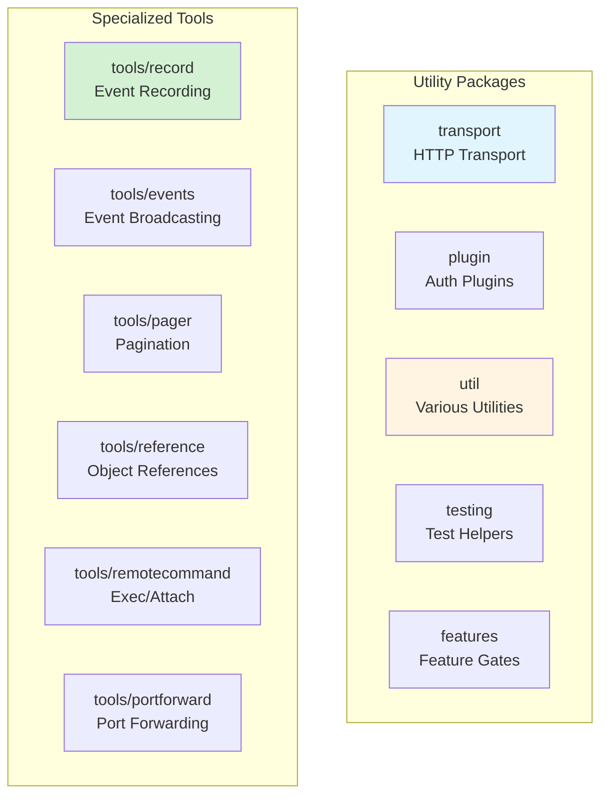

# Utilities and Supporting Packages

This document covers utility packages and supporting functionality in `client-go`.

## Package Overview



## transport Package

**Location**: `transport/`

The transport package provides HTTP transport configuration and utilities.

### Transport Configuration

```go
import "k8s.io/client-go/transport"

// Create transport config
transportConfig := &transport.Config{
    // TLS configuration
    TLS: transport.TLSConfig{
        CAFile:   "/path/to/ca.crt",
        CertFile: "/path/to/client.crt",
        KeyFile:  "/path/to/client.key",
        Insecure: false,
        ServerName: "kubernetes.default.svc",
    },
    
    // Authentication
    BearerToken: "token",
    Username:    "user",
    Password:    "pass",
    
    // Impersonation
    Impersonate: transport.ImpersonationConfig{
        UserName: "impersonated-user",
        Groups:   []string{"system:masters"},
    },
    
    // Proxy
    Proxy: func(req *http.Request) (*url.URL, error) {
        return url.Parse("http://proxy:8080")
    },
    
    // User agent
    UserAgent: "my-client/v1.0.0",
    
    // Transport wrapper
    WrapTransport: func(rt http.RoundTripper) http.RoundTripper {
        return &loggingRoundTripper{base: rt}
    },
}

// Create HTTP transport
httpTransport, err := transport.New(transportConfig)

// Use with HTTP client
httpClient := &http.Client{
    Transport: httpTransport,
}
```

### Round Tripper Wrappers

Round trippers can be chained to add functionality:

```go
// Logging round tripper
type loggingRoundTripper struct {
    base http.RoundTripper
}

func (rt *loggingRoundTripper) RoundTrip(req *http.Request) (*http.Response, error) {
    start := time.Now()
    resp, err := rt.base.RoundTrip(req)
    duration := time.Since(start)
    
    log.Printf("%s %s - %d (%v)", req.Method, req.URL, resp.StatusCode, duration)
    return resp, err
}

// Retry round tripper
type retryRoundTripper struct {
    base       http.RoundTripper
    maxRetries int
}

func (rt *retryRoundTripper) RoundTrip(req *http.Request) (*http.Response, error) {
    var resp *http.Response
    var err error
    
    for i := 0; i <= rt.maxRetries; i++ {
        resp, err = rt.base.RoundTrip(req)
        if err == nil && resp.StatusCode < 500 {
            return resp, nil
        }
        
        if i < rt.maxRetries {
            time.Sleep(time.Second * time.Duration(i+1))
        }
    }
    
    return resp, err
}
```

## plugin Package

**Location**: `plugin/pkg/client/auth/`

The plugin package provides authentication plugins for various cloud providers and identity systems.

### Available Plugins

```go
import (
    // Azure AD authentication
    _ "k8s.io/client-go/plugin/pkg/client/auth/azure"
    
    // Google Cloud Platform authentication
    _ "k8s.io/client-go/plugin/pkg/client/auth/gcp"
    
    // OpenID Connect authentication
    _ "k8s.io/client-go/plugin/pkg/client/auth/oidc"
    
    // Exec-based authentication
    _ "k8s.io/client-go/plugin/pkg/client/auth/exec"
)
```

### Exec Plugin

The exec plugin allows external commands to provide authentication:

```yaml
# In kubeconfig
users:
- name: my-user
  user:
    exec:
      apiVersion: client.authentication.k8s.io/v1
      command: aws
      args:
        - eks
        - get-token
        - --cluster-name
        - my-cluster
      env:
        - name: AWS_PROFILE
          value: production
```

## tools/record Package

**Location**: `tools/record/`

The record package provides event recording functionality for controllers.

### Event Recorder

```go
import (
    "k8s.io/client-go/tools/record"
    "k8s.io/client-go/kubernetes/scheme"
)

// Create event broadcaster
eventBroadcaster := record.NewBroadcaster()

// Start logging events
eventBroadcaster.StartLogging(klog.Infof)

// Start recording events to API server
eventBroadcaster.StartRecordingToSink(&typedcorev1.EventSinkImpl{
    Interface: clientset.CoreV1().Events(""),
})

// Create event recorder
recorder := eventBroadcaster.NewRecorder(scheme.Scheme, corev1.EventSource{
    Component: "my-controller",
})

// Record events
recorder.Event(pod, corev1.EventTypeNormal, "Started", "Pod started successfully")
recorder.Eventf(pod, corev1.EventTypeWarning, "Failed", "Failed to start: %v", err)

// Record events with annotations
recorder.AnnotatedEventf(
    pod,
    map[string]string{"controller": "my-controller"},
    corev1.EventTypeNormal,
    "Synced",
    "Pod synced successfully",
)
```

### Event Types

```go
const (
    EventTypeNormal  = "Normal"
    EventTypeWarning = "Warning"
)

// Common event reasons
const (
    ReasonSuccessfulCreate  = "SuccessfulCreate"
    ReasonFailedCreate      = "FailedCreate"
    ReasonSuccessfulDelete  = "SuccessfulDelete"
    ReasonFailedDelete      = "FailedDelete"
    ReasonSuccessfulUpdate  = "SuccessfulUpdate"
    ReasonFailedUpdate      = "FailedUpdate"
)
```

## tools/events Package

**Location**: `tools/events/`

The events package provides the newer Events API (events.k8s.io/v1).

### Event Recorder (Events API)

```go
import (
    "k8s.io/client-go/tools/events"
)

// Create event broadcaster
eventBroadcaster := events.NewBroadcaster(&events.EventSinkImpl{
    Interface: clientset.EventsV1(),
})

// Start event processing
eventBroadcaster.StartRecordingToSink(ctx.Done())

// Create event recorder
recorder := eventBroadcaster.NewRecorder(scheme.Scheme, "my-controller")

// Record events
recorder.Eventf(pod, nil, corev1.EventTypeNormal, "Started", "Action", "Pod started successfully")
```

### Event vs Events API

| Feature | core/v1 Events | events.k8s.io/v1 Events |
|---------|----------------|-------------------------|
| API Group | core/v1 | events.k8s.io/v1 |
| Event Series | Limited | Full support |
| Structured Data | Basic | Enhanced |
| Recommended | Legacy | ✅ New implementations |

## tools/remotecommand Package

**Location**: `tools/remotecommand/`

The remotecommand package provides functionality for executing commands in containers and attaching to them.

### Executing Commands

```go
import (
    "k8s.io/client-go/tools/remotecommand"
    "k8s.io/client-go/kubernetes/scheme"
)

// Create exec request
req := clientset.CoreV1().RESTClient().Post().
    Resource("pods").
    Name("my-pod").
    Namespace("default").
    SubResource("exec").
    VersionedParams(&corev1.PodExecOptions{
        Container: "nginx",
        Command:   []string{"ls", "-la", "/"},
        Stdin:     false,
        Stdout:    true,
        Stderr:    true,
        TTY:       false,
    }, scheme.ParameterCodec)

// Create executor
exec, err := remotecommand.NewSPDYExecutor(config, "POST", req.URL())
if err != nil {
    return err
}

// Execute command
var stdout, stderr bytes.Buffer
err = exec.StreamWithContext(ctx, remotecommand.StreamOptions{
    Stdout: &stdout,
    Stderr: &stderr,
})

fmt.Printf("Output: %s\n", stdout.String())
fmt.Printf("Error: %s\n", stderr.String())
```

### Interactive Exec

```go
// Interactive exec with stdin
req := clientset.CoreV1().RESTClient().Post().
    Resource("pods").
    Name("my-pod").
    Namespace("default").
    SubResource("exec").
    VersionedParams(&corev1.PodExecOptions{
        Container: "nginx",
        Command:   []string{"/bin/sh"},
        Stdin:     true,
        Stdout:    true,
        Stderr:    true,
        TTY:       true,
    }, scheme.ParameterCodec)

exec, err := remotecommand.NewSPDYExecutor(config, "POST", req.URL())

// Use with terminal
err = exec.StreamWithContext(ctx, remotecommand.StreamOptions{
    Stdin:  os.Stdin,
    Stdout: os.Stdout,
    Stderr: os.Stderr,
    Tty:    true,
})
```

### Attaching to Containers

```go
// Attach to running container
req := clientset.CoreV1().RESTClient().Post().
    Resource("pods").
    Name("my-pod").
    Namespace("default").
    SubResource("attach").
    VersionedParams(&corev1.PodAttachOptions{
        Container: "nginx",
        Stdin:     true,
        Stdout:    true,
        Stderr:    true,
        TTY:       true,
    }, scheme.ParameterCodec)

exec, err := remotecommand.NewSPDYExecutor(config, "POST", req.URL())

err = exec.StreamWithContext(ctx, remotecommand.StreamOptions{
    Stdin:  os.Stdin,
    Stdout: os.Stdout,
    Stderr: os.Stderr,
    Tty:    true,
})
```

## tools/portforward Package

**Location**: `tools/portforward/`

The portforward package provides port forwarding functionality.

### Port Forwarding

```go
import (
    "k8s.io/client-go/tools/portforward"
    "k8s.io/client-go/transport/spdy"
)

// Create port forward request
req := clientset.CoreV1().RESTClient().Post().
    Resource("pods").
    Name("my-pod").
    Namespace("default").
    SubResource("portforward")

// Create SPDY transport
transport, upgrader, err := spdy.RoundTripperFor(config)
if err != nil {
    return err
}

// Create dialer
dialer := spdy.NewDialer(upgrader, &http.Client{Transport: transport}, "POST", req.URL())

// Setup port forwarding
stopChan := make(chan struct{}, 1)
readyChan := make(chan struct{})

ports := []string{"8080:80", "8443:443"}  // local:remote

forwarder, err := portforward.New(
    dialer,
    ports,
    stopChan,
    readyChan,
    os.Stdout,
    os.Stderr,
)

// Start forwarding
go func() {
    if err := forwarder.ForwardPorts(); err != nil {
        log.Fatal(err)
    }
}()

// Wait for ready
<-readyChan
fmt.Println("Port forwarding is ready")

// Use the forwarded ports
// Connect to localhost:8080 to reach pod's port 80

// Stop forwarding
close(stopChan)
```

## util Package

**Location**: `util/`

The util package contains various utility functions.

### util/retry

```go
import "k8s.io/client-go/util/retry"

// Retry with exponential backoff
err := retry.RetryOnConflict(retry.DefaultRetry, func() error {
    // Get latest version
    deployment, err := clientset.AppsV1().Deployments("default").
        Get(ctx, "my-deployment", metav1.GetOptions{})
    if err != nil {
        return err
    }
    
    // Modify
    deployment.Spec.Replicas = ptr.To[int32](3)
    
    // Update
    _, err = clientset.AppsV1().Deployments("default").
        Update(ctx, deployment, metav1.UpdateOptions{})
    return err
})

// Custom backoff
customBackoff := wait.Backoff{
    Steps:    5,
    Duration: 10 * time.Millisecond,
    Factor:   2.0,
    Jitter:   0.1,
}

err := retry.OnError(customBackoff, func(err error) bool {
    // Return true to retry on this error
    return errors.IsServerTimeout(err) || errors.IsTimeout(err)
}, func() error {
    // Operation to retry
    return doSomething()
})
```

### util/flowcontrol

```go
import "k8s.io/client-go/util/flowcontrol"

// Create rate limiter
rateLimiter := flowcontrol.NewTokenBucketRateLimiter(
    10.0,  // QPS
    20,    // Burst
)

// Wait for token
rateLimiter.Wait(ctx)

// Try to acquire token without waiting
if rateLimiter.TryAccept() {
    // Token acquired
    doWork()
}
```

### util/homedir

```go
import "k8s.io/client-go/util/homedir"

// Get home directory
homeDir := homedir.HomeDir()

// Construct kubeconfig path
kubeconfigPath := filepath.Join(homeDir, ".kube", "config")
```

## testing Package

**Location**: `testing/`

The testing package provides utilities for testing code that uses client-go.

### Fake Clientset

```go
import (
    "k8s.io/client-go/kubernetes/fake"
    "k8s.io/apimachinery/pkg/runtime"
)

// Create fake clientset with initial objects
pod := &corev1.Pod{
    ObjectMeta: metav1.ObjectMeta{
        Name:      "test-pod",
        Namespace: "default",
    },
}

fakeClientset := fake.NewSimpleClientset(pod)

// Use like real clientset
pod, err := fakeClientset.CoreV1().Pods("default").
    Get(ctx, "test-pod", metav1.GetOptions{})

// Create new objects
newPod := &corev1.Pod{
    ObjectMeta: metav1.ObjectMeta{
        Name:      "new-pod",
        Namespace: "default",
    },
}
created, err := fakeClientset.CoreV1().Pods("default").
    Create(ctx, newPod, metav1.CreateOptions{})
```

### Fake Dynamic Client

```go
import (
    "k8s.io/client-go/dynamic/fake"
)

// Create fake dynamic client
scheme := runtime.NewScheme()
fakeDynamicClient := fake.NewSimpleDynamicClient(scheme, objects...)

// Use like real dynamic client
gvr := schema.GroupVersionResource{
    Group:    "apps",
    Version:  "v1",
    Resource: "deployments",
}

obj, err := fakeDynamicClient.Resource(gvr).Namespace("default").
    Get(ctx, "my-deployment", metav1.GetOptions{})
```

### Reactor Pattern for Testing

```go
// Add custom reactor
fakeClientset.PrependReactor("create", "pods", func(action testing.Action) (bool, runtime.Object, error) {
    createAction := action.(testing.CreateAction)
    pod := createAction.GetObject().(*corev1.Pod)
    
    // Custom logic
    if pod.Name == "fail" {
        return true, nil, errors.NewInternalError(fmt.Errorf("simulated error"))
    }
    
    // Let default handler process
    return false, nil, nil
})

// Add watch reactor
fakeClientset.PrependWatchReactor("pods", func(action testing.Action) (bool, watch.Interface, error) {
    watcher := watch.NewFake()
    
    // Send events
    go func() {
        time.Sleep(100 * time.Millisecond)
        watcher.Add(pod)
    }()
    
    return true, watcher, nil
})
```

## features Package

**Location**: `features/`

The features package provides client-side feature gates.

### Feature Gates

```go
import (
    "k8s.io/client-go/features"
    utilfeature "k8s.io/apiserver/pkg/util/feature"
)

// Check if feature is enabled
if utilfeature.DefaultFeatureGate.Enabled(features.WatchList) {
    // Use watch list feature
}

// Enable feature programmatically (for testing)
utilfeature.DefaultMutableFeatureGate.Set("WatchList=true")
```

## Best Practices

### 1. Use Fake Clients for Testing

```go
// ✅ Good: Use fake clientset for unit tests
func TestController(t *testing.T) {
    fakeClientset := fake.NewSimpleClientset()
    controller := NewController(fakeClientset)
    // Test controller logic
}

// ❌ Bad: Using real clientset in unit tests
func TestController(t *testing.T) {
    config, _ := rest.InClusterConfig()
    clientset, _ := kubernetes.NewForConfig(config)
    controller := NewController(clientset)
}
```

### 2. Record Events for Important Actions

```go
// ✅ Good: Record events for visibility
recorder.Event(pod, corev1.EventTypeNormal, "Created", "Successfully created pod")

// ❌ Bad: Silent operations
createPod(pod)
```

### 3. Use Retry for Conflict Errors

```go
// ✅ Good: Retry on conflicts
err := retry.RetryOnConflict(retry.DefaultRetry, func() error {
    obj, _ := client.Get(ctx, name, metav1.GetOptions{})
    obj.Spec.Replicas = 3
    _, err := client.Update(ctx, obj, metav1.UpdateOptions{})
    return err
})

// ❌ Bad: No retry on conflicts
obj, _ := client.Get(ctx, name, metav1.GetOptions{})
obj.Spec.Replicas = 3
client.Update(ctx, obj, metav1.UpdateOptions{})
```

### 4. Use Context for Cancellation

```go
// ✅ Good: Use context with timeout
ctx, cancel := context.WithTimeout(context.Background(), 30*time.Second)
defer cancel()

err := exec.StreamWithContext(ctx, options)

// ❌ Bad: No timeout
err := exec.Stream(options)
```

## Summary

The utility packages in `client-go` provide:

- **transport**: HTTP transport configuration and customization
- **plugin**: Authentication plugins for various providers
- **tools/record**: Event recording for controllers
- **tools/remotecommand**: Command execution and container attachment
- **tools/portforward**: Port forwarding functionality
- **util**: Various utility functions (retry, rate limiting, etc.)
- **testing**: Fake clients and testing utilities
- **features**: Client-side feature gates

These utilities enable building robust, testable, and feature-rich Kubernetes applications.
