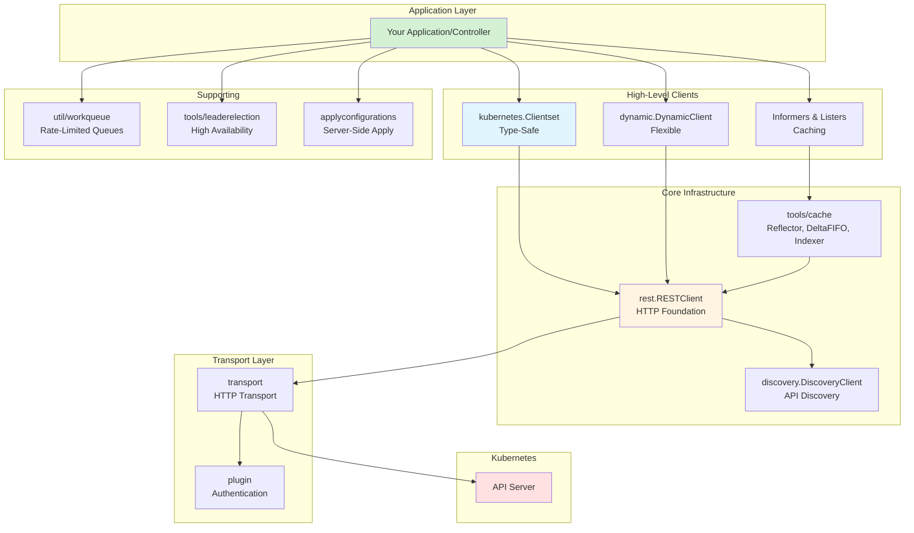

# client-go Documentation

Comprehensive documentation for the Kubernetes Go client library (`k8s.io/client-go`).

## About client-go

`client-go` is the official Go client library for interacting with Kubernetes clusters. It provides a comprehensive set of tools, clients, and utilities for building applications, controllers, and operators that communicate with the Kubernetes API server.

**Project Location**: `staging/src/k8s.io/client-go`

**Official Repository**: https://github.com/kubernetes/client-go

## Documentation Structure

This documentation is organized into the following sections:

### [00. Overview](00-overview.md)
- Project structure and architecture
- Key components and their relationships
- Versioning and compatibility
- Common use cases
- High-level architecture diagrams

**Topics Covered**:
- Client types (Clientset, Dynamic, REST)
- Configuration methods
- Controller infrastructure overview
- Event-driven patterns
- Performance considerations

### [01. Core Packages](01-core-packages.md)
- REST client foundation
- Typed Kubernetes clientset
- Dynamic client for CRDs
- Discovery client
- Metadata client
- Scale subresource

**Topics Covered**:
- `rest` package: HTTP client and configuration
- `kubernetes` package: Type-safe clients
- `dynamic` package: Unstructured operations
- `discovery` package: API resource discovery
- `metadata` package: Metadata-only operations
- Client comparison and selection guide

### [02. Configuration](02-configuration.md)
- Client configuration methods
- Authentication mechanisms
- Rate limiting and timeouts
- Transport customization
- Environment-specific patterns

**Topics Covered**:
- In-cluster configuration
- Kubeconfig file loading
- Manual configuration
- Authentication methods (tokens, certificates, exec plugins)
- Rate limiting configuration
- TLS and security settings
- Configuration best practices

### [03. Controller Infrastructure](03-controller-infrastructure.md)
- Informer pattern and implementation
- Caching mechanisms
- Work queues
- Leader election
- Controller patterns

**Topics Covered**:
- `tools/cache` package: Reflector, DeltaFIFO, Indexer, SharedInformer
- `util/workqueue` package: Rate-limited queues
- `tools/leaderelection` package: High availability
- Complete controller implementation
- Best practices for building controllers

### [04. Advanced Features](04-advanced-features.md)
- Server-Side Apply
- Apply configurations
- Metadata operations
- Pagination
- Watch optimizations

**Topics Covered**:
- Server-Side Apply concepts and usage
- `applyconfigurations` package
- Field ownership and conflict resolution
- Extract/Modify/Apply pattern
- Metadata client for optimized operations
- Paging for large lists
- Watch bookmarks and streaming
- Field and label selectors

### [05. Utilities](05-utilities.md)
- Transport and authentication plugins
- Event recording
- Remote command execution
- Port forwarding
- Testing utilities

**Topics Covered**:
- `transport` package: HTTP transport configuration
- `plugin` package: Authentication plugins
- `tools/record` and `tools/events`: Event recording
- `tools/remotecommand`: Exec and attach
- `tools/portforward`: Port forwarding
- `util` package: Retry, rate limiting, helpers
- `testing` package: Fake clients and test utilities

### [06. Examples](06-examples.md)
- Practical code examples
- Common patterns
- Complete implementations
- Best practices in action

**Topics Covered**:
- Basic CRUD operations
- Watching resources
- Building controllers
- Working with CRDs
- Server-Side Apply examples
- Leader election
- Multi-resource management
- Finalizer patterns

## Quick Start

### Installation

```bash
go get k8s.io/client-go@latest
```

### Basic Usage

```go
package main

import (
    "context"
    "fmt"
    
    metav1 "k8s.io/apimachinery/pkg/apis/meta/v1"
    "k8s.io/client-go/kubernetes"
    "k8s.io/client-go/rest"
)

func main() {
    // Create config
    config, err := rest.InClusterConfig()
    if err != nil {
        panic(err)
    }
    
    // Create clientset
    clientset, err := kubernetes.NewForConfig(config)
    if err != nil {
        panic(err)
    }
    
    // List pods
    pods, err := clientset.CoreV1().Pods("default").List(
        context.Background(),
        metav1.ListOptions{},
    )
    if err != nil {
        panic(err)
    }
    
    fmt.Printf("Found %d pods\n", len(pods.Items))
}
```

## Architecture Overview



## Key Concepts

### Client Types

| Client Type | Use Case | Type Safety | CRD Support |
|------------|----------|-------------|-------------|
| **kubernetes.Clientset** | Built-in resources | ✅ Strong | ❌ No |
| **dynamic.DynamicClient** | Any resource | ❌ Weak | ✅ Yes |
| **metadata.Client** | Metadata only | ✅ Metadata | ✅ Yes |
| **rest.RESTClient** | Custom needs | ❌ None | ✅ Yes |

### Controller Pattern

The controller pattern is central to Kubernetes:

1. **Watch** resources via Informers
2. **Cache** resources locally
3. **Enqueue** keys to WorkQueue
4. **Process** items with reconciliation logic
5. **Update** resources via API server

### Server-Side Apply

Declarative resource management with field ownership:

- **Field Managers**: Track who owns which fields
- **Conflict Detection**: Automatic conflict detection
- **Partial Updates**: Only specify fields you care about
- **Multi-Actor**: Multiple controllers can safely co-manage objects

## Version Compatibility

| client-go Version | Kubernetes Version | Status |
|-------------------|-------------------|--------|
| v0.31.0 | v1.31.x | ✅ Supported |
| v0.32.0 | v1.32.x | ✅ Supported |
| v0.33.0 | v1.33.x | ✅ Supported |
| v0.34.0 | v1.34.x | ✅ Supported |

**Note**: `client-go v0.X.Y` corresponds to Kubernetes `v1.X.Y`

**Compatibility**:
- ✅ Older clients work with newer servers (backward compatible)
- ⚠️ Newer clients may not work with older servers (forward compatibility not guaranteed)

## Common Patterns

### 1. In-Cluster Configuration

```go
config, err := rest.InClusterConfig()
clientset, err := kubernetes.NewForConfig(config)
```

### 2. Out-of-Cluster Configuration

```go
config, err := clientcmd.BuildConfigFromFlags("", kubeconfig)
clientset, err := kubernetes.NewForConfig(config)
```

### 3. Building a Controller

```go
// Create informer
informerFactory := informers.NewSharedInformerFactory(clientset, time.Minute)
podInformer := informerFactory.Core().V1().Pods()

// Add event handler
podInformer.Informer().AddEventHandler(cache.ResourceEventHandlerFuncs{
    AddFunc:    handleAdd,
    UpdateFunc: handleUpdate,
    DeleteFunc: handleDelete,
})

// Start informer
informerFactory.Start(stopCh)
```

### 4. Server-Side Apply

```go
deployment := appsv1ac.Deployment("my-app", "default").
    WithSpec(appsv1ac.DeploymentSpec().WithReplicas(3))

result, err := clientset.AppsV1().Deployments("default").
    Apply(ctx, deployment, metav1.ApplyOptions{
        FieldManager: "my-controller",
    })
```

## Best Practices

### ✅ Do

- Use informers instead of direct watches
- Configure appropriate rate limits
- Implement proper error handling
- Use context for cancellation
- Reuse clients and configurations
- Use Server-Side Apply for controllers
- Implement leader election for HA
- Use work queues for retry logic

### ❌ Don't

- Create clients for every request
- Disable rate limiting without reason
- Ignore errors
- Use infinite timeouts
- Poll the API server
- Use get-modify-update pattern (use Server-Side Apply)
- Run controllers without leader election in HA setups
- Block informer event handlers

## Resources

### Official Documentation

- **client-go Repository**: https://github.com/kubernetes/client-go
- **API Documentation**: https://pkg.go.dev/k8s.io/client-go
- **Kubernetes Documentation**: https://kubernetes.io/docs/reference/using-api/client-libraries/

### Examples and Samples

- **Official Examples**: `staging/src/k8s.io/client-go/examples/`
- **Sample Controller**: https://github.com/kubernetes/sample-controller
- **Community Examples**: https://github.com/kubernetes/client-go/tree/master/examples

### Related Projects

- **controller-runtime**: Higher-level controller framework
- **kubebuilder**: SDK for building Kubernetes APIs
- **operator-sdk**: Framework for building Kubernetes operators

## Contributing

For contributions to client-go:

1. **Main Repository**: Contributions should be made to the main Kubernetes repository
2. **Staging Area**: client-go is in the staging area at `staging/src/k8s.io/client-go`
3. **Issues**: Report issues in the main Kubernetes repository
4. **Pull Requests**: Submit PRs to the main Kubernetes repository

See [CONTRIBUTING.md](../../staging/src/k8s.io/client-go/CONTRIBUTING.md) for details.

## License

client-go is licensed under the Apache License 2.0. See [LICENSE](../../staging/src/k8s.io/client-go/LICENSE) for details.

## Support

- **Kubernetes Slack**: #client-go channel
- **Stack Overflow**: Tag questions with `kubernetes` and `client-go`
- **GitHub Issues**: https://github.com/kubernetes/kubernetes/issues

---

**Documentation Version**: Generated from Kubernetes source tree
**Last Updated**: 2026-01-15
**Source**: `staging/src/k8s.io/client-go`
